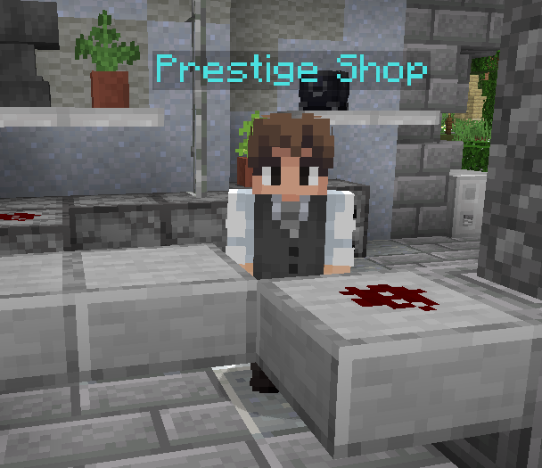

# 🎁 Das Case-Opening

### Case-Opening

Im Case-Opening können zufällige Gewinne gezogen werden. Es gibt verschiedene Kisten, welche verschiedene Gewinne beinhalten und über unterschiedliche Wege erhalten werden können.

<figure><figcaption>
Case-Opening an einem Citybuild-Spawn
</figcaption></figure>

Das Case-Opening lässt sich an allen Citybuild-Spawns durch beschriftete Truhen mit Partikeln erkennen und durch einen Rechtsklick auf die Truhe öffnen. \
Aus einigen Kisten können zusätzlich [eigene Case-Opening-Blöcke](https://items.griefergames.net/#Mobiles_Caseopening) gewonnen werden, welche du auf deinem eigenen Grundstück platzieren und dort nutzen kannst.

<figure><figcaption>
Das Case-Opening mit Auswahl der Kisten
</figcaption></figure>

Im Hauptmenü des Case-Opening findest du die 3 Standard-Kisten, sowie spezielle Kisten, welche temporär zur Verfügung stehen und die Community-Kiste.

Neben der Epischen und Supreme-Kiste können hier auch weitere Kisten zur Verfügung stehen. Die Verfügbarkeit und Inhalte bei diesen sind zeitlich begrenzt und können sich jederzeit ändern.

Mit einem Linksklick auf die Kiste öffnest du sie und startest eine Zufallsauswahl von möglichen Gewinnen aus der Kiste.\
Mit einem Rechtsklick auf die Kiste erhältst du eine vollständige Übersicht über alle möglichen Gewinne, welche aktuell in der entsprechenden Kiste enthalten sein können.

Bewegst du die Maus über den  Diamanten in der Mitte wird dir angezeigt, wie viele Kristalle du aktuell besitzt.

Die rechte Truhe in der untersten Reihe öffnet ein Menü, in welchem du verschiedene Kisten mit deinen Kristallen kaufen kannst.\
Gekaufte Kisten werden an deinem Account gespeichert. Du kannst diese entweder direkt öffnen oder aufbewahren und später öffnen.

Die linke Truhe in der untersten Reihe zeigt dir bei einem Klick, welche und wie viele Kisten du aktuell besitzt und öffnen kannst.\
In diesem Menü kannst du auch in diese Kisten sehen oder die Kisten öffnen, wenn sie aktuell nicht auf der Hauptseite des Case-Opening aufgeführt sind.


Gewinne, welche nicht abgeholt werden können - weil während dem Öffnen die Verbindung verloren geht oder euer Inventar voll ist - werden in einem eigenen Untermenü gesammelt und können über das CaseOpening-Menü zu einem späteren Zeitpunkt abgeholt werden. Eure Gewinne sind also gegen Verlust gesichert.


### In-Game Store

Über den **In-Game Store** könnt ihr **Kristalle und Kisten direkt im Spiel kaufen**, ohne dafür den Webshop öffnen zu müssen. Dabei könnt ihr genau die Menge kaufen, die ihr benötigt.

1. Verknüpft einmalig ein **Zahlungsmittel über Stripe**.
2. Wählt im In-Game Store die gewünschten Kristalle oder Kisten aus.
3. Bestätigt den Kauf.
4. Der im Shop angezeigte Betrag wird anschließend über das hinterlegte Zahlungsmittel abgebucht.


Ein Tutorial, welches zur Einführung des In-Game Stores erstellt wurde, findet ihr hier: [https://www.youtube.com/watch?v=GbdzHlwIcuY](https://www.youtube.com/watch?v=GbdzHlwIcuY).  Bitte beachtet, dass die genannte Aktion zur Verknüpfung ist beendet ist.


**Wichtig:** Eine Abbuchung erfolgt **nur nach eurer Bestätigung** des jeweiligen Kaufs.&#x20;

Die Verknüpfung eures Zahlungsmittels könnt ihr jederzeit wieder entfernen. Nutzt dafür **`/stripe`** oder die **Einstellungen des CaseOpenings**.

### Prestige-Tokens

Durch Käufe von **Kristallen oder Kisten mit Echtgeld im In-Game Store** erhaltet ihr **Prestige-Tokens**. Diese könnt ihr im Prestige-Shop für besondere Vorteile und Angebote einlösen.\
Den Prestige-Shop findet ihr am Spawn.

<figure><figcaption></figcaption></figure>

Im Prestige-Shop findet ihr unter anderem:

* Kristallpakete
* Rabatte
* besondere Angebote
* den **Creeper-Prefix**


**Wichtig:** Prestige-Tokens erhaltet ihr nur durch **Echtgeldkäufe von Kristallen oder Kisten über den In-Game Store**. Sie sind nicht einfach eine allgemeine Ingame-Währung.


Die Anzahl der erhaltenen Prestige-Tokens richtet sich nach euren Käufen im In-Game Store.

### Kisten-Arten

#### Die Vote-Kiste 

Die Vote-Kiste ist die kleinste Standard-Kiste und enthält neben einigen wertvollen Gewinnen auch Items aus dem Alltagsbedarf. Du erhältst Vote-Kisten für aktives Nutzen des Vote-Systems. Du kannst pro Tag eine Kiste erhalten, jedoch mit dem Öffnen der Kisten auch warten bis du mehrere angesammelt hast.

#### Die Epische Kiste  (1).png>)

Die Epische Kiste ist die mittlere Standard-Kiste und wird regelmäßig vom Team angepasst. Neben einer permanenten Auswahl an wertvollen Items, sind auch eine Vielzahl von thematisch zusammengehörenden Köpfen in der Kiste hinterlegt. \
Die Auswahl der Köpfe, sowie die Themen der Sets werden in regelmäßigen Abständen durch die Administration geändert.

#### Die Supreme-Kiste  (1).png>)

Die Supreme-Kiste ist die größte der 3 Standard-Kisten und enthält eine Vielzahl an wertvollen Items.&#x20;

#### Die Community-Kiste  (1).png>)

Bei der Community-Kiste handelt es sich um eine besondere Kiste des Case-Opening. Die Inhalte der Kiste stammen aus Beschlagnahmungen von gebannten Spielern, Scammern und Spenden der Community. Die Kiste wird durch die Administration befüllt und die enthaltenen Gewinne lassen sich immer nur einmal gewinnen. \
Wird also ein Gewinn aus der Kiste gezogen, so ist er für andere Spieler und das Öffnen weiterer Kisten nicht mehr verfügbar.


Sind zu wenig Gewinne in der Kiste werden automatisch Köpfe hinzugefügt, um die Gewinnchancen auszugleichen.


Community-Kisten waren auch beim [Admin-Shop](das-adventurer-system.md#der-admin-shop) des [Adventurer-Systems](das-adventurer-system.md) in der [Hauptstadt](die-hauptstadt.md) erhältlich.

#### Saisonale Kiste

Saisonale Kisten sind zeitlich begrenzt und sind üblicherweise zu bestimmten Jahreszeiten oder Feiertagen verfügbar. Sie können nur in dieser Zeit gekauft werden.

#### Besondere Zufallskisten

Die Besonderen Zufallskisten enthalten neben wertvollen Gewinnen auch andere Kisten, wodurch man mit etwas Glück hochwertige Kisten und Items gewinnen kann. Mit etwas Pech landet man aber auch bei einer einfachen Vote-Kiste. Besondere Zufallskisten enthalten zudem neben der aktuellen, auch weitere Saisonale Kisten, welche derzeit nicht käuflich zu erwerben sind.

### Fragmente

Fragmente können  als Gewinn aus verschiedenen Kisten erhalten werden. Wenn du genügend Fragmente sammelst, kannst du diese einlösen und erhältst eine zusätzliche Chance auf einen Gewinn:

* [100 Kristalle](https://items.griefergames.net/#Fragmente_%7C_100_Kristalle-Fragment)
* [150 Kristalle](https://items.griefergames.net/#Fragmente_%7C_150_Kristalle-Fragment)
* [Zufalls-Booster](https://items.griefergames.net/#Fragmente_%7C_150_Kristalle-Fragment)
* [Spawn-Ei](https://items.griefergames.net/#Fragmente_%7C_Spawnei-Fragment)
* [Spawner](https://items.griefergames.net/#Fragmente_%7C_Spawner-Fragment)
* [3.000.000$](https://items.griefergames.net/#Fragmente_%7C_3.000.000%24-Fragment)
* [7.500.000$](https://items.griefergames.net/#Fragmente_%7C_7.500.000%24-Fragment)
* [1.000.000.000$](https://items.griefergames.net/#Fragmente_%7C_1.000.000.000%24-Fragment)

### Angebotszug

Der Angebotszug befindet sich im CaseOpening unten rechts.&#x20;

Jede Woche erhältst du 10 exklusive Angebote, die für dich persönlich festgelegt werden. Diese enthalten Rabatte und andere Überraschungen für dich!


Du kannst immer nur das nächste Angebot sehen. Manchmal kann es sich also auch lohnen ein weniger interessantes Angebot anzunehmen, um das nächste freizuschalten.


Der Angebotszug wird jeden Montag um 00:00 Uhr zurückgesetzt und 10 neue Angebote für die Woche generiert. Noch nicht eingelöste Angebote verfallen dadurch.
