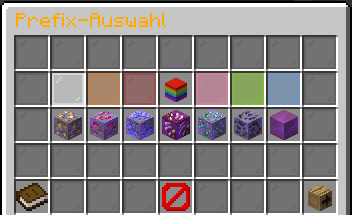
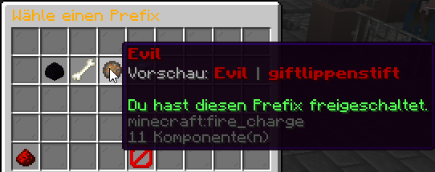
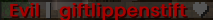
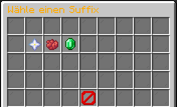
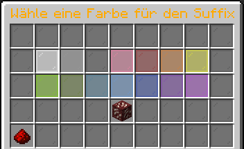
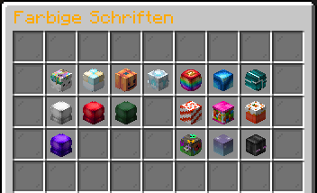

---
layout:
  width: default
  title:
    visible: true
  description:
    visible: true
  tableOfContents:
    visible: true
  outline:
    visible: true
  pagination:
    visible: false
  metadata:
    visible: true
  tags:
    visible: true
  actions:
    visible: true
---

# 🖌️ Prefix, Suffix und Schriften

### Prefix

Mit Prefixen hast du die Möglichkeit deinen Namen in der Tabliste und im Chat anzupassen und ihm so ein neues Aussehen zu verpassen. Das System zur Prefix-Verwaltung kannst du auf unseren Citybuild- & Farmwelt-Servern über den Befehl `/prefix` aufrufen.

<figure><figcaption>
Das Prefix-Menü
</figcaption></figure>

Hierüber erhältst du eine Übersicht über alle verfügbaren und von dir freigeschalteten Prefixe. Mit dem Pfeil in der unteren rechten Ecke, kannst du durch die verschiedenen Seiten blättern. Bewegst du die Maus über einen Prefix erhältst du eine Vorschau des Prefix mit deinem Rang & Namen, sowie die Anzeige, ob du den Prefix bereits besitzt.\
\
Mit einem Klick auf den Prefix kannst du diesen aktivieren und wenige Sekunden später ändert sich der Prefix in der Tabliste.


Prefixe können in verschiedenen Kisten des [Case-Openings](das-case-opening.md) oder beim [Admin-Shop](das-adventurer-system.md#der-admin-shop) erhalten werden.



Sollte sich die eigene Rangbezeichnung oder Prefix-Farbe nach einem Rangkauf/-upgrade nicht geändert haben, kannst du diese über das Menü auf die Standardeinstellung zurücksetzen (Barriere-Symbol), wodurch du den exklusiven Prefix für den von dir erworbenen Rang erhältst.


#### Custom-Prefix

Mit einem **Custom-Prefix** könnt ihr euren Namen im Chat verändern. Der Prefix wird vor eurem Spielernamen angezeigt. Über den Befehl `/prefix` kommt man in das bekannte Prefix-Menü. Klickt man nun unten links auf das Buch, kommt man in das Menü für den Custom-Prefix

<figure><figcaption></figcaption></figure>


Der Custom-Prefix ist ein rein kosmetischer "Rang", welcher keinen Einfluss auf die gekauften Ränge und die dazugehörigen Rechte hat. Aktuell gibt es unter anderem folgende Custom-Prefixe: Bonze, Rentner, Evil und Goat.

Prefixe können in verschiedenen Kisten des [Case-Openings](das-case-opening.md) erhalten werden.


### Suffix

Mit einem **Suffix** könnt ihr euren Namen im Chat um ein Symbol hinter eurem In-Game Namen erweitern.  Nutzt man sowohl einen Custom-Prefix als auch einen Suffix gemeinsam, könnte das so aussehen:

<figure><figcaption></figcaption></figure>

Über den Befehl `/suffix` kommt man in das Suffix-Menü. Hier gibt es die Möglichkeit unter den verschiedenen Suffixen zu entscheiden.&#x20;

<figure><figcaption></figcaption></figure>

Sobald man sich für einen Suffix entschieden und darauf geklickt hat, öffnet sich ein neues Fenster.    In diesem kann man sich für eine passende Suffix-Farbe entscheiden.

<figure><figcaption></figcaption></figure>


Suffixe können in verschiedenen Kisten des [Case-Openings](das-case-opening.md) erhalten werden. Die Suffix-Farben erhält man unter anderem über den Tauscher, welcher mit Einsatz von [Swap-Tokens](https://wiki.griefergames.net/grundlagen/waehrungen#swap-token) begehrte oder zum Teil auch exklusive Items verkauft.


### Schrift

Mit dem Befehl `/schrift` kannst du deine **freigeschalteten Schriften** verwalten und eine davon für den Chat auswählen.&#x20;

<figure><figcaption></figcaption></figure>

Nach dem Öffnen des Menüs kannst du aus deinen verfügbaren Schriften auswählen. Die ausgewählte Schrift wird anschließend für deine Chatnachrichten verwendet.


Schriften sind ein eigenständiges Feature und nicht mit den normalen Chat-Farbcodes wie `&c` oder `&l` zu verwechseln. Schriften können in verschiedenen Kisten des [Case-Openings](das-case-opening.md) erhalten werden.

