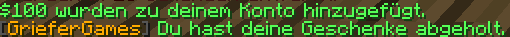

# 📊 Das Vote-System

Du kannst unseren Server kostenlos unterstützen, indem du online für ihn abstimmst.

### Für den Server abstimmen

Einmal pro Tag kannst du für den Server abstimmen. Den Link hierfür kannst du jederzeit über den Befehl `/vote` auf unseren Citybuild-Servern abrufen.

<figure><figcaption>
Chat-Ausgabe über <code>/vote</code>
</figcaption></figure>

Wenn du die [Vote-Seite](https://vote.griefergames.net/) aufrufst, wirst du automatisch auf die Seite unseres Netzwerks bei dem Anbieter minecraft-server.eu verbunden.

Hier kannst du nun, in dem dafür vorgesehenen Feld deinen Spielernamen eingeben.

<figure><figcaption>
Eingabe deines Spielernamen (Minecraft-Account)
</figcaption></figure>


Wenn du den Link aus dem Chat benutzt, kannst du diesen Schritt überspringen. Dein Name wird über den Link automatisch eingetragen.

Du musst nur noch auf den Button "Voten!" drücken.


Nach der Eingabe deines Accounts und dem Klick auf den Button "Voten!" wird deine Stimme verarbeitet. Bitte schließe das Fenster noch nicht, da der Vorgang einige Sekunden dauern kann, bis er abgeschlossen ist.

<figure><figcaption>
Erfolgsmeldung für das Abstimmen.
</figcaption></figure>

Wenn die grüne Erfolgsmeldung kommt, dass du erfolgreich für den Server abgestimmt hast, kannst du das Fenster schließen.


* Du kannst mit jedem Account einmal täglich abstimmen.
* Wenn du für den Server abstimmst, kannst du dir In-Game eine Belohnung abholen.



* Das Vote-System ist auf unserem Citybuild-Server 7 angebunden. Wenn der Server nicht erreicht ist, kann es passieren, dass dein Vote im System nicht sauber registriert wird.


***

### Vote-Belohnungen

<figure><figcaption>
Chat-Ausgabe nach <code>/geschenk</code>
</figcaption></figure>

Wenn du erfolgreich für den Server abgestimmt hast, kannst du dir In-Game eine Belohnung auf dem ebntsprechenden Account abholen. Gib hierfür einfach den Befehl `/geschenk` ein.

Du musst deine Belohnung nicht sofort einlösen. Wir sammeln diese auch für dich. Votest du an 5 Tagen und gibst dann `/geschenk` ein, erhältst du die Belohnung für alle 5 Tage auf einmal.

Pro täglicher Abstimmung erhält dein Account 16 Brote, [$100](../grundlagen/waehrungen.md#griefergames-dollar) und eine [Vote-Kiste](das-case-opening.md#die-vote-kiste).

Wenn du mehrere Tage in Folge abstimmst, erhältst du zudem Zusatz-Belohnungen für deine erreichten Vote-Streak-Ziele. Diese kannst du bis zu insgesamt 3000 Tage lang aufbauen.

| Streak              | Belohnung                          |
| ------------------- | ---------------------------------- |
| 10'er Vote-Streak   | 10.000 Dollar + 1 Vote-Kiste       |
| 25'er Vote-Streak   | 2.5000 Dollar + 3 Epische Kiste    |
| 50'er Vote-Streak   | 50.000 Dollar + 5 Epische Kisten   |
| 100'er Vote-Streak  | 100.000 Dollar + 5 Supreme-Kisten  |
| 250'er Vote-Streak  | 250.000 Dollar + 1.500 Kristalle   |
| 500'er Vote-Streak  | 375.000 Dollar + 1.750 Kristalle   |
| 750'er Vote-Streak  | 500.000 Dollar + 2.000 Kristalle   |
| 1000'er Vote-Streak | 625.000 Dollar + 2.250 Kristalle   |
| 1250'er Vote-Streak | 750.000 Dollar + 2.500 Kristalle   |
| 1500'er Vote-Streak | 825.000 Dollar + 2.750 Kristalle   |
| 1750'er Vote-Streak | 1.000.000 Dollar + 3.000 Kristalle |
| 2000'er Vote-Streak | 1.500.000 Dollar + 3.500 Kristalle |
| 2500'er Vote-Streak | 2.000.000 Dollar + 4.000 Kristalle |
| 3000'er Vote-Streak | 2.500.000 Dollar + 5.000 Kristalle |


Wenn du mehrere Tage in Folge nicht abstimmst wird deine Vote-Streak zurückgesetzt und du startest wieder von vorne.

Mit dem Item "Vote-Streak-Retter" kannst du eine zurückgesetzte Vote-Streak wiederherstellen, wenn du mindestens 1 Tag in Folge abgestimmt hast..



Wenn du am Tag der Streak die Belohnung nicht abholen kannst, versuche es am nächsten Tag erneut. Die Verarbeitung im System kann manchmal einen Tag nicht korrekt zuweisen.


Beim Vote-NPC in der Hauptstadt findest du eine Übersicht über deine aktuelle Vote-Streak, ob du heute bereits abgestimmt hast und ob du Vote-Belohnungen abholen kannst.

<figure><figcaption>
Vote-System bei einer Streak von 1 Vote
</figcaption></figure>

Durch einen Klick auf den goldenen "Vote-Streak"-Kopf erhältst du eine Übersicht über deine Streak und die Belohnungen. Hier kannst du ggf. ausstehende Zusatz-Belohnungen für deine aktive Streak auch direkt abholen.

&#x20;

An diesem Artikel beteiligt

* Zheng\_Aokiji
* 50U7R34P3R

