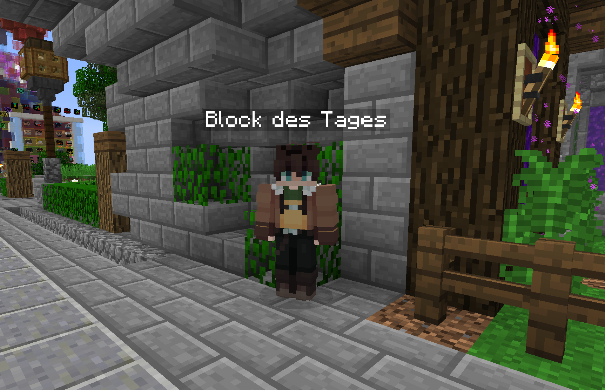
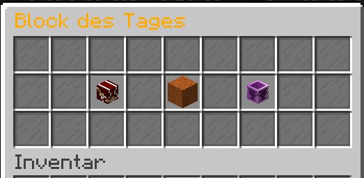

# 🔳 Der Block des Tages

<figure><figcaption>
"Block des Tages"-NPC am Spwangrundstück eines Citybuild-Servers
</figcaption></figure>

Das Ziel dieses zufallsbasierten Systems ist es, eine dauerhafte Beschäftigung für die Community zu bieten, in dem man täglich neue Biome suchen und dort natürlich generierte Blöcke abbauen muss.

### **Welchen Block muss man abbauen?**

Welcher Block am jeweiligen Tag gefordert wird, kann man sehen, wenn man auf den NPC klickt und das "Block des Tages"-Menü öffnet.

<figure><figcaption>
"Block des Tages"-Menü
</figcaption></figure>

**Im Menü sind folgende Buttons:**

* Persönliche Statistik
  * Zeigt die eigenen Ergebnisse im Block des Tages an
* Block des Tages
  * Zeigt den aktuellen Block an, der gefarmt werden muss
* Globales Ranking
  * Zeigt die Ergebnisse aller Spieler im Block des Tages an

### Welche Belohnungen  gibt es?

Es gibt verschiedenste Belohnungen wie etwa [Geld](../grundlagen/waehrungen.md#griefergames-dollar), [Kristalle](../grundlagen/waehrungen.md#kristalle), spezielle Items oder natürlich den Block mit einer besonderen Verzauberung. Jeden Tag wird zufällig festgelegt, welche Belohnung man erhält. Zum Beispiel bekommt man heute Geld, morgen den verzauberten Block und immer so weiter.

***

Solltet ihr gerade nicht im Spiel sein, könnt ihr euch folgende Beiträge in unserem Forum ansehen, in welchen ihr sehr schnell erfahrt, welche Blöcke und Belohnungen heute dran sind.


Block des Tages auf dem 1.8-Netzwerk



Block des Tages auf dem Cloud-Netzwerk



Dieser Artikel ist recht kurz. Er könnte eine Ergänzung vertragen. [Interessiert](../hilfreiche-links/under-construction.md)?


An diesem Artikel beteiligt

* [BentosMentos](https://profile.griefergames.live/minecraft/813d7454-3f9f-449d-9010-b3ee225e56aa)
* [50U7R34P3R](https://profile.griefergames.live/minecraft/8e2ce0be-aa2c-46a7-a2dc-48f948743edf)

