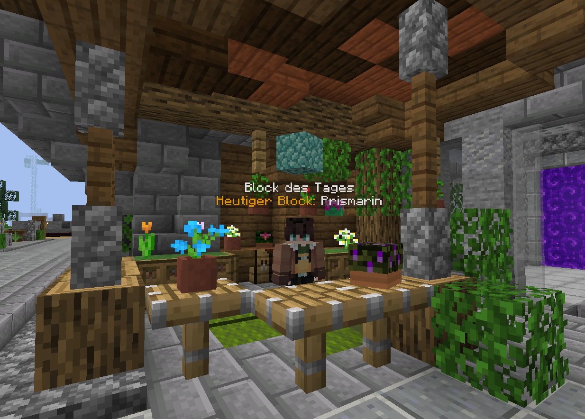

# 🔳 Der Block des Tages

<figure><figcaption>
"Block des Tages"-NPC am Spawngrundstück eines Citybuild-Servers
</figcaption></figure>

Das Ziel dieses zufallsbasierten Systems ist es, eine dauerhafte Beschäftigung für die Community zu bieten, in dem man täglich neue Biome suchen und dort natürlich generierte Blöcke abbauen muss.

### **Welchen Block muss man abbauen?**

Welcher Block am jeweiligen Tag gefordert wird, kann man entweder über dem Kopf des NPCs sehen, wenn man auf den NPC klickt und das "Block des Tages"-Menü öffnet.

<figure><figcaption>
"Block des Tages"-Menü
</figcaption></figure>

**Im Menü sind folgende Buttons:**

* Persönliche Statistik
  * Zeigt die eigenen Ergebnisse im Block des Tages an
* Block des Tages
  * Zeigt den aktuellen Block an, der gefarmt werden muss
* Globales Ranking
  * Zeigt die Ergebnisse aller Spieler im Block des Tages an

### Welche Belohnungen gibt es?

Beim Abbau **natürlich generierter Blöcke** in der Farmwelt wird, sofern man das tägliche Belohnungslimit noch nicht ausgereizt hat, mit einer festgelegten Wahrscheinlichkeit die Belohnung ausgegeben.&#x20;

* Die Wahrscheinlichkeit ist abhängig vom Block und der Art der Belohnung.&#x20;
* Die Wahrscheinlichkeit wird nicht von anderen Faktoren wie Rang oder Anzahl der bereits abgeholten Belohnungen bzw. abgebauten Blöcke beeinflusst.
* Die Wahrscheinlichkeit wird bei jedem einzelnen Blockabbau neu angewendet. Sie kann also in schneller Folge hintereinander oder erst nach langer Zeit zutreffen.

Es gibt verschiedenste Belohnungen wie etwa [Geld](../grundlagen/waehrungen.md#griefergames-dollar), [Kristalle](../grundlagen/waehrungen.md#kristalle), spezielle Items oder natürlich den Block mit einer besonderen Verzauberung. Jeden Tag wird zufällig festgelegt, welche Art von Belohnung man erhält. Zum Beispiel bekommt man heute Geld, morgen den verzauberten Block und so weiter...

Die Menge an Belohnungen pro Tag hängt von der Art der Belohnung ab:

* Verzauberter Block: 2 Mal
* Kristalle: 3 Mal
* Geld: 5 Mal
