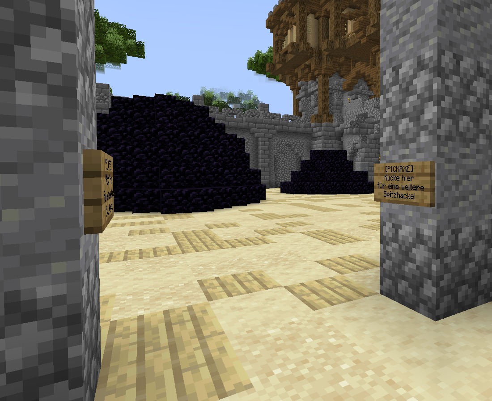

# 🏛️ Die Hauptstadt

### Stadt

Die Stadt ist ein zentraler Ort auf Griefergames, in der du dich mit anderen Spielern treffen kannst. Außerdem findest du hier wichtige Stadtbewohner, die sogenannten NPCs. Die Stadt ist auf allen [Citybuild-Servern](../grundlagen/spielmodus-citybuild/) verfügbar. Du erreichst diese über den Befehl `/warp Stadt`.

Die Stadt (oder Hauptstadt) wird mit der Entwicklung neuer Features stetig erweitert und ausgebaut.

<figure><figcaption>
 Der Spawn der Stadt
</figcaption></figure>

Erreichst du die Stadt über den Warp-Befehl landest du am Hauptplatz der Stadt. Von hier aus siehst du bereits einige der Bewohner. Schauen wir doch einmal, wen wir hier alles antreffen:

### Orb-Händler, Orb-Verkäufer, Orb-Statistik und Lotterie

<figure><figcaption>
Orb-Händler und Orb-Verkäufer am Hauptplatz der Hauptstadt
</figcaption></figure>

Diese ersten beiden NPC's sind der Kernpunkt des [Orb-System](das-orb-system.md).

* Der Orb-Händler nimmt eure Items entgegen und gibt euch dafür Orbs.
* Der Orb-Verkäufer nimmt eure Orbs entgegen und gibt euch dafür Items.

<figure><figcaption>
Orb-Statistik und Lotterie-NPC an Hauptplatz der Hauptstadt
</figcaption></figure>

* Der Statistik-NPC ist ebenfalls Teil des Orb-System. Hier erhaltet ihr stets die aktuellste Übersicht über die Spieler, welche das System am erfolgreichsten nutzen.
* Der Lotterie-NPC ist Teil der Lotterie. Ihr könnt hier Spielscheine erwerben und an der wöchentlichen Spielrunde teilnehmen. Vielleicht erwartet euch ja der nächste große Jackpot?

### Adventurer & Admin-Shop

<figure><figcaption>
Adventurer-NPC und Admin-Shop am Hauptplatz der Hauptstadt
</figcaption></figure>

Am Hauptplatz haben auch der Adventurer-NPC und der Admin-Shop-NPC ihren Stand eingerichtet. Sie sind Bestandteil des [Adventure-System](das-adventurer-system.md).

* Beim Adventurer-NPC kannst du für das Erfüllen von Aufträgen Adventure-Coins erhalten.
* Beim Admin-Shop kannst du deine Adventure-Coins gegen regelmäßig wechselnde Angebote eintauschen.

### Der Vote-NPC

<figure><figcaption>
Der Vote-NPC am Hauptplatz der Hauptstadt
</figcaption></figure>

Der Vote-NPC ist Bestandteil des [Vote-System](das-vote-system.md) und gibt euch die Übersicht über eure aktuelle Vote-Streak, ob ihr bereits abgestimmt habt und ob ihr [Vote-Belohnungen](das-vote-system.md#vote-belohnungen) abholen könnt.&#x20;

### Der Bürgermeister

<figure><figcaption>
Der Bürgermeister am Hauptplatz der Hauptstadt
</figcaption></figure>

Am Hauptplatz der Hauptstadt findet sich auch der Bürgermeister. Hier könnt ihr euren Haupt-Citybuild einstellen bzw. wechseln und euren Bürgerausweis (Karte) erhalten bzw. aktualisieren.


Ihr müsst Bürger eines Citybuilds sein, um für einen [Helfer](das-helfer-system.md) abzustimmen oder euch selbst als Helfer zur Wahl zu stellen.


Neben dem Bürgermeister ist eine Anzeige zum nächsten Farmwelt-Reset.

### Rand-Schmied

<figure><figcaption>
Der Rand-Schmied im Inneren des Hauptgebäude der Hauptstadt
</figcaption></figure>

Beim [Rand-Schmied](../grundlagen/grundstuecke/grundstuecke-veraendern.md#rand-schmied) könnt ihr eure eigenen Rand-Effekte für euer Grundstück erstellen. Hierbei gelten bestimmte Beschränkungen für die Auswahl an Items und wie viele Items ihr verwenden könnt.

### Der Jobs-NPC

<figure><figcaption>
Der Jobs-NPC am Hauptplatz der Hauptstadt
</figcaption></figure>

Bei diesem NPC könnt ihr über das [Job-System](das-job-system.md) Farm-Aufträge für andere Spieler einstellen, eure beauftragten Items abholen oder das Geld für abgebrochene Aufträge zurück erhalten.\
Das Menü des NPC ist auch über den Befehl `/jobs` aufrufbar.

***

### Das Gefängnis

Das Gefängnis oder auch Jail genannt ist eine weitere Möglichkeit zur Bestrafung auf GrieferGames. Der Unterschied zu einem Mute oder einem Bann ist, dass die bestrafte Person weiterhin auf dem Netzwerk aktiv sein kann, die Strafe jedoch **aktiv abarbeiten** muss, ohne eine Möglichkeit, diese einfach durch Warten zu überbrücken.

Das Gefängnis selbst ist ein eigenes Gebäude auf jedem Citybuild-Server. Dort kann man freiwillig, aber auch aufgrund einer Strafe hingelangen.

Spieler, die in das Gefängnis gekommen sind, müssen eine vorgegebene Anzahl an Obsidianblöcken abbauen, um frei zu kommen. Andere Spieler oder Schaulustige haben gleichzeitig die Möglichkeit, die inhaftierte Person von oben zu beobachten und ggf. mit [kreativen Mitteln](https://items.griefergames.net/#Orb-Items_%7C_Faules_Ei) das Abbauen zu erschweren.

#### **Wie kommt man in das Gefängnis?**

Als Besucher kommt man mit `/warp Gefängnis` zum Gefängnis. Vom Spawn-Punkt aus kann man sich frei bewegen. Wenn man jedoch ins Gefängnis hineinfällt, ist man selbst drin und muss Blöcke abbauen.

Ihr werdet ihr sofort ins Gefängnis teleportiert, wenn ihr eine Strafe bekommen habt oder reinfallt. \
Verlasst ihr den Server, landet ihr immer, wenn ihr einen [Citybuild-Server](../grundlagen/spielmodus-citybuild/) betretet, im Gefängnis. Dies passiert so lange, bis ihr die erforderliche Anzahl an Blöcken abgebaut habt.

Spieler können mit `/startjail` eine Abstimmung starten, um einen anderen Spieler ins Gefängnis zu schicken. Welche Gründe für eine solche Abstimmung zulässig sind, ist im [Regelwerk](https://griefergames.cloud/regelwerk) festgelegt. Für eine StartJail-Abstimmung wird zunächst ein Token benötigt. Dieser kann mit `/startjail buy`  erworben werden.


Nach einer StartJail-Abstimmung hat der Ersteller einen Cooldown von **drei Stunden**, bevor er erneut eine Abstimmung starten kann. Community-Strafen werden in der Regel nicht vom Team aufgehoben.&#x20;


Auch das Team kann Spieler aufgrund von Regelverstößen mit einer Gefängnisstrafe bestrafen. Art und Dauer der Strafe hängen vom jeweiligen Vergehen ab. Mit jeder gleichen Strafe verdoppelt sich die Anzahl der abzubauenden Blöcke. Hat man mit der ersten Strafe z.B. 20 Blöcke abzubauen, bekommt man bei der zweiten Strafe automatisch 40 Blöcke welche man abbauen muss.

#### **Wie kommt man aus dem Gefängnis heraus?**

Besucher können das Gefängnis mit allen Befehlen verlassen, die eine Teleportation beinhalten. Beispielsweise durch den Einsatz von z.B. `/p h` , `/warp` oder `/home`.

Ein Gefangener kann nur aus dem Gefängnis entkommen, indem er die vorgeschriebene Anzahl an Obsidianblöcken abbaut. \
Mit einer ["Gefängnis-Frei-Karte"](https://items.griefergames.net/#Gef%C3%A4ngnis-Frei-Karte) kann man Strafen der Community aufheben und das Gefängnis verlassen.&#x20;

<figure><figcaption></figcaption></figure>

Strafen, welche durch Teammitglieder ausgestellt wurden, können nicht mit dieser Karte aufgehoben werden. Einen Antrag auf Strafaufhebung, kann man über das Ticket-System im [Web](https://ticket.griefergames.de/) oder auf dem [Discord](https://discord.com/channels/325017098592059392/1022387246873198643) stellen.

#### Besucher

Besucher haben die Möglichkeit, den Spielern im Gefängnis den Abbau der Obsidianblöcke zu erschweren. Das geht beispielsweise durch Eier- oder Schneeballbeschuss. Passende [Eier](https://items.griefergames.net/#Orb-Items_%7C_Faules_Ei) können beim Orb-Verkäufer in der Stadt (`/warp stadt`) erworben werden. \
Das Behindern von Inhaftierten ist allerdings **auch** ein zulässiger Grund, um durch eine [Community-Abstimmung](die-hauptstadt.md#strafen) in das Gefängnis gesperrt zu werden.


**Vorsicht!** Springt oder fällt man als Besucher in das Gefängnis, wertet das System dies als Versuch zur Ausbruchshilfe und man muss selber ein paar Obsidianblöcke abbauen.


#### **Wie baue ich die Obsidianblöcke im Gefängnis ab?**

Um die Obsidianblöcke abzubauen, bekommt man beim Betreten vom Gefängnis automatisch eine Gold-Spitzhacke in das Inventar. Jedes ander Werkzeug hat in dem Gefängnisbereich **keine** Wirkung. In welchem Zustand die Gold-Spitzhacke ist, ist egal. Verzauberungen funktionieren jedoch nicht. Die Gold-Spitzhacke verliert keine Haltbarkeit und ist dementsprechend unendlich nutzbar.

<figure><figcaption></figcaption></figure>

Ist das Inventar voll oder geht die Spitzhacke anderweitig verloren, kann jederzeit eine neue an den Schildern am Eingang geholt werden. Kommt man frei, behält man die Spitzhacke im Inventar.
