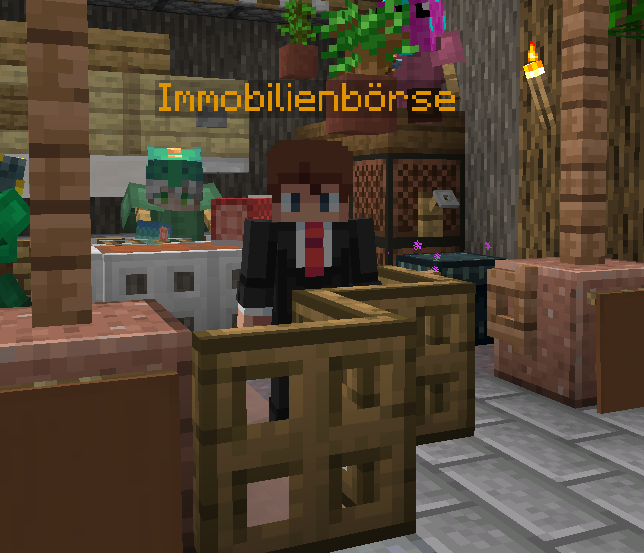
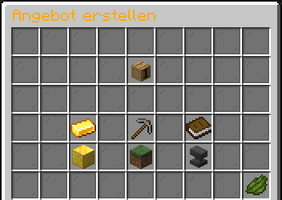

# 🏘️ Die Immobilienbörse

Die **Immobilienbörse** ermöglicht es euch, Grundstücke zum Verkauf anzubieten oder nach Grundstücken anderer Spieler zu suchen.

Ihr findet die Immobilienbörse **am Spawn.**

<figure><figcaption></figcaption></figure>

### Grundstück inserieren

Du kannst deine Grundstücke an der Immobilienbörse zum Verkauf anbieten. Für jedes Inserat gibt es die Möglichkeit, bis zu **drei Tags** auswählen. Dadurch können andere Spieler gezielt nach passenden Grundstücken suchen - zum Beispiel nach **Farmen**.

<figure><figcaption></figcaption></figure>


Im Menü "Angebot erstellen" Aktuell könnt ihr bis zu **fünf Grundstücke gleichzeitig** inserieren.


### Grundstücke kaufen

Du hast in der Übersicht ein Grundstück gefunden, was dich interessiert? Dann ist jetzt der Zeitpunkt, um das Grundstück etwas genauer anzuschauen. Dazu kannst du einfach auf das jeweilige Angebot klicken und wirst automatisch zum Grundstück teleportiert.\
\
Da der Spieler, welcher das Grundstück anbietet, immer im Inserat steht, kannst du ihn im Chat kontaktieren. Manchmal findest du in der Beschreibung allerdings auch die Information, wie der Spieler auf Discord heißt, damit du ihn dort für z.B. eine Preisverhandlung oder auch die Absprache zum Kauf kontaktieren kannst.
