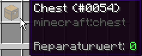

# 🎫 Der GrieferPass

Der Grieferpass ist ein aufgabenbasiertes Belohnungssystem. Innerhalb eines festen Zeitraums, der sogenannten [Season](grieferpass.md#die-season), gibt es verschiedene tägliche und wöchentliche [Aufgaben](grieferpass.md#pass-aufgaben-1), durch dessen Erfüllung man [Pass-XP](grieferpass.md#die-xp-bar) sammeln und somit im Level aufsteigen und weitere Belohnungen freischalten kann.

Es gibt sowohl Free-Belohnungen, also [Belohnungen](grieferpass.md#pass-belohnungen-1), die jeder erspielen kann, als auch einen gekauften [Grieferpass](grieferpass.md#grieferpass-kaufen), wodurch weitere Belohnungen freigeschaltet werden können.

Den Pass öffnet man mit den Befehlen `/pass`, `/grieferpass` oder `/battlepass`.

## Die Season

Eine Season läuft in der Regel 4 Monate. In dieser Zeit hat man die Möglichkeit, durch diverse [Aufgaben](grieferpass.md#pass-aufgaben-1) das maximale Level 100 zu erreichen, um alle Belohnungen zu erspielen.

Battlepass - Übersicht\

<figure><figcaption></figcaption></figure>

Auf der Übersichtsseite findest du folgende Menüpunkte:

### Die XP Bar 

<figure><figcaption></figcaption></figure>

Ganz oben findest du deine aktuellen XP.&#x20;

Diese Leiste füllt sich von rot zu grün, bis das nächste Level erreicht wurde. Ganz rechts auf dem Erfahrungsfläschchen findest du Informationen über dein aktuelles Level, deine aktuellen XP und wieviel XP du noch benötigst, um das nächste Level zu erreichen.&#x20;

<figure><figcaption></figcaption></figure>

### Pass Aufgaben

<figure><figcaption></figcaption></figure>

Hier kommst du zu den [Aufgaben](grieferpass.md#pass-aufgaben-1), die der Pass für dich bereithält.

### Pass Belohnungen

<figure><figcaption></figcaption></figure>

&#x20;Hier kannst du deine erspielten [Belohnungen](grieferpass.md#pass-belohnungen-1) abholen.

### Grieferpass kaufen

<figure><figcaption></figcaption></figure>

Hier hast du die Möglichkeit dir den Grieferpass und dessen zusätzliche Belohnungen freizuschalten.

Dies kostet aktuell [1000 Kristalle](../grundlagen/waehrungen.md#kristalle), es wird jedoch garantiert, dass man bei Erreichen der maximalen [100 Level](grieferpass.md#die-xp-bar) im Pass auch immer mindestens diese 1000 Kristalle aus den Free- und Grieferpass-Belohnungen zurückbekommt.&#x20;


Ein gekaufter Grieferpass gilt immer nur für die aktuelle Season. In der nächsten Season ist wieder nur der Free-Pass zugänglich.


### Aktuelle Season

<figure><figcaption></figcaption></figure>

Hier findest du Informationen dazu, welche [Season](grieferpass.md#die-season) gerade läuft, sowie seit wann sie läuft und wie lange man noch die Möglichkeit hat, diese zu spielen.

## Pass Aufgaben

<figure><figcaption></figcaption></figure>

Wir unterscheiden hier zwischen [Weekly](grieferpass.md#weekly-aufgaben) und [Daily](grieferpass.md#daily-aufgaben) Aufgaben.

### Weekly Aufgaben

<figure><figcaption></figcaption></figure>

Diese bringen die meisten XP. Hinter jedem Buch finden sich eine Reihe unterschiedlicher Aufgaben. Diese werden zufallsbasiert generiert und es werden jede Woche neue Aufgaben freigeschaltet, die ab freischalten der Woche absolviert werden können.

Hier ein paar Beispiele wie diese für Aufgaben aussehen könnten:

* Laufe X Blöcke
* Töte X Lohen&#x20;
* Erhalte X Effekte
* Esse X goldene Äpfel
* ... uvm.

Ist eine Woche komplett abgeschlossen, wird diese Woche als verzaubertes Buch .png>) dargestellt und somit als "erledigt" markiert.

Alle Weekly Aufgaben können auch noch bis zum Ende der aktuellen [Season](grieferpass.md#die-season) gemacht werden und müssen **nicht** bis zum Ende der Woche abgeschlossen sein.

Wenn du mit dem Mauszeiger über eine Aufgabe fährst, siehst du dort folgende Informationen:

* Was ist die Aufgabe?
* Wie ist dein aktueller Fortschritt?
* Ist die Aufgabe erledigt oder nicht?
* Wieviel XP gibt dir diese Aufgabe?

<figure><figcaption></figcaption></figure>

### Daily Aufgaben

<figure><figcaption></figcaption></figure>

Unterhalb der Weekly Aufgaben finden sich Daily, also zu deutsch tägliche neue Aufgaben.

Hier wird noch einmal unterschieden in **täglich immer vorhandene** und **täglich rotierende Aufgaben**.

#### Täglich immer vorhandene:

<figure><figcaption></figcaption></figure>

Diese Aufgaben sind **jeden Tag** dieselben und können auch **mehrfach** an einem Tag absolviert werden. Prinzipiell sind diese als kleiner Bonus gedacht, für jene, die eine dieser Aufgaben sowieso erledigen würden und geben auch entsprechend sehr wenig XP. Für das Erreichen von Level 100 sind diese Aufgaben **nicht** nötig!

Auf dem Item findet man neben der Aufgabe selbst, dem Fortschritt und der XP, auch den Punkt "Abgeschlossen:". Hat man die Aufgabe erfüllt, resettet sich der Fortschritt wieder auf 0 und der Counter bei Abgeschlossen geht hoch. Hat man wie im Screenshot hier die Aufgabe 3x erfüllt, kann diese Aufgabe erst am nächsten Tag erneut gespielt werden.

<figure><figcaption></figcaption></figure>

#### Täglich rotierende:

<figure><figcaption></figcaption></figure>

Hier werden Aufgaben ebenso wie bei den [Weekly Aufgaben](grieferpass.md#weekly-aufgaben) täglich zufallsbasiert generiert. Dies können 2 - 4 verschiedene Aufgaben sein. Da es sich um tägliche Aufgaben handelt, die nicht über einen längeren Zeitraum absolvierbar sind, natürlich dementsprechend kleiner gehalten als bei den Weekly Aufgaben.

Gibt es bei der Weekly Aufgabe bspw. "Töte 170 Lohen" wären dies bei den Daily Aufgaben bspw. nur 10-20 Lohen.

Hat man eine Aufgabe nicht erfüllt, ist diese am nächsten Tag nicht mehr absolvierbar und es kommen neue Aufgaben.


Auch hier ist es nicht nötig, alle[ täglichen Aufgaben](https://docs.google.com/document/d/1kSbhywU9oGFeylHKv4nf1uaSU0KHoAamtb-Ru57nX2w/edit?tab=t.0#heading=h.ebk7cimqzi6f) zu absolvieren, um Level 100 zu erreichen.&#x20;

Aber es ist ebenso nicht möglich komplett ohne diese das maximale Level zu erreichen!


### Reihenfolge der Erledigung

Da gewisse [Aufgaben](grieferpass.md#pass-aufgaben) sowohl wiederholt in unterschiedlichen Wochen vorkommen können als auch bei den [täglichen Aufgaben](grieferpass.md#daily-aufgaben), gibt es hier eine bestimmte Reihenfolge, wie diese systematisch erledigt werden.

Am einfachsten zu verstehen anhand eines Beispiels:

Du hast von der Aufgabe "Töte X Lohen" folgende Aufgaben offen:

* Woche 1 - Töte 170 Lohen
* Woche 7 - Töte 154 Lohen
* Daily - Töte 13 Lohen&#x20;

Tötest du nun Lohen, werden diese zuerst bei der Daily Aufgabe angerechnet, anschließend bei Woche 1, erst zum Schluss bei Woche 7.


Die Reihenfolge ist also Daily vor Weekly; bei Weekly älteste Aufgabe vor neuester Aufgabe.


## Pass Belohnungen

<figure><figcaption></figcaption></figure>

Dieses Menü ist in 2 Teile unterteilt. Oben findest du die Free-Belohnungen, unten die Grieferpass-Belohnungen, also jene, die mit dem [gekauften Grieferpass](grieferpass.md#grieferpass-kaufen) erspielt werden können.

Diese Belohnungen können [Kristalle](../grundlagen/waehrungen.md#kristalle), [InGame-Geld](../grundlagen/waehrungen.md#griefergames-dollar) oder diverse [Items](https://items.griefergames.net/) (auch Admin-Items) sein, wobei die Grieferpass-Belohnungen natürlich entsprechend auch bessere Belohnungen bereithält als der Free-Pass.

Fährt man mit der Maus über ein Item, findet man folgende Informationen:

* Welches Item ist es?
* Ist die Belohnung verfügbar oder bereits abgeholt?

<figure><figcaption></figcaption></figure>

In der Mitte zwischen den Free- und Grieferpass-Belohnungen befinden sich Glasflaschen, welche die Level darstellen, die benötigt werden, um die Belohnung darüber bzw. darunter freizuschalten.

Hat man ein Level erreicht, wird die Glasflasche zu einer XP Flasche, wodurch optisch leicht erkennbar ist, ob die Belohnung bereits verfügbar ist oder noch nicht freigeschaltet wurde.

<figure><figcaption></figcaption></figure>

Da ein Stack in Minecraft nicht mehr als 64 haben kann, sind höhere Level ebenfalls mit "64" markiert, geht man mit der Maus jedoch über die XP Flasche, ist in der Itembeschreibung das entsprechende Level jedoch abzulesen.\

<figure><figcaption></figcaption></figure>

Weiter unten befinden sich noch die Papiere, durch welche auf die nächste/vorherige Seite der Belohnungen geblättert werden kann.


Alle erspielten Belohnungen müssen bis zum [Ende der Season](grieferpass.md#aktuelle-saison) abgeholt worden sein.&#x20;

Startet die [nächste Season](grieferpass.md#die-season), ist ein nachträgliches Abholen **nicht** mehr möglich!


An diesem Artikel beteiligt

* [phanTom84\_](https://profile.griefergames.live/minecraft/f856eab9-1212-4d79-9558-e3b3f829a4f3)

