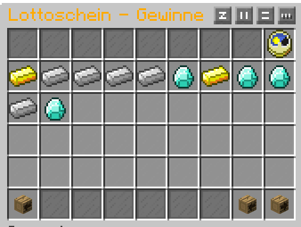
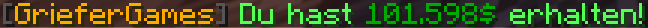
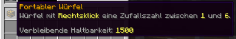
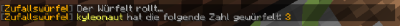

# 🎰 Zufallsbasierte Mechaniken

Auf GrieferGames gibt es verschiedene Situationen, in denen das Ergebnis unklar ist und nicht von euren Fähigkeiten, sondern von eurem Glück abhängt.

### CaseOpening

Das CaseOpening ist ein zufallsbasiertes Kistensystem, bei welchem bei jedem Öffnen aus einer größeren Auswahl an Items eine zufällige "Vorauswahl" getroffen wird und du anschließend aus den ausgewählten Items eines als Gewinn erhältst.&#x20;

Unterschiedliche Kistenarten enthalten unterschiedliche Item-Pools.  Die Vorauswahl wird bei jeder Runde neu erstellt.&#x20;

Mehr Informationen zum CaseOpening findet ihr im Artikel: [Das Case-Opening](das-case-opening.md)

### Lotterie

Die Lotterie befindet sich in der Hauptstadt und bietet euch bei wöchentlichen Ziehungen die Möglichkeit den Jackpot zu knacken.

Hierfür könnt ihr bei dem Lotterie-NPC Lottoscheine erwerben und ausfüllen, welche bei der nächsten Ziehung ausgewertet werden. Diese Lottoscheine sind in 3 Klassen aufgeteilt:

**Silber-Klasse**:

* Basis-Jackpot: 1.000.000 Dollar
* Preis pro Lottoschein: 1.000 Dollar
* Anzahl Kreuze pro Lottoschein: 4

**Gold-Klasse**:

* Basis-Jackpot: 5.000.000 Dollar
* Preis pro Lottoschein: 2.000 Dollar
* Anzahl Kreuze pro Lottoschein: 5

**Diamant-Klasse**:

* Basis-Jackpot: 10.000.000 Dollar
* Preis pro Lottoschein: 3.000 Dollar
* Anzahl Kreuze pro Lottoschein: 6

Der Jackpot erhöht sich in allen Klassen mit jedem gekauften Lottoschein um 25 % des Lottoscheinpreises.


Die Formel für den finalen Jackpot lautet also <kbd>Finaler Jackpot = Basis-Jackpot + (Anzahl Lottoschein-Verkäufe der Klasse \* (Preis pro Lottoschein der Klasse \* 0,25)</kbd>_._&#x20;

Somit wäre z. B. in der Gold-Klasse der Jackpot mit 500 verkauften Lottoscheinen bei 5.250.000 Dollar.


Wenn ihr einen Lottoschein erwerben wollt, könnt ihr je nach Klasse 4 - 6 Kreuze setzen. Nach der Kaufbestätigung können diese Zahlen nicht mehr verändert werden. Eure erworbenen Lottoscheine könnt ihr jederzeit mit euren angekreuzten Zahlen unter „Aktuelle Ziehung“ einsehen.

<figure><figcaption>
» <em>Farmst du noch oder gambelst du schon?</em> «
</figcaption></figure>

Einmal pro Woche werden die Lottozahlen automatisch gezogen. Den genauen Zeitpunkt könnt ihr sehen, wenn ihr mit dem Mauszeiger über die Uhr fahrt.

Euer Gewinn berechnet sich durch die Anzahl an Übereinstimmungen der gezogenen Zahlen mit euren angekreuzten Zahlen.

Haben mehrere Personen die gleiche Anzahl an richtigen Zahlen in einer Klasse, wird der Gewinn aufgeteilt. Hat kein Spieler einer Klasse z. B. drei richtige Kreuzen gemacht wird der Gewinn auf die nächsthöheren Gewinner, in dem Fall auf die Personen mit vier richtigen Kreuzen, hinzuaddiert. Gibt es niemanden, auf den das Preisgeld weiterverteilt werden kann, verfällt der Gewinn.

Ihr habt ab dem Zeitpunkt der Ziehung eine Woche Zeit, eure Gewinne manuell unter „Letzte Ziehung“ über den Geldsack abzuholen. Nach dem Zeitraum könnt ihr eure alten Lottoscheine nicht mehr einsehen und eure Gewinne werden automatisch eingelöst.

<figure><figcaption>
» <em>400 Euro in der Lotterie gewonnen! Jetzt halbwegs normal weiterleben, damit die Nachbarn nichts merken.</em> «
</figcaption></figure>

### Coinflip

Zu speziellen Events und Aktionen wird das Feature "Coinflip" freigeschaltet.&#x20;

Über den Befehl `/coinflip <Betrag>` kannst du als Spieler um einen selbst festgelegten Betrag wetten. Die Maximalgrenze pro Vorgang sind dabei 100 Millionen. \
Du spielst ausschließlich gegen das System und hast die Möglichkeit deinen Einsatz komplett zu verlieren oder zu verdoppeln. Der Münzwurf wird vom System automatisiert ausgeführt.


Wie bei einer klassischen Münze ist die Chance aus Gewinn nicht 50/50, sondern leicht abweichend. (Materialabnutzung, Ungleichgewicht, Wurf auf Kante, etc.).

Diese Abweichung resultiert in einem leichtem "Vorteil" für das System. Die genaue Rate wird von der Administration vor dem Event festgelegt und nicht offiziell preisgegeben.

Münzwerfen kann zum Verlust deines Vermögens führen!&#x20;


Die Statistik zum aktuell laufenden Münzwurf-Event kannst du über den Befehl `/coinflip status` für deine eigene Übersicht oder `/coinflip bank` für eine gesamte Übersicht anzeigen lassen.

### Würfel

Wann immer man einen [Würfel](https://items.griefergames.net/#Portabler_W%C3%BCrfel) braucht, hier ist er:

<figure><figcaption></figcaption></figure>

Ein Rechtsklick genügt, um den Würfel rollen zu lassen. Nach kurzer Zeit erscheint dann eine Nachricht für alle Spieler auf dem Grundstück oder nur für dich, wenn du auf der Straße stehst.

<figure><figcaption></figcaption></figure>

Du benötigst **keinen** speziellen Rang, um zu würfeln. \
Solange du den Würfel hast und auf dem Grundstück die [passende Flag](../grundlagen/befehlsuebersicht/grundstuecks-befehle/grundstuecks-flags.md#feature-flags) gesetzt ist **oder** du auf dem Grundstück [Hinzugefügt, Vertraut oder der Besitzer](../grundlagen/befehlsuebersicht/grundstuecks-befehle/grundstuecks-informationen.md) bist.

### Spieler-"Casinos"

Spieler haben die unterschiedlichsten Möglichkeiten gefunden mithilfe der InGame-Mechaniken und -Blöcke Schaltungen zu bauen, welche komplexe Mechanismen antreiben, um zufallsbasierte Ergebnisse zu erzielen.&#x20;

Die einfachsten Zufallssysteme sind Dracheneier, welche beim Abbauversuch zufällig teleportieren und Blumen, welche zufällig wachsen. Auch Werfer können bestückt werden, sodass sie zufällig unterschiedliche Items ausgeben.

Durch den Einsatz von Redstone-Technik und Trichtern, lässt sich das Schaltverhalten und somit auch die Zufallsvarianz von Schaltungen stark anpassen und ganze "Slot-Maschinen" bauen, welche vom Betreiber mit unterschiedlichen Gewinnwahrscheinlichkeiten eingestellt werden können.\
Spieler-Casinos befinden sich überwiegend auf [Citybuild Evil](../grundlagen/spielmodus-citybuild/citybuild-evil.md) und [Citybuild 1](../grundlagen/spielmodus-citybuild/citybuild-1-22.md).

An diesem Artikel beteiligt

* [50U7R34P3R](https://profile.griefergames.live/minecraft/8e2ce0be-aa2c-46a7-a2dc-48f948743edf)

