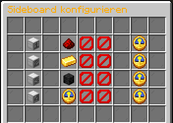

# Individuelles Scoreboard

Mit `/sideboard` könnt ihr euer Scoreboard individuell konfigurieren und selbst festlegen, welche Informationen dort angezeigt werden.

<figure><figcaption></figcaption></figure>

Pro Zeile können bis zu drei verschiedene Informationen hinterlegt werden. Zusätzlich könnt ihr festlegen, in welchem Intervall zwischen den hinterlegten Informationen gewechselt wird.


Addons, die das Scoreboard verändern, können zu Darstellungsfehlern führen. \
Sollte euer Scoreboard nicht korrekt angezeigt werden, deaktiviert das entsprechende Addon vorübergehend oder wartet auf ein Update des Anbieters.

