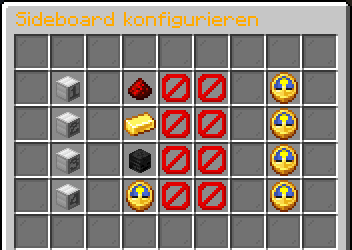

# Individuelles Scoreboard

Mit `/sideboard` könnt ihr euer Scoreboard individuell konfigurieren und selbst festlegen, welche Informationen dort angezeigt werden.

<figure><figcaption></figcaption></figure>

Pro Zeile können bis zu drei verschiedene Informationen hinterlegt werden. Zusätzlich könnt ihr festlegen, in welchem Intervall zwischen den hinterlegten Informationen gewechselt wird.


Addons, die das Scoreboard verändern, können zu Darstellungsfehlern führen.

Sollte euer Scoreboard nicht korrekt angezeigt werden, deaktiviert das entsprechende Addon vorübergehend oder wartet auf ein Update des Anbieters.


## Verfügbare Informationen

* **Server:** der Server, auf dem ihr gerade spielt
* **Kontostand** und **Bankguthaben**
* **Online:** die Anzahl der Spieler auf dem Server
* **Spielzeit:** eure gesamte Spielzeit in Stunden
* **Kristalle**, **Orbs**, **Prestige-Tokens**, **Swap-Tokens** und **Adventurer-Coins** (siehe [Währungen](../../waehrungen.md))
* **Block des Tages:** der aktuelle [Block des Tages](../../features/der-block-des-tages.md) und euer Fortschritt
* **Grundstück:** die ID und der Name oder Besitzer des Grundstücks, auf dem ihr gerade steht
* **Nächster Spieler:** der nächste Spieler in bis zu 200 Blöcken Entfernung mit Abstandsangabe
* **Name:** euer Spielername
* **Reply:** der Spieler, dem ihr mit `/r` antworten würdet
