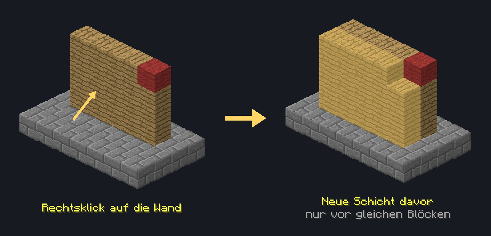

# 🧱 Builders Wand

Mit der **Builders Wand** baust du große Flächen in einem Zug. Ein Rechtsklick setzt vor eine ganze Wand oder einen ganzen Boden eine neue Schicht aus denselben Blöcken.

Die Builders Wand kannst du im [CaseOpening](../features/das-case-opening.md) gewinnen.

## So funktioniert das Item

1. Nimm die Builders Wand in die Hand.
2. Sorge dafür, dass du genug Blöcke derselben Art im Inventar hast.
3. Mache einen Rechtsklick auf die Seite der Fläche, die wachsen soll.

Die Builders Wand erfasst alle gleichen Blöcke derselben Schicht, die mit dem angeklickten Block verbunden sind, und setzt vor jeden davon einen neuen Block. Klickst du seitlich auf eine Wand, wird sie eine Schicht dicker. Klickst du von oben auf einen Boden, wird er eine Schicht höher.

<figure class="wiki-illus"><figcaption>Ein Rechtsklick auf die Holzwand setzt davor eine neue Schicht aus Holz. Vor dem roten Wollblock entsteht kein Block, weil er nicht zur Fläche gehört.</figcaption></figure>

Dabei zählt auch die Variante des Blocks, z. B. die Farbe der Wolle oder die Holzart. Neue Blöcke setzt die Builders Wand nur dort, wo Luft, Wasser oder Lava ist.

Die Builders Wand selbst wird dabei nicht verbraucht. Du kannst sie beliebig oft benutzen.


Auch Stufen kannst du mit der Builders Wand ergänzen. Klickst du von oben auf Stufen in der unteren Blockhälfte, werden daraus doppelte Stufen. Von unten funktioniert das mit Stufen in der oberen Hälfte.


## Blöcke aus deinem Inventar

Für jeden gesetzten Block wird ein passender Block aus deinem Inventar abgezogen. Umbenannte oder verzauberte Blöcke verbraucht die Builders Wand nicht.

Reichen deine Blöcke nicht für die ganze Fläche, setzt die Builders Wand so viele, wie du hast. Im Chat siehst du danach, wie viele Blöcke gesetzt wurden und wie viele nicht.

### Komprimierte Blöcke

Auch [komprimierte Blöcke](../features/die-rezeptsammlung.md#item-komprimierung) bis **Stufe 4** kann die Builders Wand verbauen. Sie verbraucht zuerst deine normalen Blöcke. Danach zieht sie für jeden gesetzten Block ein Item aus dem komprimierten Block ab.


Komprimierte Blöcke müssen einzeln im Inventar liegen. Gestapelte komprimierte Blöcke nutzt die Builders Wand nicht. Einige komprimierte Items wie Truhen oder Redstone-Fackeln kannst du damit nicht setzen.


## Einschränkungen

* Die Builders Wand setzt nur eine begrenzte Anzahl an Blöcken auf einmal. Ist die Fläche größer, setzt sie Blöcke bis zu dieser Grenze. Im Chat steht dann, wie viele Blöcke höchstens möglich sind.
* Blöcke setzt die Builders Wand nur dort, wo du auch sonst bauen darfst, z. B. auf deinem eigenen Grundstück.
