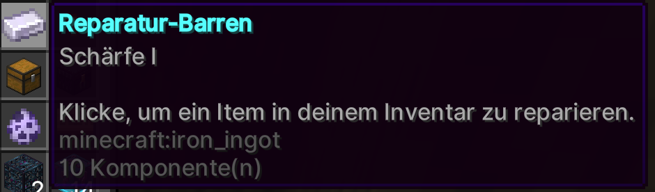

# ⚒️ Reparatur-Barren

## Reparatur-Barren

Im CaseOpening gibt es ein Item namens "Reparatur-Barren". Dieses kann für alle Rüstungen, Werkzeuge, Bögen und Schwerter angewendet werden. Das jeweilige Item wird dadurch vollständig repariert.

Man wählt dort das Item aus, welches repariert werden soll. Der Reparatur-Barren wird dann entsprechend verbraucht und verschwindet. Es gibt keine Einschränkungen zu Verzauberungen, die erhöht werden können. Die einzige Einschränkung ist, dass es nur für alle möglichen Rüstungen, Werkzeuge, Bögen und Schwerter machbar ist. 

<figure><figcaption>Erfolge auf dem 1.8 Netzwerk</figcaption></figure>

Das Item wird dann entsprechend verbraucht und verschwindet. Die benötigten Level zum Reparieren/Umbenennen des Items und die NBT-Tags bleiben dadurch unberührt.
