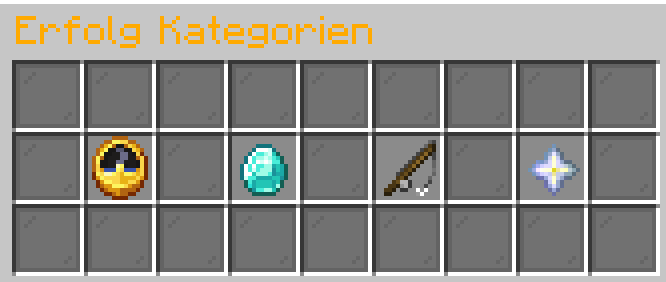

# 💪 Advancements

Jeder Spieler hat in der Standardansicht der Erfolge (*`/advancements`*) **eigene** Erfolge von GrieferGames.

<figure><figcaption>Erfolge auf dem 1.8 Netzwerk</figcaption></figure>

Die Erfolge unterteilen sich aktuell in vier verschiedene Seiten:

- **Routinemissionen**\
Eine Aufgabenreihe mit fortlaufendem Fortschritt.. Zum Beispiel für Adventurer-Aufgaben oder Spielzeit.
- **Allgemeine Aufgaben**\
Eine Aufgabenreihe, die dir den Server näher bringt. Zum Beispiel für Basisfunktionen, wie /p auto.
- **Farming-Aufgaben**\
Eine Aufgabenreihe, bei der du Gegenstände / Missionen in den Farmwelten oder deinem Grundstück erledigen musst. Hier gibt es beispielsweise Erfolge für Dinge, die man beim generellen Spielen erledigt.
- **Events**\
Hier bekommst du spezielle Belohnungen für das Erledigen von Events und bei Release von neuen Funktionen. Zum Beispiel auch für das Erhalten eines Bug-Bountys bei einer kritischen Fehlermeldung.

## Belohnungen

Für die Erfolge gibt es auch Belohnungen. Diese kannst unter `/belohnungen` oder `/rewards` abholen. Die Belohnung steht dauerhaft zur Verfügung, du musst dich also nicht beeilen, diese abzuholen. In dem Menü kannst du auch nach abgeholten und noch nicht abgeholten Belohnungen filtern.
