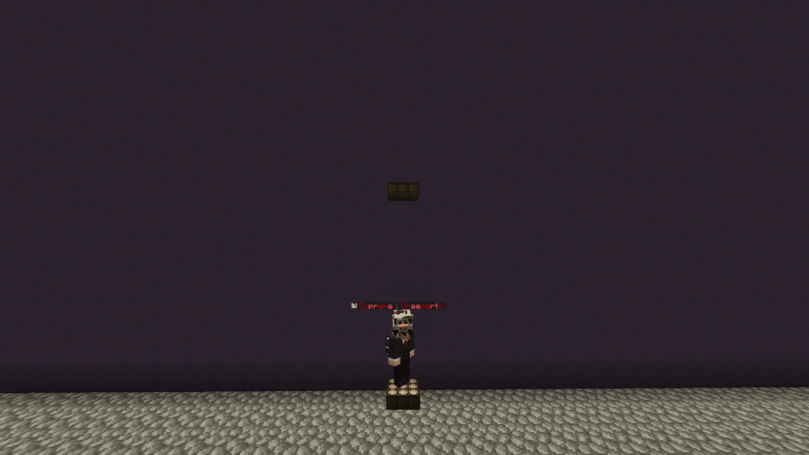
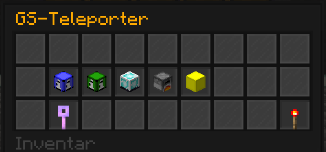
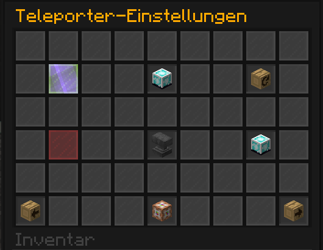

---
layout:
  width: default
  title:
    visible: true
  description:
    visible: true
  tableOfContents:
    visible: true
  outline:
    visible: true
  pagination:
    visible: false
  metadata:
    visible: true
  tags:
    visible: true
  actions:
    visible: true
  anchors:
    visible: true
---

# ↕️ Aufzüge & Teleporter

## Aufzug

Um schnellstmöglich zwischen verschiedenen Höhen zu wechseln, ist ein [Aufzug](http://items.griefergames.net/#Aufzug) sehr praktisch.

Hierfür musst du nur zwei Aufzüge auf zwei unterschiedlichen Höhen an derselben Position (X- & Z-Koordinate) platzieren.

Nun kannst du durch Springen und Schleichen zwischen den verschiedenen Ebenen wechseln.

<figure><figcaption></figcaption></figure>

Aufzüge können Spieler durch solide Blöcke hindurch transportieren. Sie eignen sich somit sowohl zum Wechseln zwischen unterirdischen und überirdischen Bereichen als auch zum Erreichen verschiedener Stockwerke innerhalb von Gebäuden.

## Teleporter

Willst du auch die Position verändern oder sogar Spieler zu einem anderen Plot bringen, so hilft dir hierbei ein [Teleporter](https://items.griefergames.net/#Teleporter).

Diesen platzierst du einfach an einer gewünschten Position. Teleporter eines Spielers (Grundstücksbesitzers) werden automatisch in ein Netzwerk eingebunden. Durch Springen oder Schleichen auf einem Teleporter wird man zum nächsten/vorherigen Teleporter-Punkt dieses Netzwerks transportiert. Ein Spieler kann bis zu 7 Teleporter-Netzwerke aufbauen.

Mit einem Rechtsklick kann das Menü des entsprechenden Teleporters geöffnet werden. Hierüber kann man auch einen beliebigen Teleportpunkt aus dem Netzwerk direkt auswählen.

<figure><figcaption></figcaption></figure>

Als Besitzer kannst du im Menü auch die Teleportpunkte individuell gestalten, z. B. den Namen ändern, den Kopf (Item-Symbol) ändern und du kannst Rechte für den Teleport-Punkt einstellen, damit alle Spieler, nur vertraute Spieler oder Helfer diesen benutzen können.


Die festgelegten Rechte gelten nur lokal – das globale Nutzen von Teleportern ist nur dem Besitzer des Grundstücks möglich.


<figure><figcaption></figcaption></figure>

An diesem Artikel beteiligt

* [Creepertiv](https://profile.griefergames.live/minecraft/6efaa799-f20d-4ac8-b0cc-e3fc1db2caab)
* [50U7R34P3R](https://profile.griefergames.live/minecraft/8e2ce0be-aa2c-46a7-a2dc-48f948743edf)


Dieser Artikel ist recht kurz. Er könnte eine Ergänzung vertragen. [Interessiert](../../allgemein/vorschlaege.md)?

