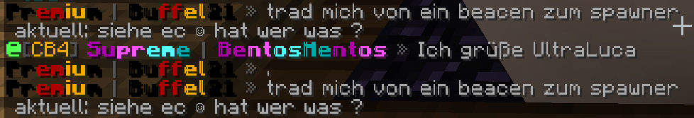
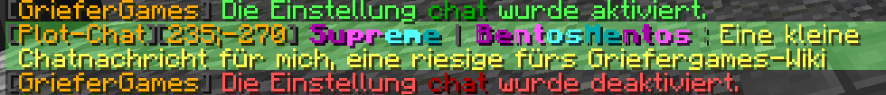
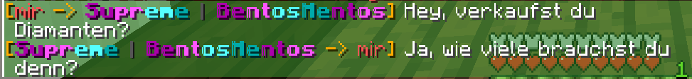
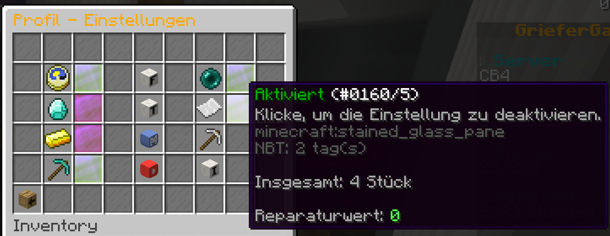

---
layout:
  width: default
  title:
    visible: true
  description:
    visible: true
  tableOfContents:
    visible: true
  outline:
    visible: true
  pagination:
    visible: false
  metadata:
    visible: true
  tags:
    visible: true
  actions:
    visible: true
  anchors:
    visible: true
---

# 💬 Chat-System

Auf dem Server kannst du auf verschiedene Arten mit deinen Mitspielern schreiben.

Eine Übersicht aller Möglichkeiten findest du hier in diesem Artikel.

## Chat-Codes

Im Chat können verschiedene Codes verwendet werden, um Nachrichten farbig darzustellen oder zu formatieren. Dazu wird der jeweilige Code vor den gewünschten Text gesetzt.

Möchtest du zum Beispiel die Nachricht „Ich verkaufe mein Grundstück“ in grüner Farbe schreiben, sieht das vor dem Abschicken so aus:

<figure><figcaption></figcaption></figure>

Eine Übersicht aller Chat-Codes (Farben, Formatierungen) findest du hier:

<table><thead><tr><th>Code</th><th>Farbe / Effekt</th></tr></thead><tbody><tr><td><code>&#x26;0</code></td><td>Schwarz</td></tr><tr><td><code>&#x26;1</code></td><td>Dunkelblau</td></tr><tr><td><code>&#x26;2</code></td><td>Dunkelgrün</td></tr><tr><td><code>&#x26;3</code></td><td>Dunkelcyan</td></tr><tr><td><code>&#x26;4</code></td><td>Dunkelrot</td></tr><tr><td><code>&#x26;5</code></td><td>Dunkellila</td></tr><tr><td><code>&#x26;6</code></td><td>Gold</td></tr><tr><td><code>&#x26;7</code></td><td>Grau</td></tr><tr><td><code>&#x26;8</code></td><td>Dunkelgrau</td></tr><tr><td><code>&#x26;9</code></td><td>Blau</td></tr><tr><td><code>&#x26;a</code></td><td>Grün</td></tr><tr><td><code>&#x26;b</code></td><td>Cyan</td></tr><tr><td><code>&#x26;c</code></td><td>Rot</td></tr><tr><td><code>&#x26;d</code></td><td>Pink</td></tr><tr><td><code>&#x26;e</code></td><td>Gelb</td></tr><tr><td><code>&#x26;f</code></td><td>Weiß</td></tr><tr><td><code>&#x26;k</code></td><td>Zufallstext / Wechselnde Zeichen</td></tr><tr><td><code>&#x26;l</code></td><td>Fett</td></tr><tr><td><code>&#x26;m</code></td><td>Durchgestrichen</td></tr><tr><td><code>&#x26;n</code></td><td>Unterstrichen</td></tr><tr><td><code>&#x26;o</code></td><td>Kursiv</td></tr></tbody></table>

## Öffentlicher Chat

Der öffentliche Chat ist der Chat, in dem du schreibst, wenn du auf einem [Citybuild-Server](../spielmodus-citybuild/) bist. Dieser Chat kann von jedem Spieler auf diesem Citybuild gelesen werden, welcher gerade online ist.

Solltest du also auf einem Citybuild-Server sein, auf welchem nur um die 10 Spieler online sind, so können nur wenige Spieler auf deine Nachrichten antworten, da die Nachrichten nur von wenigen Spielern gelesen werden.

Auf volleren Citybuilds können mehr Spieler deine Nachricht lesen. Hier gibt es dann aber den Nachteil, dass auch mehr Nachrichten in den Chat geschrieben werden und deine Nachricht schneller überlesen werden kann.

## Globaler Chat

Der globale Chat ist eine neue Art des Chats, mit dem du mit Spielern auf anderen Citybuilds schreiben kannst. Hierbei kannst du aber nur mit Spielern schreiben, die in den Chat eingeloggt sind.

Um dich im Globalchat anzumelden, musst du den Befehl `/globalchat login` eingeben. Nun siehst du neben den Nachrichten aus dem öffentlichen Chat auch die Nachrichten von Spielern von anderen Citybuilds.

Diese Nachrichten erkennst du daran, dass vor dem Spielernamen ein @ steht und dahinter der Citybuild in Klammern.

<figure><figcaption>
Nachricht eines Spielers im globalen Chat zwischen Nachrichten im öffentlichen Chat
</figcaption></figure>

Um eine Nachricht in den globalen Chat zu schreiben, kannst du `/globalchat <Nachricht>` verwenden. Wir empfehlen die Verwendung des Kurzbefehls `@<Nachricht>`.


Vergiss nicht, dass du dafür im globalen Chat angemeldet sein musst.


Du kannst unter `/globalchat settings` einstellen, von welchen Citybuilds du keine Nachrichten erhalten möchtest.

Wenn du nun keine Nachrichten aus dem globalen Chat mehr sehen möchtest, kannst du dich mit `/globalchat logout` aus dem globalen Chat abmelden.

## Plot-Chat

Der Grundstückschat (auch _Plot-Chat_ genannt) ist ein Chat, bei welchem nur die Mitspieler auf einem [Grundstück](../grundstuecke/) die geschriebenen Nachrichten lesen und auf diese antworten können.

Hierfür musst du auf einem Grundstück stehen und den Plot-Chat mit `/p chat` aktivieren. Alle von dir darauf folgenden Nachrichten werden nun in den Plot-Chat geschrieben.

Alle Nachrichten aus dem Grundstückschat haben vor dem Spielernamen in Klammern, dass diese aus dem Plot-Chat sind und auf welchem Grundstück (ID) die Nachrichten geschrieben werden.

Um den Plot-Chat wieder zu deaktivieren, musst du denselben Befehl `/p chat` noch einmal eingeben. Hierbei steht dann auch immer im Chat, ob der Plot-Chat aktiviert oder deaktiviert ist.

<figure><figcaption>
Aktivierungsbestätigung, eine Nachricht im Plot-Chat und Deaktivierungsbestätigung
</figcaption></figure>

## Privater Chat

Zum Handeln oder allgemein braucht man gelegentlich die Funktion, mit einem Spieler privat zu schreiben. Dafür gibt es private Nachrichten.

Mit `/msg <Spieler> <Nachricht>` kannst du mit jedem Spieler auf dem Citybuild-Server privat schreiben.

Das heißt, dass nur dieser Spieler die Nachricht sieht. Dieser Spieler kann dir dann auf dieselbe Weise wieder eine Nachricht zurückschreiben.

Mit dem Befehl `/r <Nachricht>` antwortest du der letzten Person, mit welcher du privat geschrieben hast, direkt. In Handelsgesprächen ist dies meist einfacher, da du nicht so einen langen Befehl eintippen musst.


Sollte dich in der Zeit aber ein anderer Spieler anschreiben, da du vielleicht mit zwei Spielern gleichzeitig schreibst, bekommt dieser Spieler die Nachricht, da dieser Spieler die letzte Person ist, welche mit dir privat geschrieben hat.


<figure><figcaption>
Direktnachrichten zwischen 2 Spielern
</figcaption></figure>

Die Nachrichten werden anders angezeigt, je nachdem, ob du die Nachricht versendet hast oder ob du sie erhältst.

Wenn du eine Nachricht sendest, steht dort, dass die Nachricht von dir zu einem Empfänger geht `[mir -> Empfänger]`. Andersrum kommt die Nachricht vom Absender zu dir `[Absender -> mir]`.

Falls du nicht direkt angeschrieben werden willst, kannst du dies im Profil-System `/profil` einstellen. Dies steht allen Accounts zur Verfügung, welche einen Rang haben ([Premium](../befehlsuebersicht/rang-befehle.md) und höher).

Dafür musst du Folgendes machen: `/profil` → Einstellungen → Private Nachrichten → auf die Glasscheibe klicken.

<figure><figcaption>
Einstellungen im Profil-System
</figcaption></figure>

Wenn du Direktnachrichten deaktiviert hast, kannst du zwar nicht angeschrieben werden, aber andere Spieler anschreiben. Diese können dir aber nicht per Direktnachricht antworten.


Die Funktion kann auch mit dem Befehl `/msgtoggle` umgeschaltet werden.


## Clan-Chat

Der **Clan-Chat** ermöglicht es euch, euch innerhalb eures Clans auszutauschen, ohne dass eure Nachrichten im öffentlichen oder auch privaten Chat untergehen oder ihr umständlich über mehrere Ecken kommunizieren müsst.

Den Clan-Chat könnt ihr mit **`/cc`** oder **`/clanchat`** öffnen. Eure Nachrichten werden dabei nur für die Mitglieder eures Clans angezeigt.

## Spieler ausblenden

Wenn dich die Nachrichten eines Spielers stören, kannst du diese auch ausblenden. Dafür gibst du einfach `/ignore <Spieler>` im Chat ein. Nun siehst du keine Chatnachrichten dieses Spielers mehr.

Du siehst jedoch weitere Aktionen des Spielers (bspw. Statusnachricht, Abstimmungen usw.).

Wenn du die Chat-Nachrichten des Spielers wieder sehen willst, gibst du den gleichen Befehl noch einmal ein.

Mit `/ignore` siehst du eine Liste von allen Spielern, welche du ignoriert hast.

## Chat-Sperren

Du kannst nicht im Chat schreiben und erhältst eine Fehlermeldung? Dafür kann es mehrere Gründe geben:

* Der Chat in den Chateinstellungen ist auf „Nur Befehle“ gestellt.
* Dein Account wurde durch ein Teammitglied/einen Spieler mit dem Mute-Perk stummgeschaltet.
* Du befindest dich in der Lobby oder im Portalraum, wo der Chat komplett deaktiviert ist.
* In deiner Nachricht befinden sich ein oder mehrere Wörter, die vom Team verboten wurden und somit auf die Blacklist gesetzt worden sind.
