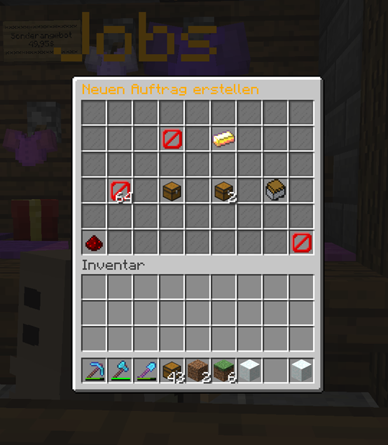
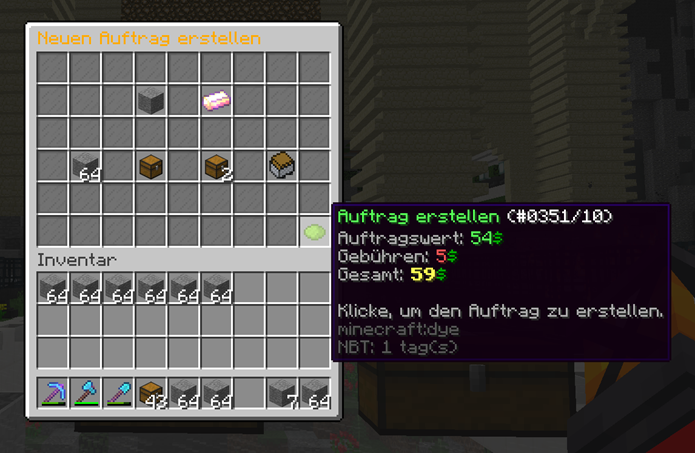
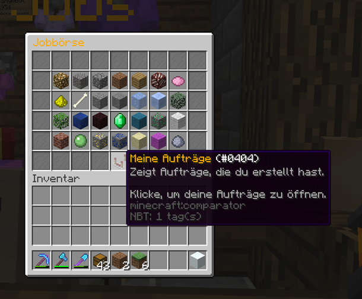
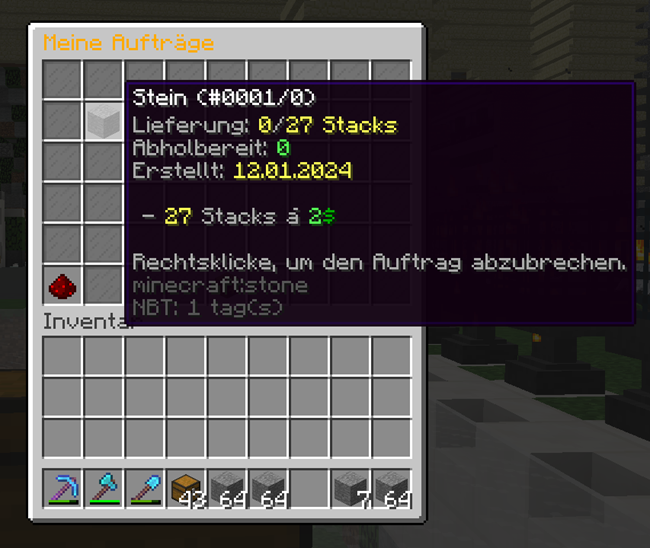

# 🧑‍🏭 Das Job-System

Ihr könnt Aufträge vergeben, damit euch andere Spieler Items erfarmen. Hierbei stellt ihr einen Auftrag ein, welches Item für euch gefarmt werden soll und in welcher Menge.

Das Ganze funktioniert mindestens stackweise (oder in größeren Mengen) und es können nur ausgewählte Materialien gesucht werden. Andere Items lassen sich nicht beauftragen.

### Wie erstelle ich einen Auftrag?

Du benötigst einen bestimmten Materialblock? Dann erstellst du einen Auftrag in diesen Schritten:

1. Job-Menü aufrufen
2. "Meine Aufträge" aufrufen
3. Neuen Auftrag anlegen
4. Auftragsdetails wählen
5. Informationen bestätigen
6. Auftrag freigeben

***

1. Das Job-System lässt sich über einen Job-NPC oder über den Befehl `/jobs` aufrufen. Der Job-NPC ist in der Hauptstadt zu finden.


**Tipp:** Am besten den gesuchten Materialblock bereits im Inventar dabei haben!


2. Es öffnet sich ein GUI mit allen eingestellten Aufträgen von Spielern. Mit dem Button „Meine Aufträge“ (Redstone – Komparator) gelangst du in deine Auftragsliste.

<figure><figcaption>
Der Button "Meine Aufträge" öffnet eure Auftragsliste
</figcaption></figure>

3. In diesem Fenster werden alle Aufträge angezeigt, die du erstellt hast. Hier hast du die Übersicht über deine bestehenden Aufträge und kannst mit dem Button „Neuen Auftrag erstellen“ (grüner Kopf mit „+“) einen neuen Auftrag anlegen.

   **Hinweis:** Abholbereite Items werden mit einem Leucht-Effekt angezeigt.
4. Sobald du auf „Neuen Auftrag erstellen“ klickst, öffnet sich ein weiteres Fenster mit folgenden Buttons:



*   Barriere „Item wählen“

    Hier gibst du an, welches Material du suchst. Dafür musst du diesen Material-Block zumindest einmal im Inventar haben. Klicke in deinem Inventar auf den gesuchten Block; dieser wird automatisch hinterlegt.
*   Goldbarren „Preis pro Stack“

    Sobald du auf den Goldbarren klickst, musst du im Chat eingeben, wie viel du bereit bist, je Stack zu bezahlen.


**Tipp:** Realistische Preise erhöhen eure Chance, dass andere Spieler diesen Block an euch verkaufen.




* **64x Barrieren „Anzahl 1x Stack“**\
  Dies bedeutet, dass ihr einen Stack des gesuchten Materials sucht bzw. kauft.
* **Truhe „Anzahl 1x Kiste“**\
  Dies bedeutet, dass ihr 27 Stacks des gesuchten Materials sucht bzw. kauft.
* **2x Truhe „1x Doppelkiste“**\
  Dies bedeutet, dass ihr 54 Stacks des gesuchten Materials sucht bzw. kauft.
* **Güterlore „Anzahl Stacks“**\
  Dies bedeutet, dass ihr individuell die Anzahl der Stacks des gesuchten Materials im Chat eingeben könnt.



* **Redstone „Abbrechen“**\
  Mit diesem Button brecht ihr den aktuellen Auftrag ab und kehrt in eure Auftragsliste zurück. Der Button ist nicht verfügbar, wenn ihr den Auftrag fertiggestellt habt.
* **Barriere „Unvollständig“**\
  Dieser Button zeigt an, dass Informationen zum Erstellen des Auftrags fehlen.
* **Grüner Farbstoff „Auftrag erstellen“**\
  Dieser Button ist erst verfügbar, wenn alle Informationen zum Auftrag eingegeben wurden. Er ersetzt die Barriere.



<figure><figcaption>
Die Erstellung eines Auftrags erfordert gewisse Informationen.
</figcaption></figure>

5. Rechts unten erscheint ein Button mit grünem Farbstoff, sobald alle Informationen hinterlegt sind.


**Tipp:** Wenn du über den Button fährst, werden dir die Kosten für den Auftrag zzgl. Gebühren angezeigt.


<figure><figcaption>
Der Mouseover des Buttons "Auftrag erstellen" gibt euch eine Übersicht eures Auftrags.
</figcaption></figure>

6. Mit einem Klick auf den Button erstellst du deinen Auftrag. Denke daran, dass du dieses Geld direkt an den NPC bezahlen musst.

### Wie storniere ich einen Auftrag?

Möchtest du einen Auftrag stornieren, gehe wie folgt vor:

1. Rufe das Jobs-Menü über einen Jobs-NPC oder per Befehl `/jobs` auf.
2. Es öffnet sich das GUI mit allen eingestellten Aufträgen von Spielern. Mit dem Knopf (Redstone – Komparator) „Meine Aufträge“ gelangst du in deine Auftragsliste.

<figure><figcaption>
Mit dem Button "Meine Aufträge" öffnest du deine persönliche Auftragsliste.
</figcaption></figure>

3. Hier findest du eine Übersicht deiner Aufträge. Mit einem Rechtsklick auf den jeweiligen Auftrag kannst du diesen stornieren.

<figure><figcaption>
Alle Aufträge, die noch nicht erledigt sind, findest du hier.
</figcaption></figure>

4. Wenn du den Auftrag abbrichst, erhältst du den verbleibenden Betrag für die ausstehende Itemmenge zurückerstattet. Das Geld wird deinem Kontostand automatisch hinzugefügt.


Du erhältst lediglich das Geld für den verbleibenden Itemwert zurück.

Die Auftragsgebühren für das Einstellen des Jobs werden nicht zurückerstattet.


An diesem Artikel beteiligt

* [Zheng\_Aokiji](https://profile.griefergames.live/minecraft/e76216f9-a714-4351-b9d1-fcb54a7d7a23)
* [50U7R34P3R](https://profile.griefergames.live/minecraft/8e2ce0be-aa2c-46a7-a2dc-48f948743edf)

