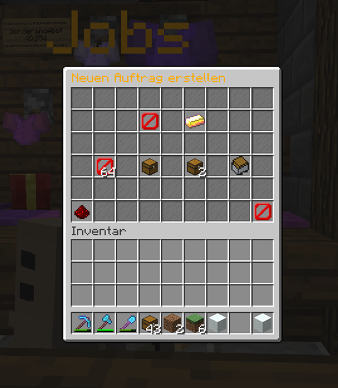
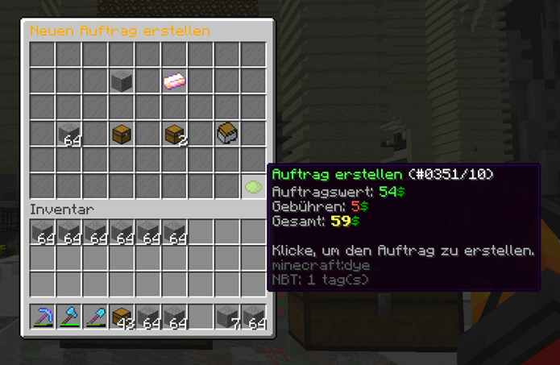
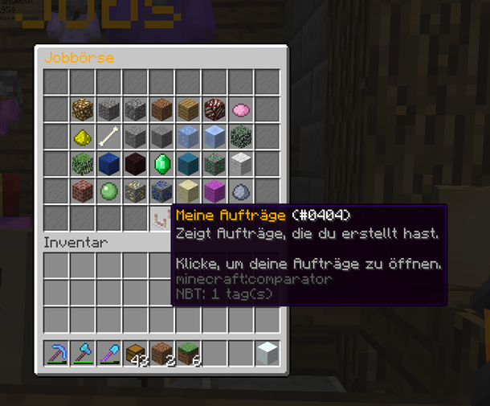
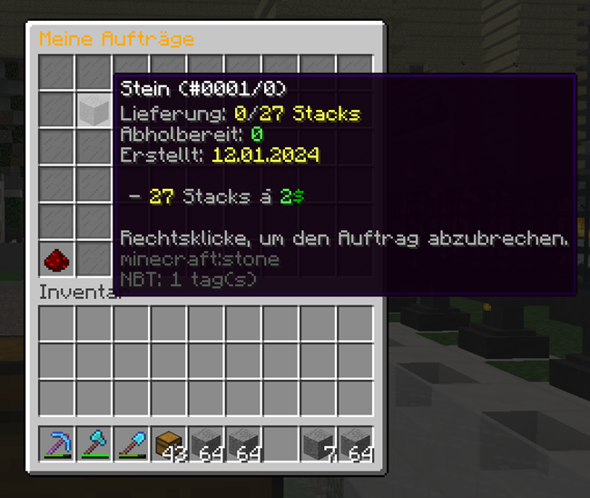
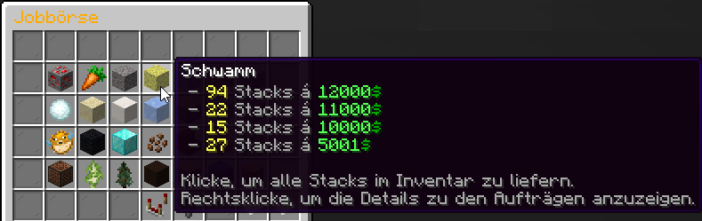

# 🧑‍🏭 Das Job-System

Ihr könnt Aufträge vergeben, damit euch andere Spieler Items erfarmen. Hierbei stellt ihr einen Auftrag ein, welches Item für euch gefarmt werden soll und in welcher Menge.Umgekehrt verdient ihr Geld, indem ihr die Aufträge anderer Spieler beliefert. Das Ganze funktioniert mindestens stackweise (oder in größeren Mengen). Gesucht werden können fast alle stapelbaren Items. Ausgenommen sind unter anderem Fackeln, Eimer und Nethersterne sowie besondere Items wie Endstein, Leuchtfeuer, Dracheneier, Köpfe, Spawner oder Spawneier.

### Wie erstelle ich einen Auftrag?

Du benötigst einen bestimmten Materialblock? Dann erstellst du einen Auftrag in diesen Schritten:

1. Job-Menü aufrufen
2. "Meine Aufträge" aufrufen
3. Neuen Auftrag anlegen
4. Auftragsdetails wählen
5. Informationen bestätigen
6. Auftrag freigeben

***

1. Das Job-System lässt sich über einen Job-NPC oder über den Befehl `/jobs` aufrufen. Der Job-NPC ist in der Hauptstadt zu finden.


**Tipp:** Am besten den gesuchten Materialblock bereits im Inventar dabei haben!


2. Es öffnet sich ein GUI mit allen eingestellten Aufträgen von Spielern. Mit dem Button „Meine Aufträge“ (Redstone – Komparator) gelangst du in deine Auftragsliste.

<figure><figcaption>
Der Button "Meine Aufträge" öffnet eure Auftragsliste
</figcaption></figure>

3. In diesem Fenster werden alle Aufträge angezeigt, die du erstellt hast. Hier hast du die Übersicht über deine bestehenden Aufträge und kannst mit dem Button „Neuen Auftrag erstellen“ (grüner Kopf mit „+“) einen neuen Auftrag anlegen.

   **Hinweis:** Abholbereite Items werden mit einem Leucht-Effekt angezeigt.
4. Sobald du auf „Neuen Auftrag erstellen“ klickst, öffnet sich ein weiteres Fenster mit folgenden Buttons:



*   Barriere „Item wählen“

    Hier gibst du an, welches Material du suchst. Dafür musst du diesen Material-Block zumindest einmal im Inventar haben. Klicke in deinem Inventar auf den gesuchten Block; dieser wird automatisch hinterlegt.
*   Goldbarren „Preis pro Stack“

    Sobald du auf den Goldbarren klickst, musst du im Chat eingeben, wie viel du bereit bist, je Stack zu bezahlen.


**Tipp:** Realistische Preise erhöhen eure Chance, dass andere Spieler diesen Block an euch verkaufen.




* **64x Barrieren „Anzahl 1x Stack“**\
  Dies bedeutet, dass ihr einen Stack des gesuchten Materials sucht bzw. kauft.
* **Truhe „Anzahl 1x Kiste“**\
  Dies bedeutet, dass ihr 27 Stacks des gesuchten Materials sucht bzw. kauft.
* **2x Truhe „1x Doppelkiste“**\
  Dies bedeutet, dass ihr 54 Stacks des gesuchten Materials sucht bzw. kauft.
* **Güterlore „Anzahl Stacks“**\
  Dies bedeutet, dass ihr individuell die Anzahl der Stacks des gesuchten Materials im Chat eingeben könnt.



* **Redstone „Abbrechen“**\
  Mit diesem Button brecht ihr den aktuellen Auftrag ab und kehrt in eure Auftragsliste zurück. Der Button ist nicht verfügbar, wenn ihr den Auftrag fertiggestellt habt.
* **Barriere „Unvollständig“**\
  Dieser Button zeigt an, dass Informationen zum Erstellen des Auftrags fehlen.
* **Grüner Farbstoff „Auftrag erstellen“**\
  Dieser Button ist erst verfügbar, wenn alle Informationen zum Auftrag eingegeben wurden. Er ersetzt die Barriere.



<figure><figcaption>
Die Erstellung eines Auftrags erfordert gewisse Informationen.
</figcaption></figure>

5. Rechts unten erscheint ein Button mit grünem Farbstoff, sobald alle Informationen hinterlegt sind.


**Tipp:** Wenn du über den Button fährst, werden dir die Kosten für den Auftrag zzgl. Gebühren angezeigt.
Die Gebühr beträgt **10 %** des Auftragswerts. Mit dem aktivierten [Gebührensenkungs-Perk](https://wiki.griefergames.net/1-8/funktionen/features/booster-and-perks#perks-and-rechte) zahlst du nur **2,5 %**.


<figure><figcaption>
Der Mouseover des Buttons "Auftrag erstellen" gibt euch eine Übersicht eures Auftrags.
</figcaption></figure>

1. Mit einem Klick auf den Button und einer Bestätigung erstellst du deinen Auftrag. Denke daran, dass der Gesamtbetrag inklusive Gebühren sofort von deinem Kontostand abgezogen wird.

### Wie storniere ich einen Auftrag?

Möchtest du einen Auftrag stornieren, gehe wie folgt vor:

1. Rufe das Jobs-Menü über einen Jobs-NPC oder per Befehl `/jobs` auf.
2. Es öffnet sich das GUI mit allen eingestellten Aufträgen von Spielern. Mit dem Knopf (Redstone – Komparator) „Meine Aufträge“ gelangst du in deine Auftragsliste.

<figure><figcaption>
Mit dem Button "Meine Aufträge" öffnest du deine persönliche Auftragsliste.
</figcaption></figure>

1. Hier findest du eine Übersicht deiner Aufträge. Mit einem Rechtsklick auf den jeweiligen Auftrag und einer Bestätigung kannst du diesen stornieren. Bereits gelieferte Items musst du vorher abholen.

<figure><figcaption>
Alle Aufträge, die noch nicht erledigt sind, findest du hier.
</figcaption></figure>

4. Wenn du den Auftrag abbrichst, erhältst du den verbleibenden Betrag für die ausstehende Itemmenge zurückerstattet. Das Geld wird deinem Kontostand automatisch hinzugefügt.


Du erhältst lediglich das Geld für den verbleibenden Itemwert zurück. Davon wird beim Abbrechen noch einmal eine Gebühr von **10 %** abgezogen, mit dem Gebührensenkungs-Perk **2,5 %**. Die Auftragsgebühren für das Einstellen des Jobs werden nicht zurückerstattet.


An diesem Artikel beteiligt

* [Zheng\_Aokiji](https://profile.griefergames.live/minecraft/e76216f9-a714-4351-b9d1-fcb54a7d7a23)
* [50U7R34P3R](https://profile.griefergames.live/minecraft/8e2ce0be-aa2c-46a7-a2dc-48f948743edf)

Über den Filter (Trichter) findest du schnell Aufträge für ein bestimmtes Item. Klicke dafür das Item in deinem Inventar an. Ein Klick auf den Trichter entfernt den Filter wieder.

## [#](#wie-hole-ich-gelieferte-items-ab)Wie hole ich gelieferte Items ab?

Haben andere Spieler Items für deinen Auftrag geliefert, holst du sie mit einem Linksklick auf den Auftrag in „Meine Aufträge“ ab.

Lässt sich das Item komprimieren, erhältst du die gelieferte Menge als komprimiertes Item. Andere Items bekommst du stackweise, solange in deinem Inventar Platz ist.

Sobald alle bestellten Stacks geliefert und abgeholt sind, ist dein Auftrag abgeschlossen.

## [#](#wie-beliefere-ich-einen-auftrag)Wie beliefere ich einen Auftrag?

1. Öffne die **Jobs** über einen Job-NPC oder mit `/jobs`.Dort siehst du alle gesuchten Items. 2. Beim Überfahren eines Items werden dir die bestbezahlten Aufträge mit Anzahl und Preis pro Stack angezeigt. 
3. Nimm volle Stacks des gesuchten Items mit ins Inventar. Komprimierte Items werden ebenfalls angenommen. 
4. Klicke auf das Item in der Jobbörse. Alle passenden Stacks aus deinem Inventar werden geliefert und das Geld wird dir sofort gutgeschrieben.

Geliefert wird immer zuerst an den Auftrag mit dem höchsten Preis. Würde der nächste Auftrag weniger Geld bringen, bekommst du einen Hinweis im Chat. Klickst du erneut, belieferst du auch diesen Auftrag.

<figure><figcaption>Beispiel</figcaption></figure>


Über den **Filter** (Trichter) findest du schnell Aufträge für ein bestimmtes Item. Klicke dafür das passende Item in deinem Inventar an. 
Ein Klick auf den Trichter entfernt den Filter wieder.

