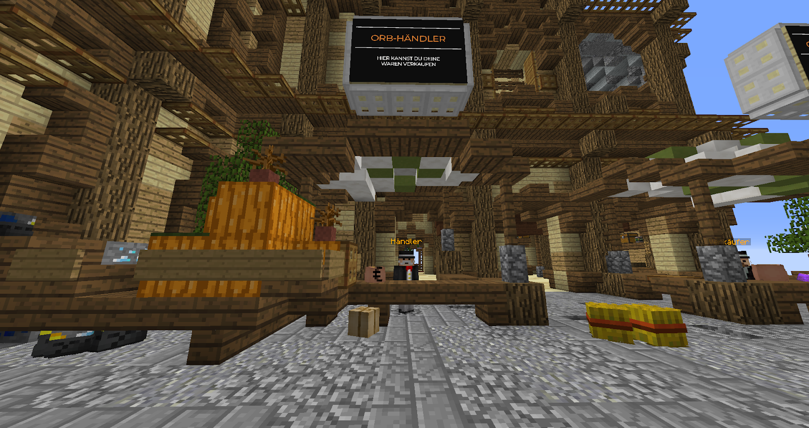
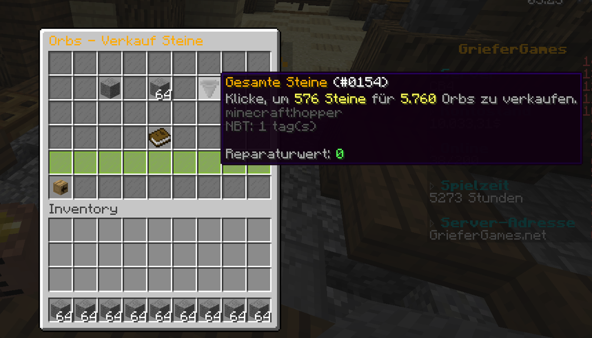
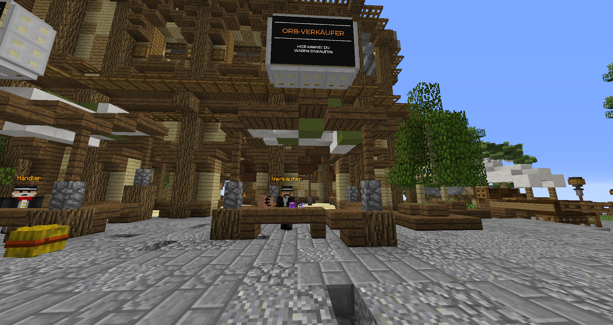
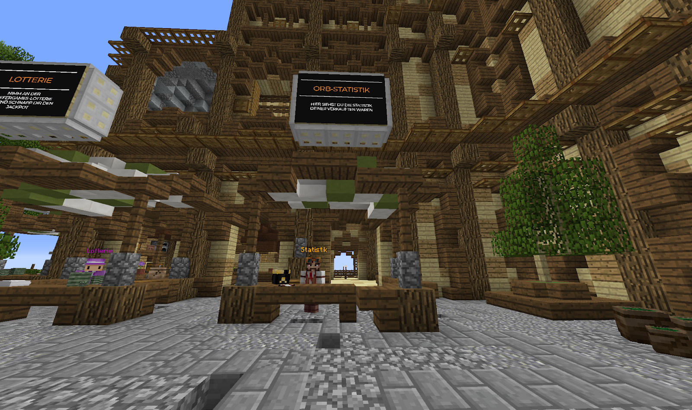

# 🔘 Orb-System

Auf dem 1.8-Netzwerk wurde 2020 eine neue [Währung](../waehrungen.md) und ein dazu passendes System vorgestellt: Das Orb-System. Ganz kurz und knapp gesagt ist das Orb-System eine neue Möglichkeit für Spieler, durch das Farmen an wertvolle Items zu kommen.

Auf jedem der 25 Citybuild-Server gelangst du mit den Befehlen `/warp Orbs` und `/warp Stadt` zu den [Orb-NPCs](die-hauptstadt.md#orb-haendler-orb-verkaeufer-und-statistik). Hier siehst du drei verschiedene NPCs, die zu dem System gehören.

### Der Orb-Händler "Händler"

<figure><figcaption>
Der Orb-Händler an seinem Stand
</figcaption></figure>

Beim Händler könnt ihr eure erfarmten Items eintauschen, um im Gegenzug [Orbs](../waehrungen.md#orbs) zu erhalten. Hierfür sind nahezu alle Items im Menü des Händlers vorhanden.

Hier könnt ihr dann in den Unterkategorien euer Item finden. Wenn ihr zum Beispiel Stein gefarmt habt, findet ihr die Abgabe für Stein in der "Steine"-Kategorie. Dort klickt ihr dann auf Stein. Nun könnt ihr eure Items abgeben.


Wenn ihr im Menü des Orb-Händlers seid und ein Item in eurem Inventar anklickt, gelangt ihr direkt zum Eintausch, sofern der Orb-Händler das Item entgegennimmt.


Zur Auswahl stehen die Abgabe eines einzelnen Items, eines Stacks oder aller Items dieser Art aus eurem Inventar (per Klick auf den Trichter).

<figure><figcaption>
Der Orb-Händler kauft eure Items an
</figcaption></figure>


Besondere Items (bspw. Admin-Items oder abweichende Namen/Signatur/NBT) werden vom System nicht gesondert erkannt/behandelt!


Je seltener und schwerer das Item zu farmen ist, desto mehr Orbs gibt es für das Item.

Der Preis jedes Items wird täglich um 18 Uhr zurückgesetzt. Das heißt, zu bestimmten Uhrzeiten bekommt ihr teilweise mehr Orbs für eure Items. Je mehr Items nun von einem Item-Typ auf dem Citybuild-Server abgegeben werden, desto weniger Orbs bekommst du bei der nächsten Abgabe der Items. Dafür gibt es zwei Preisfall-Stufen.

Wenn eine bestimmte Anzahl an abgegebenen Items erreicht wird, greift der Preisfall und jeder Spieler auf dem Citybuild-Server bekommt weniger Orbs für diese Item-Art. Der resultierende Preis verbleibt bis zum nächsten Preisreset für jeden Spieler.

Beispiel Steine

* Normaler Preis: 1 Stein = 20 Orbs
* Nach dem 1. Preisfall: 1 Stein = 15 Orbs
* Nach dem 2. Preisfall: 1 Stein = 10 Orbs


Einige Items haben zudem eine Preisfallstufe, bei der der Preis unter 1 Orb fällt. Kakteen erzielen bspw. im zweiten Preisfall nur 0,2 Orbs.

Die Anzeige "0 Orbs" ist hier ein bekannter Fehler, den wir leider nicht beheben können. Die Orbs werden dennoch korrekt berechnet und ausgegeben.


Der Orb-Händler erkennt auch komprimierte Items und gibt euch passend Orbs für die komprimierte Item-Anzahl im Austausch.


Ihr könnt maximal 4.782.969 Items auf einmal abgeben. Das entspricht einem maximal komprimierten Stufe-7-Block.


### Der Orb-Verkäufer "Verkäufer"

<figure><figcaption>
Der Orb-Verkäufer an seinem Stand
</figcaption></figure>

Ihr habt nun also einige Orbs durch Farmen erhalten. Was macht ihr jetzt damit?

Beim Orb-Verkäufer könnt ihr wie in einem Shop verschiedene Items mit euren Orbs kaufen.

Öffnet das Menü des Verkäufers und euch werden verschiedene Kategorien angeboten. In diesem Menü könnt ihr über den "Geldsack-Kopf" eure aktuell gesammelten Orbs sehen.



In dieser Kategorie könnt ihr euch drei verschiedene Perks kaufen, die normalerweise nur durch GrieferGames-$ oder durch Kisten erhältlich sind.



In dieser Kategorie könnt ihr euch drei verschiedene Partikel kaufen, die nur hier erhältlich sind.



In dieser Kategorie könnt ihr euch spezielle Items kaufen.

Hier gibt es „Trophäen“ wie den [Kaktus-](https://items.griefergames.net/#Orb-Items_%7C_Kaktusk%C3%B6nig) und [Kürbiskönig](https://items.griefergames.net/#Orb-Items_%7C_K%C3%BCrbisk%C3%B6nig).

Ebenso finden sich hier nützliche Dinge, wie Upgrades für passive Spawner, Flug-/Abbautränke und magische Items, mit denen ihr zum Beispiel mit einem Eimer 1000 Wasserblöcke setzen könnt.



In dieser Kategorie gibt es eine Rüstung, die besser ist als alles, was du selber herstellen kannst. Damit bist du ein wahrer Krieger und sehr gut auf deinen Reisen geschützt.



In dieser Kategorie gibt es spezielle Werkzeuge, mit denen ihr zum Beispiel einen ganzen Baum oder ein 3x3 Feld an Blöcken auf einmal abbauen könnt.



### Die Orb-Statistik "Statistik"

<figure><figcaption>
Der Statistik-NPC an seinem Stand
</figcaption></figure>

Der letzte NPC des Orb-Systems ist der Statistik-NPC.

Über diesen findet ihr ein Menü mit allen Items im Orb-System und eine Rangliste, die die Spieler auflistet, die die meisten Items einer Art abgegeben haben.

Hierüber könnt ihr euren Fortschritt mit dem anderer Spieler vergleichen und darauf hinarbeiten, der Spieler zu sein, der die meisten Items einer Art abgegeben hat.

### Die Zukunft des Orb-Systems


Seit einiger Zeit wird das Orb-System immer häufiger kritisiert und ein Update wird gefordert. Das Team hat hierzu mitgeteilt, dass das Orb-System dafür komplett überarbeitet werden muss. Ein Update wird also noch etwas brauchen.


An diesem Artikel beteiligt

* [BentosMentos](https://profile.griefergames.live/minecraft/813d7454-3f9f-449d-9010-b3ee225e56aa)
* [50U7R34P3R](https://profile.griefergames.live/minecraft/8e2ce0be-aa2c-46a7-a2dc-48f948743edf)

