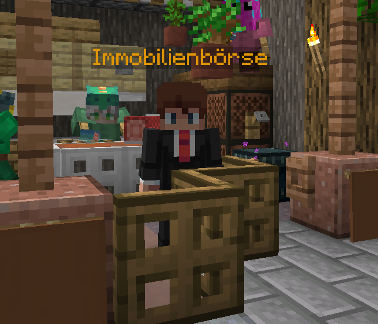
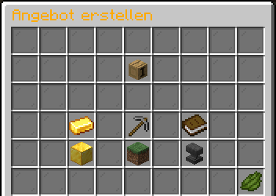

# 🏘️ Immobilienbörse

Die **Immobilienbörse** ermöglicht es euch, Grundstücke zum Verkauf anzubieten oder nach Grundstücken anderer Spieler zu suchen.

Ihr findet die Immobilienbörse **am Spawn** jedes Citybuilds.

<figure><figcaption></figcaption></figure>

### Grundstück inserieren

Du kannst deine Grundstücke an der Immobilienbörse zum Verkauf anbieten. Das Angebot erstellst du auf dem Citybuild, auf dem dein Grundstück liegt. Über **„Meine Angebote“** legst du ein neues Angebot an und bestimmst dabei:

* die ID deines Grundstücks, z. B. `45;22` (du musst der Besitzer sein),
* den Preis und ob er ein **Festpreis** oder **verhandelbar** ist,
* eine kurze Beschreibung mit höchstens **50 Zeichen**.

ID, Preis und Beschreibung gibst du im Chat ein. Den Preis schreibst du als reine Zahl ohne Punkte, z. B. `2500000`.

Für jedes Inserat wählst du außerdem **einen bis drei Tags** aus. Dadurch können andere Spieler gezielt nach passenden Grundstücken suchen - zum Beispiel nach **Farmen**.

<figure><figcaption>
Das Menü „Angebot erstellen“
</figcaption></figure>


Aktuell könnt ihr bis zu **fünf Grundstücke gleichzeitig** inserieren.


Ein Angebot bleibt **30 Tage** in der Immobilienbörse und endet danach automatisch. Unter „Meine Angebote“ bearbeitest du ein Angebot mit einem Rechtsklick. Mit einem Linksklick beendest du es vorzeitig, etwa wenn dein Grundstück schon verkauft ist.

### Grundstücke kaufen

In der Übersicht zeigt dir jedes Angebot den Anbieter, den Citybuild, die Beschreibung, den Preis und die Tags. Unter **„Grundstück-Größe“** siehst du außerdem, aus wie vielen Grundstücken ein [Merge-Grundstück](../grundstuecke/grundstuecke-verbinden.md) besteht.

Über den **Filter** kannst du gezielt nach Tags oder nach einem Citybuild suchen.

Du hast in der Übersicht ein Grundstück gefunden, das dich interessiert? Dann ist jetzt der Zeitpunkt, um das Grundstück etwas genauer anzuschauen. Dazu genügt ein Linksklick auf das jeweilige Angebot, und du wirst automatisch zum Grundstück teleportiert, auch wenn es auf einem anderen Citybuild liegt.

Mit einem Rechtsklick setzt du ein Angebot auf deine Beobachtungsliste. Diese Angebote findest du unter **„Meine beobachteten Inserate“**. In der **Angebotshistorie** siehst du abgelaufene und beendete Angebote der letzten 30 Tage.

Da der Spieler, der das Grundstück anbietet, immer im Inserat steht, kannst du ihn im Chat kontaktieren. Manchmal findest du in der Beschreibung allerdings auch die Information, wie der Spieler auf Discord heißt, damit du ihn dort z. B. für eine Preisverhandlung oder auch die Absprache zum Kauf kontaktieren kannst.


In der Immobilienbörse selbst kannst du weder bieten noch bezahlen. Habt ihr euch geeinigt, überschreibt dir der Anbieter das Grundstück, wie unter [Grundstücke überschreiben](../grundstuecke/grundstuecke-ueberschreiben.md) beschrieben.

