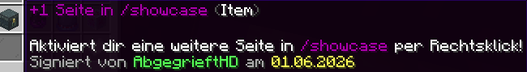
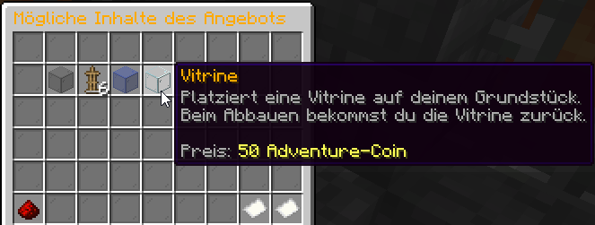

# 💎 Showcase, Truhen & Vitrinen

Vitrinen und Showcase-Truhen ermöglichen es dir, Items sicher und dekorativ auf deinem Plot darzustellen, perfekt für Shops, Sammlungen oder besondere Items.

Die Showcase als Befehl (`/sc`) ermöglicht es dir, Items übersichtlich und sicher zu verstauen und anderen Spielern zu präsentieren.

## Showcase-Truhen

Die Showcase-Truhe ist ein Behältnis, das von anderen geöffnet werden kann, in dem aber weder Items hinzugefügt noch entnommen werden können.

Wie auf den Bildern zu sehen, wird dazu eine normale Truhe im Amboss in „Showcase“ umbenannt:

Andere Spieler können sie zwar öffnen, wenn das entsprechende Material freigegeben ist oder sie auf dem Grundstück vertraut sind, jedoch kann nur der Grundstücksbesitzer Items dort hineinlegen oder entnehmen.


Damit vertraute Spieler den Inhalt einer Showcase ändern können, kann folgende Flag auf dem Grundstück gesetzt werden: `/p flag set trusted-showcase-edit true`


Damit andere Spieler den Inhalt der Kiste einsehen, aber nicht ändern können, muss die Use-Flag für den entsprechenden Behälter gesetzt werden. Das wird durch folgenden Befehl ermöglicht: `/p flag set use <Behälter-ID>`. Für Redstone-Truhen wäre der Befehl also `/p flag set use 146`.


Die Flag gilt für **alle Behälter dieses Typs auf dem Grundstück**, nicht nur für den Showcase.

Wird beispielsweise eine **Redstone-Truhe** mit der Flag **146** als Showcase verwendet, können Spieler auch auf andere Redstone-Truhen zugreifen.

Daher sollte man diesen Behältertyp **nicht für das eigene Lager verwenden**.


## Showcase als Befehl

Die **Showcase** über den Befehl `/showcase` oder `/sc` funktioniert ähnlich wie eine persönliche Endertruhe und bietet zusätzlichen Platz zum Aufbewahren von Items. Gleichzeitig kann man Items darin für andere Spieler sichtbar präsentieren, beispielsweise um sie zum Verkauf anzubieten.

Mit `/showcase <NAME>` oder `/sc <NAME>` kann man die Showcase eines anderen Spielers öffnen.

<figure><figcaption>
Übersicht Showcase als Befehl
</figcaption></figure>

### Seitenanzahl erhöhen

Mit dem im **Case Opening** gewinnbaren Item „+1 Seite in /showcase (Item)“ kann man die Showcase um weitere Seiten erweitern.

<figure><figcaption>
Item „+1 Seite in /showcase“
</figcaption></figure>

### Seitenname bearbeiten

Die einzelnen Showcase-Seiten können individuell benannt werden. Dazu öffnet man über **„Seitenauswahl“** die gewünschte Seite per Rechtsklick und wählt anschließend den Amboss **„Seiten Name bearbeiten“** aus. Den gewünschten Namen gibt man anschließend im Chat ein und bestätigt mit Enter.

### Anzeigeitem bearbeiten

Für jede Showcase-Seite kann außerdem ein eigenes **Anzeigeitem** festgelegt werden. Dazu öffnet man über **„Seitenauswahl“** die gewünschte Seite per Rechtsklick und wählt **„Anzeige Item bearbeiten“** aus. Anschließend wählt man ein Item aus dem eigenen Inventar als Anzeigeitem aus und bestätigt die Auswahl.

## Vitrinen

Mit einer **Vitrine** können Items auf dem Grundstück ausgestellt werden. Das Item wird dabei lediglich **angezeigt bzw. gespiegelt** und nicht aus dem Inventar entfernt.

Die Vitrine ist unter anderem im **Admin-Shop** im Tausch gegen **Adventure-Coins** erhältlich.

<figure><figcaption>
Übersicht Admin-Shop
</figcaption></figure>

Damit andere Spieler auf die Vitrine zugreifen können, kann folgende Flag auf dem eigenen Grundstück aktiviert werden: `/p flag set use 20`.

Auch vertraute Spieler können Items in die Vitrine legen. Das ausgestellte Item bleibt dabei erhalten und geht nicht verloren.


Eine **Vitrine** kann mit einer Spitzhacke mit **Behutsamkeit** abgebaut werden. Dabei bleibt die Vitrine als Item erhalten und kann anschließend erneut platziert werden.

