# Grundstück-Menü

Auf deinem Grundstück hast du die Möglichkeit, deine Besucher zu grüßen oder bestimmte Blöcke auf deinem Grundstück freizugeben. Auch kannst du dich vor Angriffen schützen, eine Kampfarena errichten oder entscheiden, ob das Gras auf deinem Grundstück wachsen darf oder du doch lieber einen Erdboden besitzt.

Hierfür stellen wir dir das Grundstücks-Menü vor, in welchem du viele verschiedene Einstellungen findest.

Das Menü rufst du auf deinem Grundstück mit `/plot`, `/p`, `/menü` oder `/m` auf.

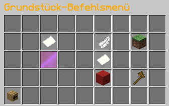

| Icon / Bezeichnung | Befehl | Funktion |
| --- | --- | --- |
| 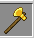 |  | Grundstücksbefehle |
| 
 Grundstückschat - /p chat
 | `/p chat` | Hier hast du die Möglichkeit, auszuwählen, dass deine Chatnachrichten nur auf dem Grundstück zu lesen sind. |
| 
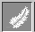 Alias entfernen
 | `/p alias remove` | Hier hast du die Möglichkeit, den Alias deines Grundstücks zu entfernen. |
| 
 Beschreibung entfernen
 | `/p description remove` | Entferne die Beschreibung deines Grundstücks. |
| 
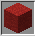 Rechteentzug
 | `/p remove *` | Entferne alle Rechte, die du vergeben hast. |
| 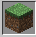Grundstücksinformation | `/p i` | Schaue, wo sich dein Grundstück befindet und welcher Alias aktuell gesetzt ist. |
| 
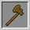 Einstellungen zurücksetzen
 |  | Klicke, um alle Einstellungen auf den Standard zurückzusetzen. |

## Grundstücks-Flags

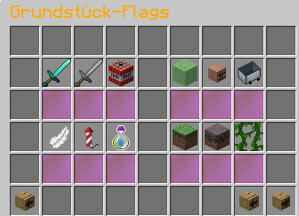

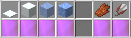

| Icon / Bezeichnung | Befehl | Funktion |
| --- | --- | --- |
| 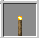 |  | Grundstücks-Flags |
| 
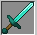 PvP
 | 
<code>/p flag set pvp true</code> <code>/p flag set pvp false</code>
 | Ist PvP aktiviert, könnt ihr euch auf dem Grundstück gegenseitig Schaden zufügen. |
| 
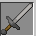 Animal-Attack
 | 
<code>/p flag set animal-attack true</code> <code>/p flag set animal-attack false</code>
 | Ist Animal-Attack aktiviert, so können Spieler auf dem Grundstück Tiere angreifen. |
| 
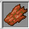 Hostile-Attack
 | 
<code>/p flag set hostile-attack true</code> <code>/p flag set hostile-attack false</code>
 | Ist Hostile-Attack aktiviert, so können Spieler auf dem Grundstück Monster angreifen. |
| 
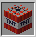 Explosionen
 | 
<code>/p flag set explosion true</code> <code>/p flag set explosion false</code>
 | Sind Explosionen aktiviert, so kann TNT Schaden anrichten. |
| 
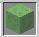 Forcefield
 | 
<code>/p flag set forcefield true</code> <code>/p flag set forcefield false</code>
 | 
Ist Forcefield aktiviert, stößt du Spieler zur Seite, die dir zu nahe kommen.

<strong>Hinweis:</strong> Das <a href="https://items.griefergames.net/#Rechte_%7C_Forcefield_Flag">Forcefield-Flag-Item</a> aus der Supreme-Kiste wird benötigt.
 |
| 
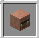 Dorfbewohnerhandel
 | 
<code>/p flag set villager-interact true</code> <code>/p flag set villager-interact false</code>
 | Erlaubt es Spielern, mit deinen Dorfbewohnern zu interagieren. |
| 
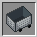 Loren-Nutzung
 | 
<code>/p flag set vehicle-use true</code> <code>/p flag set vehicle-use false</code>
 | Ist die Loren-Nutzung aktiviert, so dürfen Spieler deine Loren nutzen. |
| 
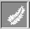 Fliegen
 | 
<code>/p flag set allowfly true</code> <code>/p flag set allowfly false</code>
 | 
Ist Fliegen aktiviert, so dürfen Spieler auf deinem Grundstück fliegen.

<strong>Hinweis:</strong> <a href="https://items.griefergames.net/#Orb-Items_%7C_Flugtrank_">Fly-Trank</a>, Fly-Booster oder <a href="https://items.griefergames.net/#Plot-Fliegen">Plot-Fliegen</a> vorausgesetzt.
 |
| 
 Feuerwerke
 | 
<code>/p flag set firework true</code> <code>/p flag set firework false</code>
 | Erlaubt es Spielern, auf deinem Grundstück Feuerwerk abzuschießen. |
| 
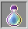 Disguise
 | 
<code>/p flag set disguise true</code> <code>/p flag set disguise false</code>
 | Diese Flag erlaubt bei Aktivierung, dass Spieler sich auf deinem Grundstück verkleiden. |
| 
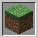 Gras-Wachstum
 | 
<code>/p flag set grass-grow true</code> <code>/p flag set grass-grow false</code>
 | Ist Gras-Wachstum aktiviert, wächst Gras auf deinem Grundstück. |
| 
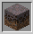 Myzel-Wachstum
 | 
<code>/p flag set mycel-grow true</code> <code>/p flag set mycel-grow false</code>
 | Ist Myzel-Wachstum aktiviert, wächst Myzel auf deinem Grundstück. |
| 
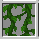 Ranken-Wachstum
 | 
<code>/p flag set vine-grow true</code> <code>/p flag set vine-grow false</code>
 | Ist Ranken-Wachstum aktiviert, wachsen Ranken auf deinem Grundstück. |
| 
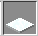 Schnee-Formungen
 | 
<code>/p flag set snow-form true</code> <code>/p flag set snow-form false</code>
 | Ist diese Flag aktiviert, formt sich Schnee auf deinem Grundstück. |
| 
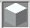 Schnee-Schmelzungen
 | 
<code>/p flag set snow-melt true</code> <code>/p flag set snow-melt false</code>
 | Ist diese Flag aktiviert, schmilzt der Schnee auf deinem Grundstück. |
| 
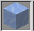 Eis-Formungen
 | 
<code>/p flag set ice-form true</code> <code>/p flag set ice-form false</code>
 | Ist diese Flag aktiviert, formt sich Eis auf deinem Grundstück. |
| 
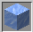 Eis-Schmelzungen
 | 
<code>/p flag set ice-melt true</code> <code>/p flag set ice-melt false</code>
 | Ist diese Flag aktiviert, schmilzt das Eis auf deinem Grundstück. |
| 
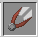 Tier-Interaktionen
 | 
<code>/p flag set animal-interact true</code> <code>/p flag set animal-interact false</code>
 | Erlaubt es Spielern, mit Tieren zu interagieren. |

## Use-Flag-Menü

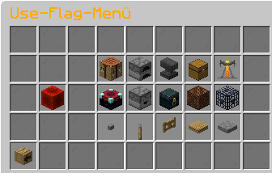

| Icon / Bezeichnung | Befehl | Funktion |
| --- | --- | --- |
| 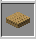 | `/p flag set use <ItemID>` | Use-Flag-Menü |

Mit dem Use-Flag-Menü hast du die Möglichkeit, gängige Blöcke für Spieler freizugeben.

Zur Auswahl stehen dir hier:

<table data-header-hidden><thead><tr><th></th><th width="108"></th><th></th><th width="159"></th><th></th></tr></thead><tbody><tr><td>Werkbänke</td><td>Öfen</td><td>Ambosse</td><td>Truhen</td><td>Braustände</td></tr><tr><td>Zaubertische</td><td>Spender</td><td>Endertruhen</td><td><a href="https://items.griefergames.net/#Mobiles_4-Gewinnt">4-Gewinnt</a></td><td>Spawner</td></tr><tr><td>Knöpfe</td><td>Hebel</td><td>Zauntore</td><td>Holzdruckplatte</td><td>Steindruckplatte</td></tr></tbody></table>

Ob eine Use-Flag gerade freigegeben ist, erkennst du daran, ob das Item leuchtet oder nicht.

Beispiel:

| 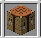Werkbank nicht freigegeben | 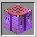Werkbank freigegeben |
| --- | --- |

## Weitere Menüpunkte

| Icon / Bezeichnung | Befehl | Funktion |
| --- | --- | --- |
| 
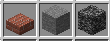 Rand-Wand-Bodeneffekte
 | 
<code>/rand</code> <code>/wand</code> <code>/boden</code>
 | 
Hier findet ihr eine Auswahl an <a href="grundstuecke-veraendern.md">Rand-, Wand- und Bodeneffekten</a>. Ihr könnt euren Grundstücksrand zum Beispiel in Quarzstufen oder auch Kohleblöcke verwandeln.

<strong>Hinweis:</strong> Die Effekte sind <a href="../befehlsuebersicht/rang-befehle.md">rangabhängig</a>. Einige Effekte können auch nur in <a href="../features/das-case-opening.md#die-supreme-kiste">Supreme-Kisten</a> gewonnen werden.
 |

Zusätzlich findest du in den Grundstücksbefehlen folgende Möglichkeiten:

| Icon / Bezeichnung | Befehl | Funktion |
| --- | --- | --- |
| 
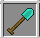 Aushöhlen
 | `/aushöhlen` | Über diesen Befehl hast du die Möglichkeit, dein Grundstück von bestimmten Baumaterialien zu [befreien](grundstuecke-veraendern.md#aushoehlen). |
| 
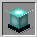 Leucht-Effekt
 | `/leuchten` | 
Durch die Nutzung des Befehls werden auf der Straße an den Ecken deines Grundstücks Beacons platziert. Unter den Beacons befinden sich Diamantblöcke, sodass die Beacons aktiviert sind und einen Lichtstrahl nach oben erzeugen.

<strong>Hinweis:</strong> Der Befehl muss vorher in der Supreme-Kiste gewonnen werden.
 |
| 
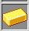 Grundstück kaufen
 | `/p claim` | Hier kannst du per Mausklick ein freies Grundstück kaufen. |
| 
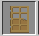 Übersicht freier Grundstücke
 |  | Diese Übersicht zeigt dir an, wie viele kostenlose Grundstücke du auf dem Citybuild zur Verfügung hast. |
