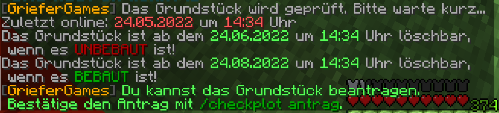

# Grundstücke inaktiver Spieler beantragen

GrieferGames ist nun schon seit 2016 als Citybuild-Server für die Spieler da. Da kommt es natürlich vor, dass einige Spieler den Server nach einiger Zeit wieder verlassen.

Du möchtest nun aber an einem Bauprojekt weiterbauen, aber alle Grundstücke um deines herum sind schon im Besitz von anderen Spielern? Wenn diese Spieler inaktiv sind, kannst du ihre Grundstücke mit dem Checkplot-System beantragen.

## Ablauf eines Antrags im Checkplot-System

Um ein Grundstück neben deinem per Checkplot zu beantragen, musst du auf das Grundstück gehen und den Befehl `/checkplot` eingeben. Nun erhältst du eine Nachricht im Chat.


Du kannst nur inaktive Grundstücke in der Nähe eines deiner Grundstücke beantragen.

**Besonderheiten bei Spawn-Grundstücken:** Um den Spawn herum gibt es Spawn-Grundstücke, die von Spielern mit hohem Wert gehandelt werden. Diese Grundstücke befinden sich in der 1. bis 5. Grundstücksreihe direkt um den Spawn herum und können **nicht** über `/checkplot` beantragt werden. Sollte ein Spawn-Grundstück inaktiv oder unbebaut sein, kann es über `/spawnplotreport` gemeldet werden.


Lässt sich das Grundstück nicht betreten, weil das durch den Besitzer verboten wurde, kannst du den Antrag durchführen, indem du vor dem Grundstück stehst und den [Befehl](../befehlsuebersicht/spezielle-features/checkplot.md) eingibst, während du auf das Grundstück schaust.

Befehl mit ID

Alternativ kannst du das Grundstück auch über die Grundstücks-ID beantragen.

* `/checkplot [Grundstücks-ID]`
* `/checkplot antrag [Grundstücks-ID]`
* `/checkplot claim [Grundstücks-ID]`
* `/checkplot claim confirm [Grundstücks-ID]`

<figure><figcaption>
Rückmeldung im Chat nach Eingabe von <code>/checkplot</code>
</figcaption></figure>

In dieser Nachricht stehen nun weitere Informationen. Zum einen steht oben, wann der Grundstücksbesitzer das letzte Mal online war. Ein Spieler muss einen gewissen Zeitraum offline gewesen sein, damit du das Grundstück beanspruchen kannst.

In der Nachricht stehen nun zwei weitere Daten. Das erste Datum zeigt dir, wann du ein unbebautes Grundstück beantragen kannst. Das zweite Datum zeigt dir, wann du das Grundstück beantragen kannst, wenn es baulich verändert wurde.

Wenn das aktuelle Datum nach den Daten des Systems ist, kannst du deinen Antrag mit `/checkplot antrag` einreichen.

Baulich unveränderte Grundstücke werden vom System automatisch freigegeben.

Wenn das Grundstück bebaut ist, wird der Antrag von einem Teammitglied geprüft und du bekommst zeitnah eine Nachricht, ob du das Grundstück übernehmen kannst.


Den Status deiner Anträge kannst du jederzeit mit `/checkplot list` einsehen.


Wenn ein Grundstück freigegeben wurde, kannst du es mit `/checkplot claim` beanspruchen und darauf folgend mit `/checkplot claim confirm` die Übernahme bestätigen.


Ein Grundstück kannst du nur annehmen, wenn du noch ein weiteres Grundstück auf dem Citybuild-Server besitzen kannst. Solltest du keinen freien Grundstücks-Slot haben, musst du 10.000$ für den Kauf eines weiteren Grundstücks zahlen.



Wenn du Fragen zu deinem Antrag hast, kannst du diese auch direkt dem Teamler stellen, der die Checkplot-Anträge auf deinem Citybuild-Server prüft.

Die [Liste der zuständigen Teammitglieder](../../team/) findest du auf der Team-Seite.


## Ablehnungsgründe

Wenn dein Antrag abgelehnt wird, so kann dies unterschiedliche Gründe haben.



* Der Besitzer des Grundstücks ist noch nicht lange genug offline.
* Du besitzt kein eigenes Grundstück im Umkreis von 2 Grundstücken.
* Du hast bereits 5 offene Anträge im System, welche geprüft werden müssen.
* Das Grundstück ist ein Merge-Grundstück.
* Das Grundstück befindet sich in den ersten 5 Reihen um das Spawn-Grundstück des Citybuild-Servers.
* Das Grundstück wurde bereits von einem anderen Spieler beantragt.
* Das Grundstück gehört einem Spieler, welcher einen besonderen Rang hat. (Teammitglieder, Freunde, Content-Creator etc.)
* Dein Antrag auf das Grundstück wurde in den letzten 14 Tagen durch ein Teammitglied abgelehnt.



* Deine Grundstücke in der Nähe sind nicht ausreichend bebaut.
* Das beantragte Grundstück ist wertvoll bebaut oder hat wertvolle Items in Truhen.
* Das beantragte Grundstück trägt einen wertvollen Alias.



## Ein Merge-Grundstück beantragen

Mit dem Checkplot-System kannst du keine Merge-Grundstücke beantragen. Dafür gibt es aber eine andere Lösung. Du kannst eine [Grundstücks-Verschiebung](grundstucke-verschieben-and-erweitern.md) beantragen.

Wenn du diesen Weg der Grundstücksverschiebung wählst, kann es auch vorkommen, dass dein eigenes Grundstück verschoben wird. In der Regel wird immer das Grundstück verschoben, bei welchem dies sinnvoller ist.


Dies ist ein freiwilliger Service seitens des Teams, weshalb eine Verschiebung nicht immer erfolgen muss und manchmal auch mehrere Tage bis Wochen dauern kann.


An diesem Artikel beteiligt

* [BentosMentos](https://profile.griefergames.live/minecraft/813d7454-3f9f-449d-9010-b3ee225e56aa)
* [50U7R34P3R](https://profile.griefergames.live/minecraft/8e2ce0be-aa2c-46a7-a2dc-48f948743edf)

