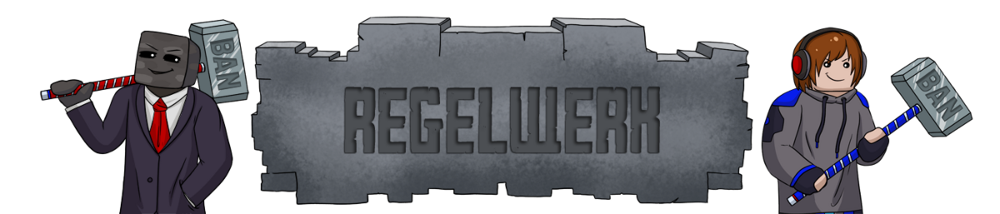

# 📜 Regelwerk

<figure><figcaption></figcaption></figure>

***

## § 1 - Netzwerkübergreifende Regeln 

#### (1) Spam, Beleidigungen, Drohungen und Provokationen gegen andere Nutzer sind verboten.

1. Zum Spammen zählt bereits eine Nachricht 3-mal in sehr kurzer Zeit zu posten.
2. Exzessiver Spam von `/pay *`-Ausführungen wird wie normaler Chatnachrichten-Spam geahndet.
3. Das Aufrufen zum Spam, zum Beispiel bei Zahlenspielen oder Versteigerungen, ist ebenfalls in öffentlichen Chats verboten.
4. Das Schreiben von Nachrichten in vordefinierten Zeitintervallen (das automatische Schreiben von Nachrichten) ist verboten.
5. Das indirekte Spammen mit selben oder ähnlichen Nachrichten zu einem Angebot über mehrere Accounts ist ebenfalls verboten.

#### (2) Extremistische, ethisch inakzeptable und pornografische Inhalte sind strengstens verboten. Politische und religiöse Inhalte sind zwar grundsätzlich nicht verboten, aber unerwünscht. Die Administration behält sich vor, unvoreingenommen gewisse politische und religiöse Inhalte als Ausnahmen gelten zu lassen.

#### (3) Das Äußern und Diskutieren von konstruktiver Kritik ist grundsätzlich erwünscht. Kritik, welche allerdings beleidigend, provokant oder allgemein nicht konstruktiv geäußert wird, ist nicht gestattet. (Bewertungs-)Umfragen über Arbeiten einzelner Teammitglieder sind ebenfalls nicht gestattet.

(4) Sich als eine bekannte Person auszugeben ist in jeglicher Art und Weise verboten. Als bekannte Personen zählen alle Teammitglieder, Freunde vom Team, welche mit der „Freund“- oder „Best Buddy“-Gruppe auf dem TeamSpeak-Server oder dem „Freund“-Rang auf dem Minecraft-Netzwerk gekennzeichnet sind, sowie Spieler auf dem Minecraft-Netzwerk mit dem „Helfer“-, „YouTuber“-, „YouTuber+“-, „Streamer“- oder „Streamer+“-Rang.

#### (5) Werbung in Form der Nennung von vollständigen Serveradressen (Domain inkl. Top-Level-Domain) für Angebote, die nicht GrieferGames betreffen (z. B. fremde Minecraft-, TeamSpeak-, Discord-Server), ist verboten.

1. Ausnahmeregelung 1\
   Wenn jemand gezielt mündlich als auch schriftlich nach der Adresse eines bestimmten Angebots eindeutig fragt, darf die Adresse als Privatnachricht an den Fragenden mitgeteilt werden. Man begeht einen Regelbruch, wenn auf Nachfrage die Daten trotzdem in einen (semi-)öffentlichen Chat gesendet werden.
2. Ausnahmeregelung 2\
   YouTube- und Twitch-Werbung für Livestreams und Videos ist erlaubt, wenn sich der Kanal, das Video oder der Livestream um GrieferGames handelt. Das Spammen solcher Werbung wird als härterer Spam deklariert und dementsprechend härter bestraft.

#### (6) Die Weitergabe von Links, die nichts mit GrieferGames zu tun haben, ist verboten.

#### (7) Private, eigene und vor allem fremde Daten dürfen in keinem Fall weitergegeben werden.

#### (8) Es dürfen lediglich virtuelle Güter auf unseren eigenen Plattformen (Minecraft-, TeamSpeak- & Discord-Server sowie im Forum) gehandelt werden. Wer ein virtuelles Gut auf unseren Plattformen gegen ein echtes Gut wie z. B. Geld (in Form von paysafecards, PayPal, o. Ä.) handeln möchte, begeht einen Regelverstoß. Skins, Schematics und andere Minecraft-basierende Inhalte dürfen umstandslos gehandelt werden. Das Team übernimmt allerdings keine Haftung bei betrügerischen Handelsvorgängen.

#### (9) Das bewusste Vortäuschen fremder Identitäten, Clan-Mitgliedschaften oder Besitztümern (z. B. von Grundstücken) ist in jeglicher Art und Weise verboten.

1. Nutzernamen, die die gefälschte Clan-Mitgliedschaft zeigen sollen, sind nicht gestattet.
2. Clan-Items nachzustellen und mit diesen die Clan-Mitgliedschaft vorzutäuschen ist untersagt.
3. Nutzernamen, die bewusst in Kauf nehmen, bekannte Grundstück-Aliasse unbrauchbar zu machen, können vom Team verboten werden.
4. Nutzernamen, die bewusst gewählt werden, um Transaktionen an andere Spieler zu behindern, können vom Team verboten werden.

#### (10) Verwarnungs-, Mute- und Bannumgehungen mithilfe von Multi- und Alt-Accounts sind verboten.

#### (11) Jegliches Bugusing, also das bewusste Ausnutzen eines Serverfehlers, ist untersagt. Administratoren können Fehler als Features anerkennen und die Regelung außer Kraft setzen.

#### (12) Phishing (Stehlen von Accountdaten) ist strengstens verboten.

#### (13) Jegliche Anweisungen von Teammitgliedern sind Folge zu leisten.

#### (14) Teammitglieder sind auf offiziellen Plattformen von GrieferGames durch eine eindeutige Rangbezeichnung, meist vor dem Namen, zu erkennen.

#### (15) Teammitglieder dürfen im eigenen Ermessen Entscheidungen in Form von Bestrafungen treffen, wenn Nutzer gegen festgelegte Regeln verstoßen.

#### (16) Beschwerden über Teammitglieder werden nur über die Admin-E-Mail-Adresse oder im Ticket-System über das dafür vorgesehene Label angenommen und bearbeitet.

#### (17) Verliehene Ränge und Rechte dürfen nicht entgegen den Regelungen genutzt werden. Das Team behält sich das Recht vor, durch Käufe verliehene Rechte jederzeit wegen Missbrauch ohne Vorankündigung zu entziehen.

#### (18) Das Umgehen von blockierten und reservierten Wörtern, Sätzen, Links, E-Mail-Adressen und anderweitige Funktionen ist strengstens untersagt.

***

## § 2 - Spezifische Regeln zu Minecraft-Servern 

#### (1) Spielernamen oder Teile des Spielernamens können ohne Angabe von Gründen auf einer serverweitigen Blacklist stehen, wenn das Team der Meinung ist, dass diese nicht angebracht sind oder andere Spieler belästigen.

#### (2) In-Game-Werte, welche durch Serverfehler, Lags oder Eigenverschulden verloren gegangen sind, werden nicht zurückerstattet.

#### (3) Verliehene Ränge und Rechte sind accountgebunden und werden nur im Ermessen der Administration auf einen anderen Account übertragen.

#### (4) Items, die durch unerlaubte Modifikationen (Hacked Clients, Cheats) oder Serverfehler entstanden sind, müssen zerstört oder an das Team übergeben werden.

#### (5) Alle Modifikationen, die einen erheblichen Spielvorteil bieten, sind verboten. [In dieser Auflistung](https://wiki.griefergames.net/hilfreiche-links/empfohlene-modifikationen) sind einige Modifikationen aufgelistet, die wir zum angenehmen Spielen auf unserem Netzwerk empfehlen.

#### (6) Keine der exklusiv für diesen Server gebauten Bauwerke (Lobby, Portalraum, Spawns) dürfen ohne eine ausdrückliche, schriftliche Erlaubnis der Serverleitung, sowohl für private als auch gewerbliche Zwecke genutzt werden.

#### (7) Das sogenannte [„Scammen“](das-scamming.md) (zum Beispiel Betrug beim Handeln und Teleport-Fallen) ist auf dem Servernetzwerk **nicht** verboten, **kann** aber in Einzelfällen zu Sanktionen führen.

1. Teammitglieder dürfen grundsätzlich nicht gescammt werden. Sie dürfen allerdings nachweisliche Scammer scammen, wenn sie das komplette Szenario aufnehmen und öffentlich auf ihrem YouTube-Kanal hochladen.
2. Das Scammen ist allerdings nur im Spiel nicht verboten. Sobald es um Echtgeld geht, ist dies nicht mehr gestattet und kann zu einer polizeilichen Anzeige führen.

#### (8) Das Nutzen jeglicher „Hacked Clients", Bots und visueller Vorteile ist strengstens verboten. Die Nutzung von Bots, die einen automatischen An- und Verkauf anbieten, ist lediglich auf dem 1.8 Citybuild-Netzwerk erlaubt. Das automatisierte Herstellen von Items durch Minecraft-eigene Rezepte – auch unter AutoCrafting bekannt – ist ebenfalls nur auf dem 1.8 Citybuild-Netzwerk erlaubt.

1. Der automatische An- und Verkaufsbot darf lediglich auf grundlegende Mechanismen und die automatische Sendung von Nachrichten über Privat- und Grundstücks-Chats zurückgreifen.
2. Ein Handel mit anderen Spielern durch einen solchen Bot darf nur abgeschlossen werden, wenn ein Spieler in Form eines Ansprechpartners per Global-Chat oder Global-MSG erreichbar ist und dementsprechend auf Anfragen aktiv reagieren kann.
   * Der Spielername des Ansprechpartners muss gut erkenntlich bei dem Bot-Account auf einem Schild geschrieben stehen.
   * Der Ansprechpartner muss auf dem exekutiven Grundstück des Bots über den Befehl `/plot trust <Spieler>` vertraut sein.
   * Der Ansprechpartner muss den Bot, falls von einem Teammitglied gewünscht, entsprechend verwalten können.
3. An- und Verkaufsbots dürfen lediglich mit Gegenständen handeln, die auf dem Netzwerk vorhanden sind. Skins, Schematics und andere Minecraft-basierende Inhalte dürfen nicht automatisiert angekauft/verkauft werden.
4. Durch den aktuellen Befehl `/rezepte` auf dem 1.8 Citybuild-Netzwerk ermöglichen wir bereits eine Form des AutoCraftings. Spieler, die einfachere Möglichkeiten zum Herstellen von Items nutzen möchten, können dies beispielsweise durch Client-Mods tun. Allerdings ist hiermit nur das Crafting erlaubt, alles darüber Hinausgehende bleibt verboten (z. B. automatisiertes Abgeben von Items beim Orb-Händler). Nutzt man eine solche Art des AutoCraftings, muss man im Spiel anwesend und für potenzielle Rückfragen von Teammitgliedern ansprechbar sein.

#### (9) Anstößige Skins sind verboten. Ob ein Skin anstößig ist, entscheidet das Team nach eigenem Ermessen.

#### (10) Die Verwendung von sogenannten „Alt-Accounts" ist verboten. „Alt-Accounts“ sind Accounts, die man über dritte Wege erwerben oder geschenkt bekommen kann. „Multi-Accounts“ sind hingegen Accounts, welche offiziell bei [https://www.minecraft.net/](https://www.minecraft.net/) für den vollen Preis erworben wurden.

1. Bedrock-Accounts die für einmalige Verwendung erstellt oder entsprechend verwendet werden, werden wie "Alt-Accounts" betrachtet.
2. Bei unüblichen Mengen von Bedrock-Accounts pro Spieler werden diese ebenfalls als “Alt-Accounts” betrachtet.

#### (11) Der Erwerb und Weiterverkauf von Minecraft-Accounts ist nicht gestattet.

#### (12) Es sind, außer duplizierte Items, Items mit rassistischem oder nationalsozialistischem Hintergrund und nicht eingebaute Ghast-Spawner, alle Items erlaubt, solange sie nicht den Betrieb des Servers schädigen und/oder den Spielspaß anderer Spieler negativ beeinflussen.

#### (13) Ein StartKick, StartJail und MuteP darf nicht ohne jeglichen Grund ausgeführt werden. Bei starkem Missbrauch dieser Rechte darf der Spieler im Forum gemeldet werden.

1. Gerechtfertigte Gründe für StartKick, StartJail und MuteP sind: Scamming, Griefing, Spam, Beleidigungen, Ausgeben als bekannte Person, Fremdwerbungen, Echtgeldhandel, Veröffentlichung privater Daten, rassistische, politische, ethisch inakzeptable und pornografische Ausdrücke sowie Rufschädigung und Bugusing.
2. Das Team behält sich vor, das StartKick- & MuteP-Perk des Spielers bedingungslos zu entfernen und das Geld nicht wieder zurückzugeben, sollte ein Spieler nach Ermessen der Administration die Rechte extrem ausnutzen.
3. StartJails darf man ebenfalls für jegliche Behinderungen beim Abbauen von Obsidianblöcken im Gefängnis aussprechen.
4. Pro Vergehen darf nur eine StartKick-, StartJail- oder MuteP-Strafe ausgehändigt werden.

#### (14) Grundstücke am Spawn (erste bis fünfte Reihe) dürfen mit Köpfen, Bannern, Leuchtfeuer, Rahmen, etc. ausgestattet werden. Wenn es dadurch allerdings zu Client-Lags kommen sollte, trägt man das Risiko, dass das Grundstück vom Spawn weit weg verschoben wird.

#### (15) Jegliche mechanischen, technischen oder softwarebasierten Umgehungen des automatisierten AFK-Plugins sind verboten. Dies betrifft auch In-Game-Mechaniken wie beispielsweise AFK-Brunnen, AFK-Lorenbahnen und ähnliche Umgehungslösungen.

#### (16) Community-Events jeglicher Art (Drop-, Abbau-, XP-, Container-, etc. Events) sind jedem Spieler gestattet. Sollte der Server durch ein solches Event zum Laggen und somit zur Unspielbarkeit getrieben werden, werden die Verantwortlichen des Events bestraft.

#### (17) Währenddessen man AFK („away from keyboard“, dt. „weg von der Tastatur“) ist, darf kein großer automatischer Farmmechanismus aktiviert werden.

1. Das betrifft vollautomatische Farmen, die große Item-Mengen produzieren und/oder die Serverperformance dauerhaft beeinträchtigen.
2. Erlaubt sind vollautomatische Farmen mit bis zu 2 Spawnern pro Grundstück (ein Merge-Grundstück zählt als ein Grundstück) die von einem Account betrieben werden können.
3. Jeder Einzelfall wird von einem Administrator überprüft und bei Verstoß mit einem Kick oder Bann vom Server oder mit einer Löschung des Grundstücks geahndet.
4. Der Grundstücksbesitzer kann dafür belangt werden, wenn ein fremder, helfender oder vertrauter Spieler diese Farmen betreibt.
5. Im Spawn-Bereich (erste bis dritte Reihe) dürfen keine Farmen gebaut werden. Ausnahmeregelung: Sie bieten der Community einen Community-Zweck mit zum Beispiel speziellen dauerhaft aktivierten Flags.
6. Vollautomatisierte Spieleraccounts, welche wir als Bots einstufen, werden mindestens einen langen Bann erhalten. Hier gilt ebenfalls [§ 2 Absatz 8](regelwerk.md#id-8-das-nutzen-jeglicher-hacked-clients-bots-und-visueller-vorteile-ist-strengstens-verboten.-die-nutz).
7. Die Administration behält sich das Recht vor, AFK-betriebene Farmen vollständig zu deaktivieren, zu griefen oder zu zerstören.
8. Community-Farmen dürfen AFK-Farmmechanismen betreiben, wenn sie eine bestätigte Community-Farm sind. Darunter müssen folgende Kriterien eingehalten werden:
   * AFK-Farmer müssen aktiv von den Farmbesitzern gekickt, gebannt oder getötet werden.
   * Die Farm muss für alle Spieler nutzbar sein. Es ist gestattet, Spieler einzeln von der Farm zu bannen.
   * Mindestens 50 % des Loots kommt bei den farmenden Spielern an.
   * Es sind mindestens 20 Spawner auf dem Community-Farm-Grundstück platziert.
9. Wir erlauben weiterhin das automatische Töten (zum Beispiel durch Pistons, jedoch nicht durch unerlaubte Modifikationen, wie zum Beispiel KillAura) oder das automatisierte Einsammeln (zum Beispiel durch Trichter) von Items. Eines von beiden muss man allerdings aktiv erledigen – ab einer höheren Spawneranzahl als zwei. Beides kombiniert wird jedoch als AFK-Farming bezeichnet und bestraft. Sollten im selben Chunk weitere Spawner aktiviert werden, die nicht an eine automatische Farm angeschlossen sind oder kosmetisch verwendet werden, ist dies legitim und wird nicht bestraft.

#### (18) Irreführende und in jeglicher Art beleidigende Clan-Tags sind verboten.

#### (19) Das Erstellen von anstößigen Karten (z. B. mit zu viel Nacktheit) ist grundsätzlich verboten. Mit Ausnahmen, die offiziell über die Admin-E-Mail-Adresse oder im Ticket-System über das dafür vorgesehene Label eingesendet werden können, kann diese Regelung allerdings außer Kraft gesetzt werden. Diese Karten müssen dann in einem deutlich mit Schildern oder Karten gekennzeichneten FSK-18-Bereich aufgehangen werden.

#### (20) Das Checkplot-System darf nicht missbraucht werden. Unter „Missbrauch“ definieren wir unter anderem die folgenden Punkte:

1. Das dauerhafte Beantragen von Grundstücken ohne ein erkennbares Bauvorhaben oder einen erkennbaren kontinuierlichen Baufortschritt des Projekts.
2. Das Beantragen von Grundstücken, nur um einen Grundstück-Alias zu erhalten.
3. Das Beantragen von Grundstücken, um ein fremdes Bauvorhaben zu blockieren oder zu stören.
4. Das Umgehen einer Checkplot-Sperre durch das Beantragen durch sowohl eigene als auch fremde Minecraft-Accounts.

#### (21) Auf dem Cloud Netzwerk gibt es zu Spawn-Grundstücken spezielle Regeln.

1. Spawn-Grundstücke dürfen aus Performancegründen nicht für Lager, Farmen und große Redstone-Anlagen verwendet werden.
2. Wird ein Spawn-Grundstück ausgehöhlt, muss dieses auch unterhalb bebaut werden.
3. Das Schaffen von hohen Wänden, damit Sichten eingeschränkt werden, ist bei Spawn-Grundstücken nicht erlaubt. Die Spawn-Grundstücke im Hintergrund (z. B. die zweite Reihe) müssen vom Spawn aus auch sichtbar sein.
4. Auf Spawn-Grundstücken darf nicht jeder vertraut oder verboten sein (`/p trust *` / `/p deny *`).

#### (22) Auf dem Cloud-Netzwerk ist das Betreiben von Minecraft-Casinos nicht gestattet.

1. Ein Casino ist, wenn Schaltungen einen Zufallspreis gegen einen Einsatz ermöglichen (z. B. Casino-Redstone-Slots).

#### (23) Im Global-Chat ist Werbung jeglicher Art für zufallsbasierte Mechanismen mit Einsatz (z. B. Redstone-Casinos, Drachenei-Spiele, Blumen-Casinos) verboten.

#### (24) Bei Events, welche von GrieferGames veranstaltet werden, welche es ermöglichen Belohnungen in Form von Items, Geld oder Kristallen zu erspielen, darf mit maximal 2 Accounts pro Spieler teilgenommen werden.

1. Dieses betrifft ebenfalls Aktionen bei denen mittels eines Befehls kostenlose Belohnungen erhalten werden können.
2. Rangvorteile oder Vote-Belohnungen sind von dieser Regel ausgenommen

#### (25) Bei den folgenden Funktionen / Features auf GrieferGames gibt es eine maximale Anzahl an Accounts pro Spieler:

* Block des Tages - max. 5 Accounts pro Tag

***

## § 3 - Spezifische Regeln zum TeamSpeak- & Discord-Server 

#### (1) Namen dürfen nur alphanumerische Zeichen enthalten. Als Ausnahme gilt, dass man dennoch ein Ausrufezeichen und Unterstriche benutzen darf.

#### (2) Das wiederholte Betreten und Verlassen eines Sprachchannels gilt als Spam (explizit „Channelhopping") und wird als solches geahndet.

#### (3) Stimmenverzerrer, Musikbots und Soundboards sind verboten.

1. Ausnahmeregelung\
   In privaten, passwortgeschützten Channels dürfen sie verwendet werden, wenn ihr Spieler, denen ihr das Passwort gebt, darauf hinweist.
2. Das Musizieren ist nur in passwortgeschützten Channels mit der Einverständnis des Besitzers vom Channel erlaubt.
3. Störgeräusche sind bitte zu vermeiden.

#### (4) Audioaufnahmen sind ohne Einverständnis der betroffenen Nutzer verboten und kann bei Verstoß polizeilich verfolgt werden. Aufnahmen sind allerdings erlaubt, wenn der Channel entweder passwortgeschützt oder im Namen des Channels vermerkt ist, dass ihr aufnehmt. Ihr müsst allen aufgenommenen Spielern mitteilen, wofür ihr die Aufnahme verwenden wollt. Betritt ein Spieler dann einen Channel, in dessen Namen eine Aufnahme vermerkt ist, akzeptiert er diese ausnahmslos.

#### (5) Das Umgehen von Sprach- und Schreibblockaden in Form von Channel-Banns, -Mutes, -ChatBanns, etc. ist verboten.

(6) Telefonstreiche sind verboten.

(7) Das Blockieren von Serverslots mit mehr als 2 Clients/Accounts ist verboten.

(8) Jegliche Skripts, die den Client verändern, sind verboten.

(9) Das beabsichtigte Ausnutzen der Report-Funktion auf dem Discord-Server ist verboten.

(10) Der Verrat von Anwesenheiten eines Teammitglieds, welches sich verdeckt in einem Channel befindet, ist verboten.

(11) Sinnlose Markierungen von Teammitgliedern in Textkanälen auf unseren Discord-Servern sind untersagt.

***

## § 4 - Spezifische Regeln zum Forum 

#### (1) Das Verfassen von unnötigen Beiträgen, die nichts mit dem eigentlichen Thema zu tun haben oder keinen Mehrwert bieten, ist verboten. Dies gilt auch für Beiträge, welche über die grundlegende Frage des Themenerstellers hinausgehen oder nicht aus dem Diskussionsverlauf hervorgehen. In Foren, in welchen die Aktivitätspunkte für neue Beiträge nicht zählen, gilt diese Regelung nicht. All diese Foren können [hier](../faq/forum/erste-schritte.md#in-welches-unterforum-gehort-mein-thema) eingesehen werden. Ausgenommen von dieser Ausnahmeregelung ist jedoch der Handelsbereich – in diesem befinden sich zwar keine punkterelevanten Foren, allerdings greift diese komplette Regelung dort ebenfalls.

#### (2) Das Verfassen von Beiträgen im falschen Forum ist zu unterlassen. Wo man welches Thema posten sollte, kann man durch das Wiki, beispielsweise [hier](https://wiki.griefergames.net/faq/forum/erste-schritte#in-welches-unterforum-gehort-mein-thema), erfahren.

#### (3) Private Diskussionen sind nicht im öffentlichen Forum gewünscht. Diese können beispielsweise in Konversationen getätigt und geführt werden.

#### (4) Für die Bereiche Vorschläge & Ideen, Fehlermeldungen, Strafaufhebungsbereich, Beschwerden über Spieler und [Warnungen vor Spielern](https://forum.griefergames.de/article/3-scammer-warnungen/) gibt es spezielle Seiten, die man vor Erstellung eines neuen Themas gelesen haben muss.

1. Eine garantierte Bearbeitungszeit für Strafaufhebungsanträgen und Fehlermeldungen gibt es nicht.
2. Das Datum der Banndauer in Strafaufhebungsanträgen ist korrekt anzugeben und kann aus der Meldung, beim Versuch den Minecraft-Server zu betreten, entnommen werden.

#### (5) Das direkte und indirekte Anfragen von Reaktionen, für beispielsweise Gewinnspielteilnahmen, ist verboten.

#### (6) Das bewusste Hochreagieren – in Form von Reaktionen – von Benutzern ist verboten.

#### (7) Zu auffällige Signaturen durch zum Beispiel übergroße Schriften, Zeichenüberlängen oder übergroße YouTube-Embeds sind verboten. Ob eine Signatur zu auffällig ist, entscheidet das Team nach eigenem Ermessen.

#### (8) Das Erstellen von Benutzerkonten mit sogenannten Einmal-E-Mail-Adressen („Trash-Mails“) ist verboten.

#### (9) Jeder Spieler darf nur ein Benutzerkonto im Forum besitzen und nutzen. Ist dieser gebannt so gilt [§ 1 Absatz 10](regelwerk.md#id-10-verwarnungs-mute-und-bannumgehungen-mithilfe-von-multi-und-alt-accounts-sind-verboten).

#### (10) Das Hinweisen auf moderative Fehler eines Benutzers obliegt dem Team. Es ist daher als nicht-Teammitglied zu unterlassen, Benutzer auf Themen im falschen Forum, unnötigen Beitrag, Spam oder anderes hinzuweisen. Die Meldefunktion soll benutzt werden. Das Anfragen von moderativen Aktionen (Schließen, Verschieben, etc.) durch den Themenautor ist über die Meldefunktion vorzunehmen.

#### (11) Es ist nicht gestattet, die Meldefunktion (für beispielsweise seinen eigenen Vorteil) zu missbrauchen.

#### (12) Mass-Mention-Beiträge (Beiträge, die viele Erwähnungen von Benutzern enthalten) in Foren, in welchen Aktivitätspunkte für neue Beiträge, Themen, Reaktionen, usw. vergeben werden, dürfen nicht mehr als zehn Erwähnungen enthalten.

#### (13) Das Erstellen, Leiten, Verbreiten und Nutzen von Mass-Mention-Themen ist verboten. Im Handelsbereich dürfen nur Benutzer markiert werden, die ihre Einverständnis gegeben haben.

#### (14) Sinnlose Erwähnungen von Teammitgliedern in jeglichen Inhalten sind untersagt.

#### (15) Das Farmen von Punkten ist strengstens verboten. Punktefarming wird dadurch definiert in kurzer Zeit viele Beiträge oder Themen in punkterelevanten Foren zu verfassen, welche qualitativ keinen Mehrwert bieten oder durch Reaktionen und sog. „hilfreiche Beiträge“ einen Benutzer bewusst Punkte zu erfarmen.

***

## § 5 - Spezifische Regeln für YouTuber & Streamer 

#### (1) Als YouTuber oder Streamer gilt ein Spieler, wenn dieser von der Administration exklusiv mit dem Rang „YouTuber“, „YouTuber+“, „Streamer“ oder „Streamer+“ ausgestattet wurde.

#### (2) Für Spieler mit einem YouTuber- oder Streamer-Rang gelten alle Punkte dieses Regelwerks, insofern diese nicht explizit davon ausgenommen wurden.

#### (3) Es besteht keinerlei Anspruch seitens der Spieler auf die von der Administration freiwillig sowie kostenlos zugewiesenen Ränge, Gruppen oder Rechte. Des Weiteren können diese ohne Verwarnung dauerhaft wieder entzogen werden.

#### (4) Spieler mit einem YouTube oder Streamer-Rang dürfen grundsätzlich weder scammen noch griefen. Sollten sie allerdings Content für YouTube oder vergleichbare Video-/Streaming-Plattformen produzieren wollen, gilt eine Ausnahmeregelung, wenn die erscammten oder ergrieften Inhalte zumindest wieder dem betroffenem Spieler zurückgegeben werden. Spieler mit dem Rang „YouTuber+“ oder „Streamer+“ dürfen hingegen nachweisliche Scammer scammen und deren Verlust in Form von Items, Grundstücken, etc. behalten, wenn sie den kompletten Verlauf aufzeichnen und auf Nachfrage seitens der Administration die Aufzeichnung dauerhaft zur Verfügung stellen können.

#### (5) Sowohl Schilder als auch Köpfe und andere Anpassungen auf Grundstücksrändern und -straßen dürfen nicht missbräuchlich aufgestellt bzw. genutzt werden.

1. Bevor ein Schild, ein Kopf oder ein anderer Inhalt aufgestellt wird, muss der Grundstücksbesitzer mit dem Setzen und beim Schild auch mit dem Inhalt des Schildes einverstanden sein.
2. Es dürfen keine Grundstücke mit mehr als drei Schildern und Köpfen pro YouTuber/Streamer ausgestattet werden.
3. Schilder und Köpfe dürfen keinen eigenen Vorteil (Ver- & Ankaufsabsichten, Werbung für Videos/Livestreams etc.) enthalten.
4. Es dürfen keine Schilder oder Köpfe für andere Spieler, die keine Berechtigung haben, Schilder und Köpfe selbst setzen zu können, gesetzt werden.

#### (6) Die Administration behält sich Anpassungen der Anforderungen zu allen YouTuber- und Streamer-Rängen vor. Diese können ohne vorheriger Ankündigung und Begründung von ihr verändert werden.

***

## § 6 - Spezifische Regeln für Nutzer mit speziellen Rängen & Rechten 

#### (1) Niemand hat einen Anspruch auf einen von der Administration freiwillig und kostenlos ausgesprochenen Rang, ausgesprochener Gruppe oder ausgesprochenem Recht. Solches kann ohne Vorwarnung dauerhaft von der Administration wieder entzogen werden.

#### (2) Nutzer, die die Server Gruppe „Join“ oder „Join+“ auf dem TeamSpeak-Server von der Administration erhalten haben, dürfen keine Informationen weitergeben, die in TeamSpeak-Sprachchannels besprochen und eingesehen werden können. Darunter zählt auch das Weitergeben von Informationen, welcher Nutzer sich in welchem Channel befindet.

#### (3) Nutzer, die auf dem TeamSpeak-Server die Server Gruppe „Freund“ oder „Best Buddy“ haben sowie Spieler, die auf dem Minecraft-Netzwerk mit einem „Freund“-Rang ausgestattet wurden, dürfen weder scammen noch griefen. Bei Regelverstoß wird der Rang entzogen. Es gibt trotzdem keine Erstattung der verloren gegangenen Grundstücke, Gelder, Items etc.

***

## Disclaimer zum Regelwerk 

Diese Regeln gelten für das GrieferGames Netzwerk. Durch das Nutzen der GrieferGames-Server und -Dienste werden die Regeln vom Nutzer automatisch akzeptiert. Das Nutzen der Server und Dienste ist nicht erlaubt, wenn die Regeln nicht gelesen und akzeptiert wurden. Jeder Nutzer muss eigenständig und ohne Aufforderung selbst Informationen über Regeländerungen einholen. Nutzer müssen mit Folgen rechnen, wenn sie gegen jene Regeln verstoßen.

Die Administration behält sich das Recht vor, die Regeln jederzeit zu ändern.

_<mark style="color:red;">**Unwissenheit schützt vor Strafe nicht.**</mark>_

_Letzte Änderung: 30.06.2025, 15:00 Uhr_
