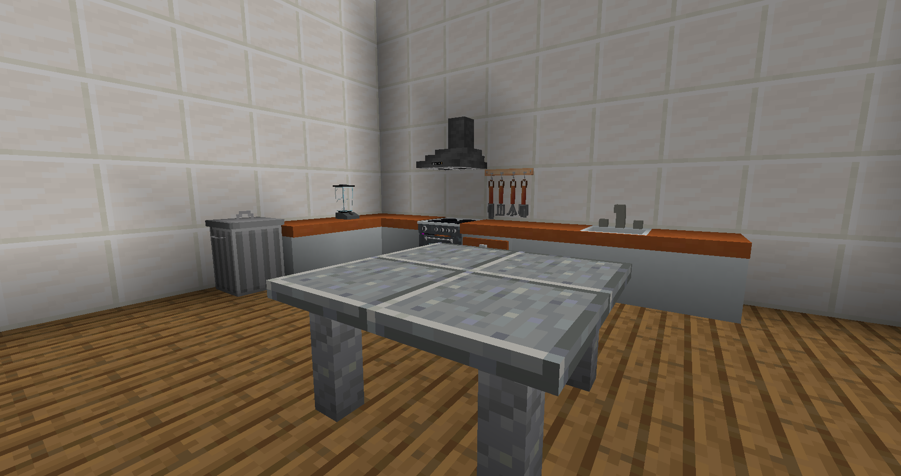
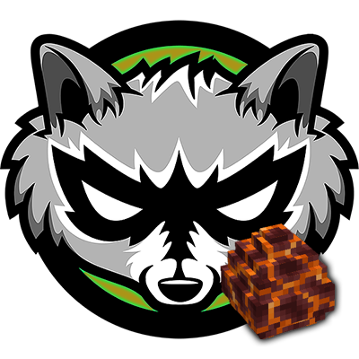
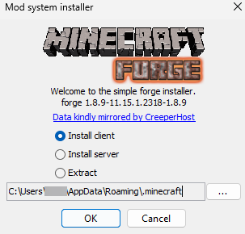

# 🅱️ CustomBlocks

Auf GrieferGames gibt es eigene Blöcke, welche durch eine Mod zur Verfügung gestellt werden. Es stehen dort diverse Blöcke zum Bauen und Dekorieren zur Verfügung.

Anders als bei anderen Modded-Servern ist es auf GrieferGames nicht verpflichtend, die dazugehörige Client-Mod installiert zu haben. Ist die Client-Mod nicht installiert, werden die neuen Blöcke durch Ersatzblöcke ersetzt und so wird es ermöglicht, auch mit Vanilla-Minecraft auf GrieferGames weiterhin zu spielen.


Die Nutzung der Blöcke ist freiwillig. Wir empfehlen natürlich die Erweiterung zu installieren.


###  CustomBlocks mit MysteryMod 

Für die 1.8 Version stehen die Blöcke zusätzlich als Möbel-Addon im [MysteryMod Client](https://mysterymod.net/downloadmainpage1-8-9/) zur Verfügung.

Starte den MysteryMod 1.8.9 Client, öffne die Minecraft Einstellungen, öffne MysteryMod Settings, öffne Addons und installiere das "Furniture" Addon. Starte danach den Client neu und Du hast die CustomBlocks installiert!

### ​ CustomBlocks als Forge-Mod (Minecraft 1.8.9) 

Solltet ihr MysteryMod nicht verwenden wollen, stehen euch die CustomBlocks auch als Erweiterung auf Basis von Forge zur Verfügung. Diese könnt ihr in den Client eurer Wahl hinzufügen und seid nicht mehr auf den MysteryMod Client angewiesen.

 Forge-Mod 1.8.9 Installation

Für die Installation wird Forge benötigt. Solltest du Forge schon installiert haben, kannst du bei Punkt 3 starten.

1. Lade dir den [1.8.9 Forge Installer](https://files.minecraftforge.net/net/minecraftforge/forge/index\_1.8.9.html) herunter
2.  Führe den Installer aus und klicke auf “OK”

    <figure><figcaption></figcaption></figure>
3. Navigiere nun in deinen Minecraft Ordner `%appdata%/.minecraft` und navigiere dort in den Ordner "mods"
4. Ziehe in diesen Ordner die MysteryBlocks-Datei
5. Starte dein Spiel neu und du hast die GrieferGames CustomBlocks installiert!

Die Forge-Mod "CustomBlocks" ist auf [CurseForge](https://www.curseforge.com/minecraft/mc-mods/mysterymod-customblocks/files/all?page=1\&pageSize=20\&version=1.8.9\&gameVersionTypeId=1) zu finden.

Sollte die Forge-Mod nicht verfügbar sein, kann diese ebenfalls aus unserem [GitHub heruntergeladen](https://github.com/griefergames/customblocks-download/blob/master/1.8.9/forge/MysteryBlocks-1.8.9-1.0.2.jar) werden.

### ​ CustomBlocks Fabric (Neuste Minecraft-Version)

Mehr zu den CustomBlocks als Fabric-Mod findet ihr im [Cloud Wiki](https://wiki.griefergames.live/funktionen/customblocks#customblocks-als-fabric-mod). Fabric steht nur in höheren Spielversionen zur Verfügung. Diese Version ist nicht für Spieler geeignet, welche nur in der 1.8.9 spielen!

### Ihr braucht Hilfe? 

Solltet ihr Probleme oder generelle Fragen zu der Installation von CustomBlocks haben, könnt ihr [unserem Discord](https://discord.griefergames.net/) beitreten und dort nach Hilfe fragen.

An diesem Artikel beteiligt

* SyntaxOfficial
* CosmoHDx

