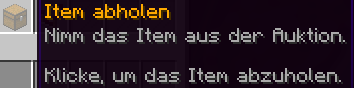
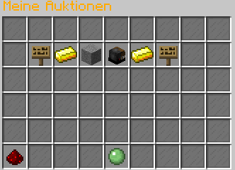
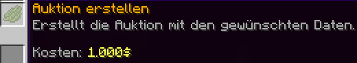
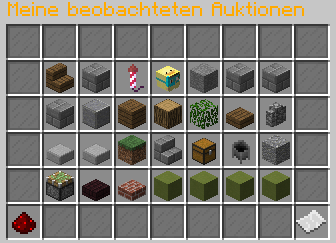
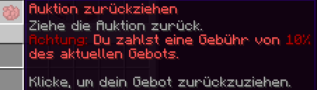

# 📈 Das Auktionshaus

Wertvolle Gegenstände verkaufen war noch nie so einfach. Das Auktionshaus verkauft eure wertvollsten Items an den Höchstbietenden.

Das Grundprinzip ist einfach: Ware einstellen, warten, bieten lassen, kassieren **oder** sich in den Bieterkrieg mit einreihen, gewinnen und abholen.

Den NPC für das Auktionshaus findet ihr an allen Citybuild-Spawns oder ihr ruft das Menü über den Befehl `/ah` auf.

### Auktionsübersicht 

<figure><figcaption>
Die Übersicht im Auktionshaus
</figcaption></figure>

Ihr bekommt standardmäßig alle Auktionen angezeigt, aufsteigend nach der Restzeit der Auktion. Ihr erhaltet alle wichtigen Informationen zu einer Auktion direkt auf dem Item.

In der Auktionsübersicht habt ihr folgende Möglichkeiten:

Mit einem Klick auf ein Item in der Liste könnt ihr die Auktion zu diesem Items aufrufen.

<figure><figcaption>
Die Auktionshistorie zeigt die Auktionen der letzten 30 Tage an.
</figcaption></figure>

<figure><figcaption>
Eure beobachteten Auktionen zeigen alle Auktionen an, auf die ihr geboten habt.
</figcaption></figure>

<figure><figcaption>
Unter euren Auktionen könnt ihr eine neue Auktion erstellen oder eure bereits erstellten Auktionen einsehen.#
</figcaption></figure>

<figure><figcaption>
Über die Filter könnt ihr die Auktionsübersicht nach einem bestimmten Item filtern.
</figcaption></figure>

### Bieten 

<figure><figcaption>
Die Auktion eines einzelnen Items
</figcaption></figure>

In der Auktionsansicht habt ihr die Möglichkeit, auf ein ausgewähltes Item zu bieten. Für das Bieten stehen zwei verschiedene Varianten zur Auswahl.

#### Gebot 

<figure><figcaption>
Über diesen Button könnt ihr euer aktuelles Gebot auf die Auktion einsehen.
</figcaption></figure>

Mit einem Gebot wird der Betrag direkt geboten und der Auktionspreis erhöht sich auf diesen Betrag.

<figure><figcaption>
Über das "Schnellgebot" wird der erforderliche Preis direkt als Gebot abgegeben.
</figcaption></figure>

<figure><figcaption>
Über "Eigenen Beitrag bieten" kannst du auch direkt ein höheres Gebot setzen.
</figcaption></figure>

#### Gebotslimit 

Mit einem Gebotslimit erhöht sich der Betrag nur so weit, dass ihr Höchstbietender seid. Danach bietet das Gebotslimit automatisch für euch weiter, bis das Limit erreicht ist.

<figure><figcaption>
Mit dem Gebotslimit wird das aktuell nächste Höchstgebot als Preis gesetzt.
</figcaption></figure>

<figure><figcaption>
Mit diesem Button könnt ihr euer individuelles Limit festlegen.
</figcaption></figure>


Sowohl beim Direktgebot, als auch beim Gebotslimit wird der von euch **gebotene Betrag direkt von eurem Konto abgezogen**. Eure Gebote (oder die Differenz eures Gebotslimits) könnt ihr zurücknehmen, sofern ihr gerade nicht der Höchstbietende seid oder die Auktion beendet ist.


#### Geld abholen 

Wurdet ihr überboten und möchtet nicht weiter mitbieten, könnt ihr auch noch während der Auktion euer Geld wieder abholen. Hierfür geht ihr in die einzelne Auktion und drückt den Button "Geld abholen".

<figure><figcaption>
Geld aus der Auktion abholen.
</figcaption></figure>

Wenn eine Auktion endet, werden alle Gelder an die nicht erfolgreichen Bieter zurückgezahlt. Ebenso werden ggf. Überschüsse des Gewinners eines Gebotslimits ausgezahlt.

#### Item abholen 

Habt ihr eine Auktion gewonnen _(oder ist dein Item nicht verkauft worden)_ könnt ihr das Item in der Auktion abholen. Dazu öffnet ihr die gewünschte Auktion (über beobachtete Auktionen, Auktionshistorie oder Meine Auktionen) und klickt auf den Button, um das Item zu erhalten.

<figure><figcaption></figcaption></figure>


Du brauchst einen freien Inventarplatz für das Item, auch wenn du bereits ein gleiches Item davon im Inventar hast.



Die auslaufenden Auktionen werden alle **15 Minuten** verarbeitet. Es befinden sich also zeitweise ausgelaufene Auktionen in der Übersicht.


### Auktion erstellen 

Jeder Spieler kann eine neue Auktion erstellen. Dazu wählt ihr in der Auktionsübersicht "Meine Auktionen". Von dort könnt ihr über die Schleimkugel eine neue Auktion erstellen.

<figure><figcaption></figcaption></figure>

<figure><figcaption></figcaption></figure>

Wählt nun ein Item aus eurem Inventar, welches ihr im Auktionshaus anbieten möchtet. _Dieses erscheint dann oben als angezeigtes Item._

<figure><figcaption></figcaption></figure>

#### Startpreis festlegen 

<figure><figcaption></figcaption></figure>

Du kannst der Auktion einen Startpreis geben. Die Auktion startet dann automatisch auf diesem Preis und ab dort kann geboten werden. Standardmäßig ist der Startpreis auf 0 Dollar, somit ist das niedrigste Gebot 1 Dollar.

#### Sofortkaufpreis festlegen 

<figure><figcaption></figcaption></figure>

Wird in einer Auktion ein Sofortkaufpreis hinterlegt, ist es möglich, das Item für den Preis sofort zu kaufen. Ebenfalls wird das Item für diesen Preis automatisch verkauft, sobald ein Gebot diesen Preis erreicht. Somit wird das Item höchstens zu diesem Sofortkaufpreis verkauft.

#### Laufzeit festlegen 

<figure><figcaption></figcaption></figure>

Hier kann angegeben werden, wie lange die Auktion im Auktionshaus bleiben soll. Nach Ablauf der Laufzeit gewinnt der Höchstbietende die Auktion. Man sollte also darauf achten, wie lange man die Auktion einstellen will, da ggf. der Höchstbietende sonst lange Zeit auf den Gewinn der Auktion warten muss. **Das Erreichen des Sofortkaufpreises beendet die Auktion sofort.**

Folgende Laufzeitstufen gibt es: 1 Stunde, 3 Stunden, 6 Stunden, 12 Stunden, 24 Stunden _**(Standard)**_, 48 Stunden _(2 Tage)_, 120 Stunden _(5 Tage)_ , 168 Stunden _(7 Tage)_

#### Auktion bestätigen & erstellen 

<figure><figcaption></figcaption></figure>

Wenn ihr alle gewünschten Einstellungen getroffen habt, könnt ihr die Auktion mit einem Klick auf den Grünen Farbstoff "Bestätigen" abschließend erstellen.

Je nach Einstellung fällt dabei eine **Gebühr** für das Erstellen der Auktion von **10 %** an. Dafür ausschlaggebend ist der höchste eingestellte Preis (Mindestpreis, Sofortkaufpreis). Diese Gebühr muss beim Erstellen gezahlt werden und wird nicht erstattet, falls das Item nicht verkauft wird.

### Auktion zurückziehen 

Verklickt? Falsch eingestellt? Oder das Item doch anderweitig verkauft? Dann könnt ihr die Auktion zurückziehen.

<figure><figcaption></figcaption></figure>

Geht dazu in eure Auktion und klickt auf den Button zum Zurückziehen der Auktion.

<figure><figcaption></figcaption></figure>


Es fällt eine **Strafgebühr** von **10 % auf das aktuelle Gebot** an! Je höher das Item also bereits geboten wurde, desto teurer wird das Zurückziehen.


### Auktionshistorie 

<figure><figcaption></figcaption></figure>

Die Auktionshistorie zeigt die Auktionen der letzten 30 Tage an. Hier können auch Auktionen angesehen werden, in welchen ihr nicht involviert (bieten, verkaufen) wart.

Zusätzlich zu den letzten 30 Tagen befinden sich hier auch ältere Auktionen, bei denen noch Werte (Items, Geld) zum Abholen ausstehend sind.

### Auktionen filtern 

In einigen Menüs stehen Filter zur Verfügung.

#### Item-Filter

Hier kann per Klick auf ein Item im Inventar auf einen Item-Typ gefiltert werden. (Z. B. Feder -> Zeigt auch Fly-Perks an).&#x20;

<figure><figcaption>
Filter zur Auswahl eines Items aus dem eigenen Inventar.
</figcaption></figure>

#### Filter-Kategorie

Zusätzlich kann per Klick auf den Filter-Button eine vorgegebene Kategorie gewählt werden.&#x20;

<figure><figcaption>
Die verfügbaren Filter im Auktionshaus.
</figcaption></figure>

Aktuelle Filter-Kategorien

Folgende Filter sind aktuell im Auktionshaus vorhanden:

* Rüstungen
* Waffen
* Werkzeuge
* Sofortkauf
* Teure Items (> 5 Millionen)
* Günstige Items (< 500 Tausend)
* Köpfe
* Prefixe
* OP-Verzauberungen (nicht für Spieler mgl.)
* Komprimierte Items
* Signierungen von AbgegrieftHD
* Admin-Items
* CustomBlocks
* CaseOpening-Kisten
* Zauberwald-Items

Im Filtermenü kann mit Klick auf den "Kein-Filter"-Button, ein gesetzter Filter (auch Item-Typ-Filter) aufgehoben werden.


Items können (je nach Art) auch in mehreren Kategorien liegen.&#x20;


#### Übersicht-Filter

Unter "Meine Auktionen" und "Meine beobachteten Auktionen" könnt ihr zudem Filter einstellen, welche euch eine bessere Übersicht verschaffen.\
Diese sorgen dafür, dass beendete Auktionen in euren Auktionen ausgeblendet werden (nur laufende anzeigen) und dass bereits abgeholte Auktionsinhalte ausgeblendet werden (nur ausstehende Items/Geld anzeigen).

<figure><figcaption>
Filter in "Meine Auktionen" um nur Auktionen anzuzeigen, welche noch laufen.
</figcaption></figure>

<figure><figcaption>
Filter in "Meine beobachteten Auktionen", um nur Auktionen anzuzeigen, welche zur Abholung bereit stehen.
</figcaption></figure>

An diesem Artikel beteiligt

* SyntaxOfficial
* 50U7R34P3R

