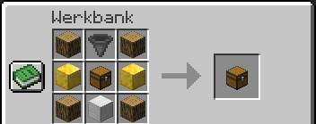
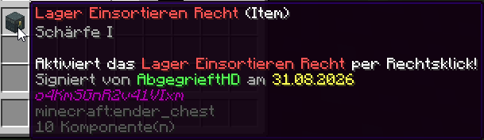

# 📦 Das Unendliche Lager

Die [unendlichen Lager](https://wiki.griefergames.live/funktionen/features/unbegrenzter-speicher) stehen euch nun ebenfalls auch auf dem 1.8 Netzwerk zur Verfügung. Hier allerdings in etwas abgewandelter Form mit mehreren Besonderheiten.

Folgende Items sind lagerbar:

**Alle Items, außer:**&#x20;

* Spawn-Eier
* Spawner
* Beacons
* Dracheneier
* Endstein
* Bedrock
* Barrieren
* Endportalrahmen
* Nethersterne
* Karten
* Feuerwerksraketen&#x20;
* Feuerwerkssterne&#x20;
* (+ CustomBlocks)

Alle Sub-ID's dieser Items sind hierin mit einbegriffen.

### Crafting-Rezept

Das unendliche Lager kann über folgendes Rezept in der Werkbank hergestellt werden:

<figure><figcaption></figcaption></figure>

Es werden 4x Holzstamm, 1x Trichter, 2x Goldblock, 1x Eisenblock und 1x Truhe _oder_ 1x Redstonetruhe benötigt um das unendliche Lager herzustellen.

### Allgemeine Funktionsweise

Anders als auf der Cloud ist das [unendliche Lager auf der 1.8 eine Truhe](https://items.griefergames.net/#Unbegrenzter_Speicher) und speichert weit aus mehr Items (also über 2.147.483.647 Einheiten).&#x20;

Das Lager speichert immer den Item-Typ, welcher als erstes reingelegt wurde - ab diesem Zeitpunkt ist das Lager speziell auf dieses Item fixiert und kann keine anderen Items mehr aufnehmen. Pro Grundstück können zwar mehrere unendliche Lager eines bestimmten Item-Typs verwendet werden, allerdings kann nur eines davon als ["passive Farm" (Einsaugmodus)](das-unendliche-lager.md#passive-farmen)​​ aktiv sein.&#x20;

Außerdem sind auch Verbindungen mit Trichtern möglich. Die Funktionen des [Trichter-Systems](das-trichter-system.md) können also auch auf ein Unendliches Lager geleitet werden.

Die Lager lassen sich nur abbauen, wenn sie komplett leer sind. Durch `/breakblock` ist das Abbauen auch in gefülltem Zustand möglich. Die Items gehen in diesem Fall verloren.

Unendliche Lager lassen sich mit der `/p flag set unlimited-storage-public true` für andere Spieler auf einem Grundstück freigeben.

### Komprimierte Items

Das unendliche Lager verfügt außerdem über einen automatischen Komprimierer. Das bedeutet, dass man mit Shift + Rechtsklick auf die Kiste in ein Menü kommt, aus welchem man sich das gelagerte Item direkt [in komprimierter Form](../erweiterte-features/die-rezeptsammlung.md#item-komprimierung) rausziehen kann.

<figure><figcaption>
Abruf eingelagerter Items mit vorher eingestellter Komprimierungsstufe
</figcaption></figure>

### Der Einsaugmodus

Über Shift + Rechtsklick hat man außerdem auch die Möglichkeit den Einsaugmodus) des Unendlichen Lagers zu aktivieren.&#x20;

Nach Auswahl werden alle Items dieses Typs, die auf dem Grundstück natürlich entstehen oder gedroppt werden würden, automatisch direkt in das Lager geleitet. \
Diese Funktion greift priorisiert vor dem "Einsaugen" durch Trichter.

Um den Einsaug-Modus zurückzusetzen, kann man diesen am jeweiligen Unendlichen Lager wieder ausschalten. \
Falls ein Unendliches Lager/Einsaug-Modus fehlerhaft hinterlegt ist, kann über den Befehl `/storage clear` der Fehler selbstständig behoben werden. Über den Befehl werden **alle** aktiven Einsaug-Modi auf dem jeweiligen Grundstück aufgehoben. \
Die Einsaug-Modi können dann an den Unendlichen Lagern neu eingestellt werden. 

### Das Lagerterminal

Mit einem Lagerterminal können mehrere unendliche Lager zentral an einem Ort verbunden werden. Mit dem Lagerterminal besteht die Möglichkeit auf alle verbundenen Lager von einem Ort aus zuzugreifen ohne durch das ganze Lager laufen zu müssen.

<figure><figcaption></figcaption></figure>


Ein unendliches Lager kann immer nur mit **einem** Terminal verbunden sein. Die Lager müssen sich in der Nähe des Terminals befinden. Ist ein Lager zu weit entfernt, kann es nicht verbunden werden.


Lagerterminals lassen sich mit der Flag `/p flag set unlimited-storageterminal-public true` für andere Spieler auf einem Grundstück freigeben. Im Menü unten links (Buch) können außerdem Zugriffsrechte verwaltet werden. Dort gibt es die Möglichkeit, dass ihr einzelnen Spielern Zugriff auf das Lagerterminal gebt.

### Lager Einsortieren Recht

<figure><figcaption></figcaption></figure>

Dieses Item vergibt die Möglichkeit, über das Lagerterminal-Menü alle Items aus dem Inventar automatisch in die mit dem Terminal verknüpften unendlichen Lager einzusortieren. \
Dazu öffnet man das Lagerterminal-Menü und wählt das Trichter-Symbol unten links aus. Die Items werden dann automatisch in das passende Lager einsortiert.
