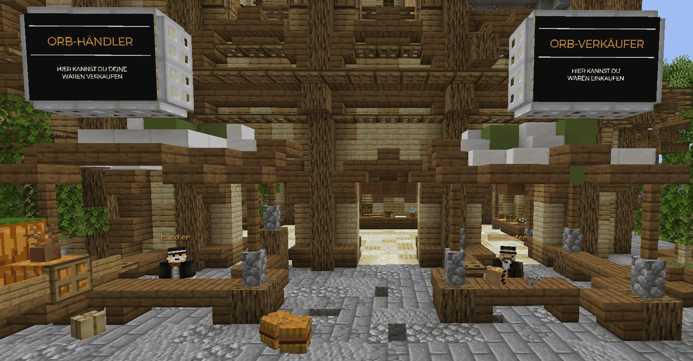
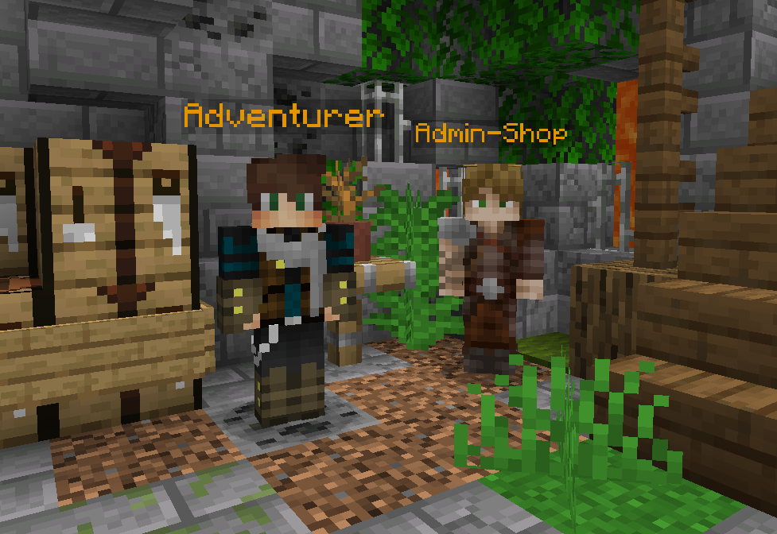
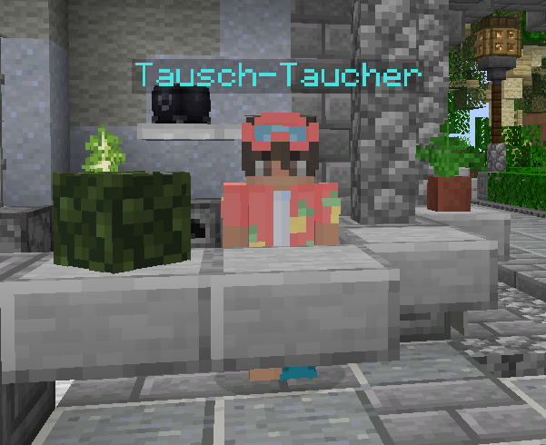

# 💰 Währungen

### GrieferGames-Dollar

GrieferGames-Dollar ($) werden als allgemein gültiges Zahlungsmittel auf unserem 1.8-Netzwerk verwendet, um den Handel zwischen Spielern zu vereinfachen. Ihr könnt Geld verdienen, indem ihr direkt mit Spielern untereinander Items handelt oder [Jobs](https://wiki.griefergames.net/erweiterte-features/das-job-system) (`/jobs`) erfüllt.\
Es wird auch zum Bezahlen von verschiedenen Serverfunktionen eingesetzt.

$ werden auf verschiedenen Wegen in das Spielgeschehen eingebracht.&#x20;

Spieler können ihre $ entweder mit sich führen (Kontostand) oder auf der Bank sichern (Bankguthaben). Geld auf der Bank steht nicht für die Verwendung zur Verfügung, bis es vom Spieler abgehoben wird.

Beim Bezahlen von Serverfunktionen wird das Geld automatisch vom Kontostand abgezogen. \
Zum Überweisen an Spieler oder zum Übertragen zwischen Bankguthaben und Kontostand werden [Befehle](befehlsuebersicht/allgemeine-befehle.md#allgemeine-befehle) verwendet.

Viele Transaktionen kannst du über den Befehl `/moneylog` anzeigen lassen.

### Kristalle

Kristalle sind eine Premium-Währung, welche zum Kauf von Kisten am [Case-Opening](../erweiterte-features/das-case-opening.md#caseopening) eingesetzt werden kann.

Kristalle können im über den [In-Game Store](https://wiki.griefergames.net/erweiterte-features/das-case-opening#in-game-store) oder den [GrieferGames WebShop](../hilfreiche-links/griefergames-dienste.md) erworben oder durch Spielaktivitäten erspielt werden. Klickst du z.B. ein Teammitglied oder einen Spieler mit Hero-Rang an, bekommst du **einmalig** einen zufälligen Betrag an Kristallen.\
Sie sind **nicht handelbar** und können daher nicht als Zahlungsmittel zwischen 2 Spielern genutzt werden.

Das Gutschreiben und Einsetzen deiner Kristalle kannst du über den Befehl `/kristalllog` prüfen.

### Prestige-Tokens

Durch Käufe von **Kristallen oder Kisten mit Echtgeld im In-Game Store** erhaltet ihr **Prestige-Tokens**. Diese könnt ihr im Prestige-Shop für besondere Vorteile und Angebote einlösen.\
Den Prestige-Shop findet ihr am Spawn.

<figure><figcaption></figcaption></figure>

Weitere Informationen dazu, gibt es im Beitrag "[Das Caseopening](https://wiki.griefergames.net/erweiterte-features/das-case-opening)".\
Prestige-Tokens sind **nicht handelbar** und können daher nicht als Zahlungsmittel zwischen 2 Spielern genutzt werden.

### Orbs

[Orbs ](../erweiterte-features/das-orb-system.md)sind eine Serverwährung, welche beim [Orb-Händler](../erweiterte-features/das-orb-system.md#der-orb-haendler-haendler) erhältlich ist. Orbs werden im Tausch gegen Items generiert, welche der Server entgegen nimmt. Spieler können daher unbegrenzt Orbs durch Spielaktivität selbst erzeugen.&#x20;

<figure><figcaption></figcaption></figure>

Orbs können beim [Orb-Verkäufer](../erweiterte-features/das-orb-system.md#der-orb-verkaeufer-verkaeufer) eingesetzt werden, um spezielle Items und optische Features zu erwerben. Sie sind **nicht handelbar** und können daher nicht als Zahlungsmittel zwischen 2 Spielern genutzt werden.

### Adventurer-Coins

Adventurer-Coins (oder kurz "Coins") sind eine Serverwährung, welche beim [Adventurer](../erweiterte-features/das-adventurer-system.md#adventurer) erhältlich sind. Coins werden durch das Erledigen von Aufgaben für den Adventurer generiert. Spieler können daher nur zeitlich begrenzt eine bestimmte Menge an Coins durch Spielaktivität generieren.

<figure><figcaption></figcaption></figure>

Coins können beim [Admin-Shop](../erweiterte-features/das-adventurer-system.md#der-admin-shop) eingesetzt werden, um spezielle Item, sowie optische und funktionelle Features zu erwerben. Adventure-Coins sind **nicht handelbar** und können daher nicht als Zahlungsmittel zwischen 2 Spielern genutzt werden.

### Swap-Token

Swap-Tokens sind eine saisonale Währung, welche vor allem zu besonderen Anlässen temporär im Spiel nutzbar sind. Tokens kann man durch die Abgabe von Items bei einem Tausch-NPC erhalten. Hierbei bekommt man verschieden viele Tokens für verschiedene Items.

<figure><figcaption></figcaption></figure>


In der Vergangenheit gab es zur Weihnachtszeit 2024 die Tausch-Elfe, zu Ostern 2025 den Tausch-Hasen oder auch im Sommer 2026 den Tausch-Taucher.


Für gängige Admin-Items wie [Grundgestein](https://items.griefergames.net/#Grundgestein), [Barrieren](https://items.griefergames.net/#Barriere) oder [Dracheneier ](https://items.griefergames.net/#Drachenei)kann man einen Swap-Token gutgeschrieben bekommen. Für spezielle saisonale Items, welche man aus dem CaserOpening ziehen kann erhält man bis zu 5 Swap-Tokens.

Von den Swap-Tokens kann man sich beim selben NPC dann im Token-Shop Kisten für das Case-Opening, bekannte begehrte Items oder sogar exklusive Items und Item-Variationen kaufen.

Swap-Tokens sind **nicht handelbar** und können daher nicht als Zahlungsmittel zwischen 2 Spielern genutzt werden.


Bitte beachte, dass die Swap-Tokens immer nur für den derzeitigen Token-Shop nutzbar sind, sie verfallen also wenn der temporäre NPC wieder weg ist.


