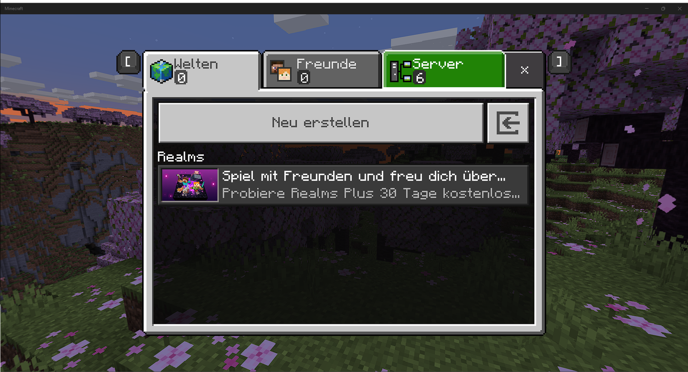
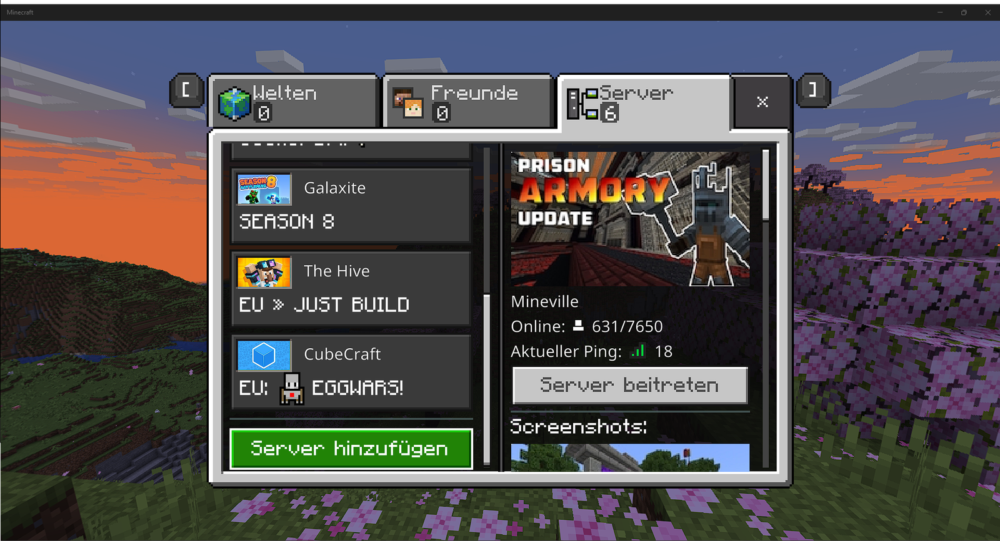
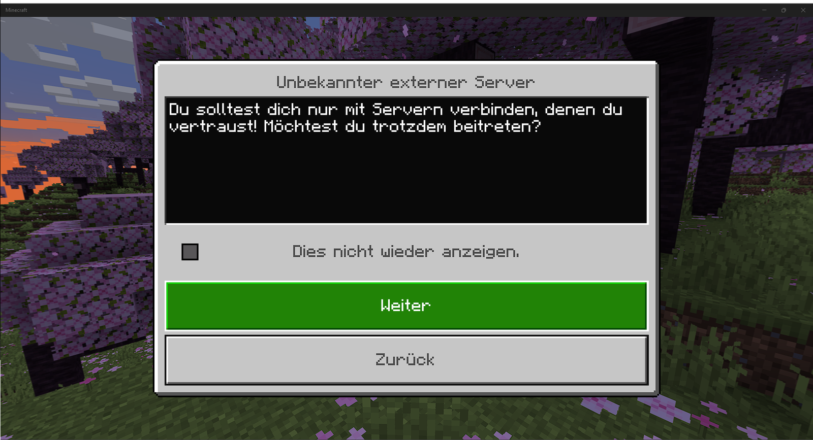
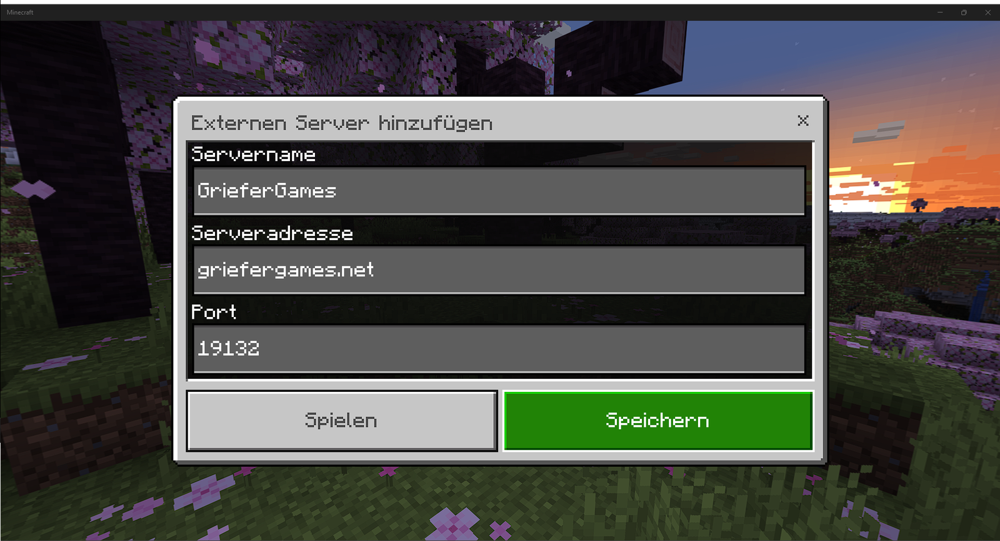
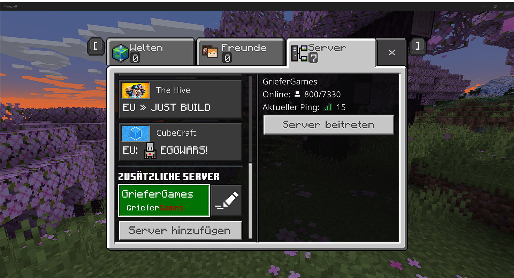

# ...in der Bedrock-Version

<figure><figcaption>
Zur Server-Liste wechseln
</figcaption></figure>

### Server-Liste

<figure><figcaption>
Am Ende der Liste "Server hinzufügen"
</figcaption></figure>

### Server hinzufügen

<figure><figcaption>
Den Warnhinweis zu externen Servern bestätigen
</figcaption></figure>

<figure><figcaption>
Serverangaben hinzufügen und Speichern
</figcaption></figure>

### Server verbinden

* Adresse: `griefergames.net`
* Port: `19132`

<figure><figcaption>
Eintrag auswählen und "Server beitreten"
</figcaption></figure>

Der Standard-Port für die Bedrock-Edition ist 19132. Über diesen Port wirst du beim Verbinden gefragt, ob auch das Server-Ressourcenpaket für die CustomBlocks geladen werden soll. Bei leistungsschwachen Geräten oder bei schlechter Verbindung können diese zusätzlichen Daten zu Problemen oder gar Spielabstürzen führen. Hier solltest du diese abwählen.&#x20;

### Konsolen-Edition

Unsere bisherige Entwicklung zeigt, dass das Beheben von Fehlern für eine Plattform, neue Fehler auf anderen erzeugt. Unser Fokus liegt daher auf der Weiterentwicklung der PC-/Mobile-Edition der Bedrock-Version.

Einige Konsolen-Anbieter verhindern das Anlegen eigener Server. Wir gestatten weiterhin das Verbinden mit Konsolen über diverse Umgehungsmöglichkeiten (eigener DNS-Server, virtuelle Server zur Weiterleitung, Apps etc.). Ein offizieller Support der Konsolen zum Verbinden ist leider nicht mehr möglich.

### Updates der Bedrock-Edition


<mark style="color:red;">**Achtung:**</mark> Da GrieferGames die Bedrock-Version über eine eigene Schnittstelle anbindet, brauchen wir bei jedem neuen Update des Spiels ein wenig Zeit, um diese Änderungen umzusetzen. \
\
Versuche daher, wenn möglich, die automatischen Updates deiner App zu deaktivieren.


Den aktuellen Stand zu Updates erfahrt ihr auf unserem [Discord-Server](../hilfreiche-links/griefergames-dienste.md).

An diesem Artikel beteiligt

* 50U7R34P3R

