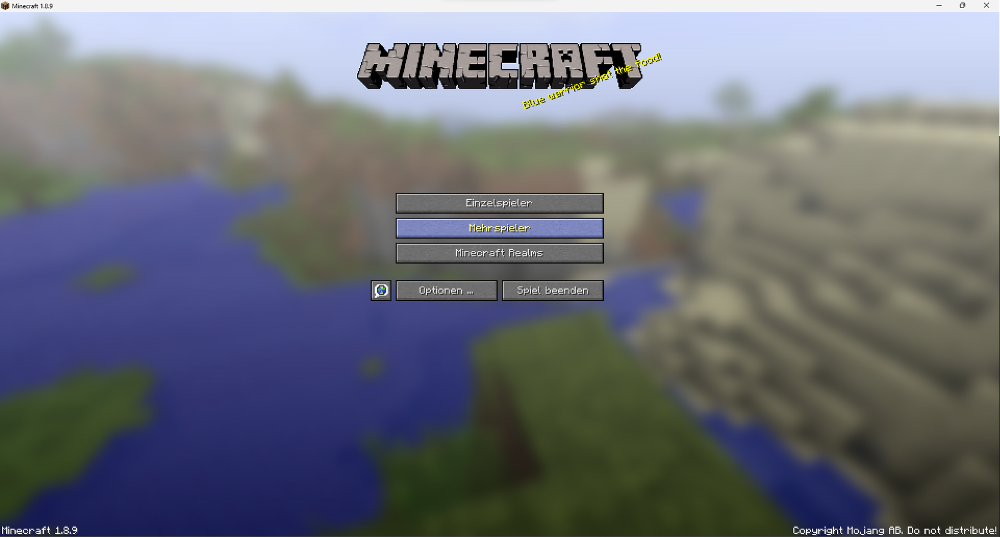
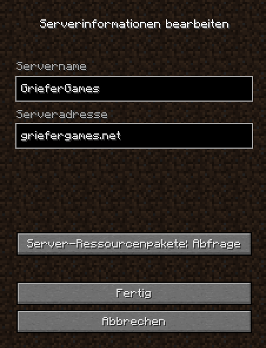
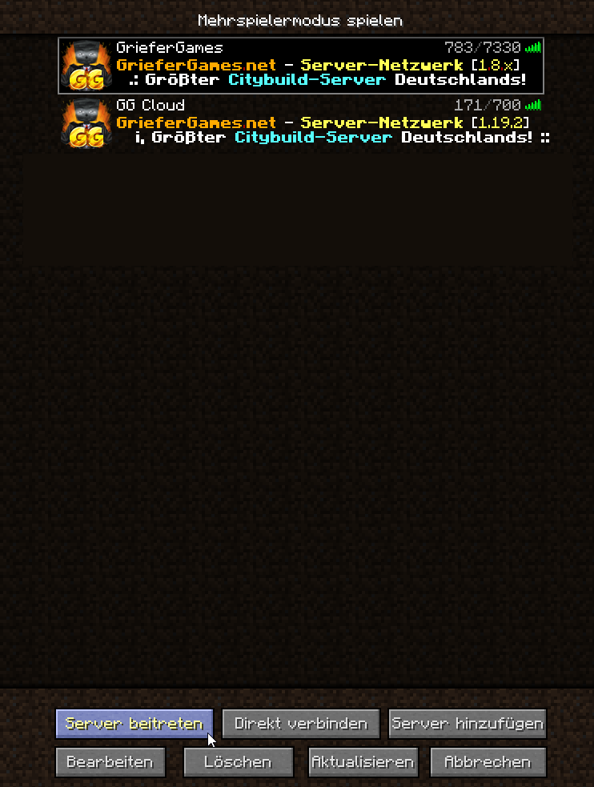

# ...in der Java-Version

### Mehrspieler-Modus auswählen

<figure><figcaption>
Den Mehrspieler-Modus auswählen
</figcaption></figure>

Nach Auswahl des Mehrspieler-Modus geht ihr unter der Liste auf den Button "Server hinzufügen".

### Server-Angaben hinterlegen

* Serveradresse: `griefergames.net`&#x20;

<figure><figcaption>
Tragt die Daten ein und klickt auf "Fertig"
</figcaption></figure>

### Verbindung herstellen

<figure><figcaption>
Server in Liste auswählen und "Server beitreten" anklicken
</figcaption></figure>

